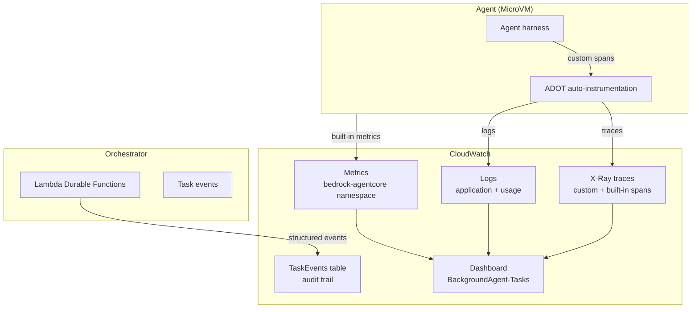

# Observability

For a system where agents run for hours and burn tokens autonomously, observability is load-bearing infrastructure. The platform captures task lifecycle, agent reasoning, tool use, and outcomes so operators can monitor health, debug failures, and improve agent performance over time.

- **Use this doc for:** understanding what the platform observes, how telemetry flows, metrics, dashboards, alarms, and deployment safety.
- **Related docs:** [ORCHESTRATOR.md](./ORCHESTRATOR.md) for task state machine, [MEMORY.md](./MEMORY.md) for code attribution and cross-session learning, [EVALUATION.md](./EVALUATION.md) for agent performance measurement.

## Telemetry architecture

The platform combines three telemetry sources: AgentCore built-in metrics, custom OpenTelemetry spans from the agent harness, and structured task events from the orchestrator. All data flows to CloudWatch.



**AgentCore built-in metrics** (automatic): invocations, session count, latency, errors, throttles, CPU/memory usage per session. Published to the `bedrock-agentcore` CloudWatch namespace.

**Custom spans** from the agent harness provide task-level tracing:

| Span | What it covers |
|------|----------------|
| `task.pipeline` | Root span: end-to-end task execution |
| `task.context_hydration` | GitHub issue fetch + prompt assembly |
| `task.repo_setup` | Clone, branch, mise install, initial build |
| `task.agent_execution` | Claude Agent SDK invocation |
| `task.post_hooks` | Safety-net commit, build/lint verification, PR creation |

Root span attributes (`task.id`, `repo.url`, `agent.model`, `agent.cost_usd`, `build.passed`, `pr.url`, etc.) enable CloudWatch querying and filtering.

**Session correlation**: the AgentCore session ID propagates via OTEL baggage, linking custom spans to AgentCore's built-in session metrics in the CloudWatch GenAI Observability dashboard.

## Correlation envelope

Every action in a task's lifecycle is attributable to a stable set of fields — the **correlation envelope** — so operators can answer "who triggered this, on which repo, in which task?" by joining CloudWatch logs, the `TaskEvents` table, and X-Ray traces on shared keys rather than manually stitching them.

| Field | Meaning | Authoritative source | Optional? |
|-------|---------|----------------------|-----------|
| `task_id` | ULID identifying the task | `createTask` (API) → `TaskRecord.task_id` | No — present on every plane |
| `user_id` | Platform identity (Cognito `sub`) that triggered the task | `TaskRecord.user_id`, set at task creation | No |
| `repo` | Target repository (`owner/repo`) | `TaskRecord.repo` | **Yes** — **absent** (key omitted, not `null`/`""`) for repo-less workflows (`requires_repo: false`, #248 Phase 3). Consumers must treat it as optional; the memory/attribution fallback namespace is `user:{user_id}` |
| `trace_id` | OTEL trace id (32-char lowercase hex) of the agent run | agent's active root span, via `current_otel_trace_id()`; persisted to `TaskRecord.otel_trace_id` | Yes — `null` when tracing is disabled or the span context is invalid |
| `session_id` | AgentCore session id | compute strategy at `start-session`; propagated via OTEL baggage | Yes — absent until a session starts; used as the `trace_id` proxy when the trace id is unavailable |

**Field naming is snake_case and shared** with Bedrock cost attribution (#215), the compliance export schema (#237), and delegation-chain propagation (#249), so the same names join across all four features.

### Join model

The orchestrator runs *before* the agent's trace exists, so there is no single W3C trace root spanning both planes. Instead, the `TaskRecord` is the orchestrator↔agent bridge:

```
orchestrator log ──task_id──▶ TaskRecord ──otel_trace_id──▶ agent trace + TaskEvents + S3 trace artifact
```

- **Orchestrator plane** (Lambda): structured logs and `TaskEvents` carry `{task_id, user_id, repo}`. The orchestrator never sees `trace_id` (the agent trace hasn't started), so it joins to the agent plane through the `TaskRecord`.
- **Agent plane** (MicroVM): OTel spans, baggage, and agent-emitted `TaskEvents` carry `{task_id, user_id, repo, trace_id}`, so the event stream is joinable to the X-Ray trace directly.
- **TaskRecord**: holds `otel_trace_id` and `session_id` (persisted at terminal write, #515), the durable link between the two planes and the basis of the [task replay bundle](#task-replay-bundle).

**Coverage notes:**

- The `task_created` event is written at task creation, *before* the correlation envelope exists on the orchestration path; it joins by `task_id` alone. Every event from `hydration_started` onward carries the envelope. Rare safety-net writers (e.g. the stranded-task reconciler) likewise join by `task_id`.
- The envelope is stamped on the stored `TaskEvents` items and is queryable directly in DynamoDB / CloudWatch. The `GET /tasks/{id}/events` and `/replay` API responses surface `user_id`/`repo`/`trace_id` per event when present; CLI consumers (`bgagent watch`/`events`/`replay`) can also join at the task level via `TaskRecord.otel_trace_id` (exposed on the replay bundle).

## What to observe

The platform tracks four categories of signals, each serving different consumers (operators, users, evaluation pipeline).

### Task lifecycle

Every task emits structured events at each state transition, stored in the TaskEvents table:

- State transitions: `task_created`, `admission_rejected`, `uploads_confirmed`, `hydration_started`, `hydration_complete`, `session_started`, `pr_created`, `task_completed`, `task_failed`, `task_cancelled`, `task_timed_out`
- Blueprint custom step events: `{step_name}_started`, `{step_name}_completed`, `{step_name}_failed`
- Guardrail events: `guardrail_blocked` (content blocked during hydration)

All events carry `task_id` and `user_id` for filtering.

### Agent execution

- **Logs** - Agent and runtime logs in CloudWatch (application log group). Primary debugging window after a session ends.
- **Traces** - Custom spans + AgentCore built-in spans in X-Ray, visible in CloudWatch GenAI Observability. Span attributes enable queries like "show all tasks for repo X that failed."
- **Live streaming** - Not available in MVP. Users poll task status via the API.

### System health

- **Concurrency** - RUNNING task count (system-wide and per user), SUBMITTED backlog depth. Used for admission control and capacity planning.
- **Counter drift** - Reconciliation of UserConcurrency counters with actual task counts. Alert when drift is detected.
- **Orchestration health** - Durable function execution status, failures, and retries.

### Cost and performance

- **Token usage** - Per task, per user, per repo. Feeds cost attribution and budget enforcement.
- **Task duration** - End-to-end, cold start (clone + install), and time to first agent output.
- **Error rates** - By failure type (agent crash, timeout, cancellation, orchestration failure).

## Metrics

| Metric | Type | Purpose |
|--------|------|---------|
| Task duration (p50, p95) | Latency | Performance baseline and regression detection |
| Token usage per task | Cost | Cost attribution and budget enforcement |
| Cold start duration | Latency | Image optimization signal |
| Active tasks (RUNNING count) | Capacity | Admission control and capacity planning |
| Pending tasks (SUBMITTED count) | Capacity | Backlog depth and throughput monitoring |
| Task completion rate | Reliability | Success vs failed/cancelled/timed out |
| Error rate by failure type | Reliability | Regression and bottleneck detection |
| Agent crash rate | Reliability | Runtime stability |
| Counter drift frequency | Correctness | Concurrency accounting health |
| Guardrail blocked rate | Security | Content screening activity |
| Guardrail screening failure rate | Availability | Bedrock Guardrail API health |

Emitted as custom CloudWatch metrics and used in dashboards and alarms.

## Dashboard

A CloudWatch dashboard (`BackgroundAgent-Tasks-${stackName}`, i.e. the base name suffixed with the stack name) is deployed via the `TaskDashboard` CDK construct. It provides Logs Insights widgets for:

- Task success rate and count by status
- Cost per task and turns per task
- Duration distribution
- Build and lint pass rates
- AgentCore built-in metrics (invocations, errors, latency)

The CloudWatch GenAI Observability console provides additional views: per-session traces, CPU/memory usage, trace timeline with custom spans, and transaction search by span attributes.

## Alarms

| Alarm | Trigger | Action |
|-------|---------|--------|
| Stuck task | RUNNING > 9 hours | Check session liveness. If dead, trigger manual finalization. If alive but unresponsive, cancel. |
| Counter drift | UserConcurrency differs from actual task counts | Reconciliation Lambda auto-corrects. If it fails, manual correction. |
| Orchestration failures | Repeated durable function execution failures | Check failing step, verify service health. Durable execution auto-retries transient failures. |
| Agent crash rate spike | Sustained high session failure rate | Check for model API errors, compute quota exhaustion, image pull failures. |
| Submitted backlog depth | SUBMITTED count exceeds threshold | System at capacity. Increase concurrency limits or wait for running tasks. |
| Guardrail screening failures | Sustained Bedrock Guardrail API failures | Tasks fail at submission (503) and hydration (FAILED). Recovers when Bedrock recovers. |

## Code attribution

Every agent commit carries `Task-Id:` and `Prompt-Version:` trailers (via a git hook installed during repo setup). This links code changes to the task and prompt that produced them, enabling queries like "what prompt led to this change?" and supporting the evaluation pipeline.

Task conversations, tool calls, decisions, and outcomes are persisted with metadata (`task_id`, `session_id`, `repo`, `branch`, `commit SHAs`, `pr_url`) in a searchable store. The agent retrieves relevant past context via memory search at task start. See [MEMORY.md](./MEMORY.md) for the memory lifecycle and retrieval strategy.

## Audit and retention

- **TaskEvents table** - Append-only audit log of all task events. Records carry a DynamoDB TTL and are auto-deleted after the retention period (default 90 days, configurable via `taskRetentionDays`).
- **Task records** - Status, timestamps, metadata. TTL is stamped when the task reaches a terminal state (default 90 days). Active tasks are retained indefinitely.
- **Logs** - Application and usage logs retained for 90 days in CloudWatch. Traces flow to X-Ray via CloudWatch Transaction Search.
- **Model invocation logs** - Bedrock model invocation logging with 90-day retention for compliance and prompt injection investigation.

## Task replay bundle

For post-mortems, eval-harness input, and compliance export, the API exposes a single **replay bundle** per task that aggregates the telemetry stores above — chronological `TaskEvents`, the verification verdict, the `--trace` S3 URI, `prompt_version` / `workflow_ref`, the OTEL trace id (or `session_id` as the correlation proxy when absent), and cost — without manually correlating CloudWatch, DynamoDB, and S3. It reads existing stores only (no new persistence).

- **API:** `GET /v1/tasks/{task_id}/replay` (Cognito, owner-scoped — same auth as task read). Schema and example in [API_CONTRACT.md](./API_CONTRACT.md#get-replay-bundle).
- **CLI:** `bgagent replay <task-id> [--json] [--output <file>]`.

Fields whose source did not run for a given task are returned `null`/empty (e.g. no `--trace` → `trace_uri: null`), so the schema is stable for consumers.

## Deployment safety

Agent sessions run for up to 8 hours. CDK deployments replace Lambda functions, which can orphan in-flight orchestrator executions. The platform handles this through multiple mechanisms:

- **Drain before deploy** - Pre-deploy check for active tasks. Warn or block if tasks are running.
- **Durable execution resilience** - Lambda Durable Functions checkpoints are stored externally. A replaced Lambda can resume from its last checkpoint.
- **Consistency recovery** - If a deploy interrupts a running orchestrator, the `ConcurrencyReconciler` Lambda (every 15 minutes) corrects the concurrency counter. (This is distinct from the stranded-task reconciler, a separate Lambda that runs every 5 minutes to fail tasks whose pipeline never started.) The stuck task alarm fires and triggers manual finalization.
- **Blue-green deployment** - CI/CD pipeline uses blue-green for the orchestrator Lambda, with automatic rollback if error rates increase.

## Account prerequisites

Two one-time, account-level setup steps are required before deployment (not managed by CDK):

1. **X-Ray trace segment destination** - Run `aws xray update-trace-segment-destination --destination CloudWatchLogs`. Without this, `cdk deploy` fails.
2. **CloudWatch Transaction Search** - Enable in the CloudWatch console (Application Signals > Transaction Search > Enable, with "ingest spans as structured logs" checked).
