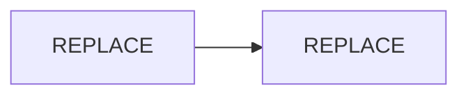

# REPLACE_TITLE

**Level:** 200 — How it fits together  
**Prerequisites:** Read [REPLACE_LEVEL_100](../level-100/REPLACE.md) first.

## Overview

What this page explains and who it is for.

## How it works

Explain interactions between platform components. Use a diagram if helpful:

## In practice

What operators or teammates observe when this runs (symptoms, logs, outcomes).

## Related

| Topic | Doc |
|-------|-----|
| Fundamentals | [REPLACE](../level-100/REPLACE.md) |
| Architecture | [REPLACE](../../design/REPLACE.md) |
