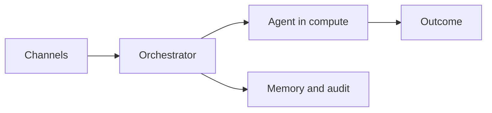

# How the platform works

ABCA is a **self-hosted platform** that runs autonomous agents in your AWS account. You submit work through a **channel** (CLI, API, Slack, Linear, Jira, or webhook). The **orchestrator** admits the task, hydrates context, and runs pre-flight checks. An **agent** executes inside an isolated **compute** session under a **harness** (tool loop + policy). You get a **reviewable outcome** — a pull request, review comments, or a research brief — plus an audit trail.

## Sixty-second flow

1. **Submit** — A typed task (workflow, repo, description) enters the input gateway.
2. **Admit** — Concurrency, auth, and guardrails are enforced; doomed tasks fail fast.
3. **Hydrate** — Issue body, repo docs, and memory are assembled into agent context.
4. **Execute** — The agent runs in a per-task MicroVM with scoped credentials.
5. **Finalize** — Status, PR links, learnings, and events are recorded.

## Start here if…

| You are… | Read first |
|----------|------------|
| New operator deploying the stack | [Quick Start](../QUICK_START.mdx) |
| Teammate submitting tasks | [Task and workflow](./level-100/task-and-workflow.md) → [Using the CLI](../USER_GUIDE.md#using-the-cli) |
| Evaluator (no deploy yet) | [Introduction](../INTRODUCTION.md), then Level 100 pages below |
| Repo author customizing behavior | [Blueprint vs workflow](./level-100/blueprint-vs-workflow.md) → Customizing guides |
| Platform contributor | [Developer guide](../DEVELOPER_GUIDE.md) |

## Level 100 — Fundamentals

Plain-language concepts (no code required):

- [Task and workflow](./level-100/task-and-workflow.md) — unit of work and versioned recipe
- [Blueprint vs workflow](./level-100/blueprint-vs-workflow.md) — per-repo config vs task kind
- [Orchestrator and agent](./level-100/orchestrator-and-agent.md) — control plane vs reasoning
- [Agent harness](./level-100/agent-harness.md) — the execution loop around the model

## Level 200 and architecture

Deeper “how it fits together” pages and implementation detail are in Phase 2. Until then, use [Architecture](../../design/ARCHITECTURE.md) for full design docs and [Using the platform](../USER_GUIDE.md) for day-to-day operations.

## Next steps

- [Learning path](../LEARNING_PATH.md) — goal-based router after deploy
- [Use cases index](../use-cases/USE_CASES_INDEX.md) — outcome tutorials
- [Vision](../../design/VISION.md) — long-term direction and dark-factory scorecard
