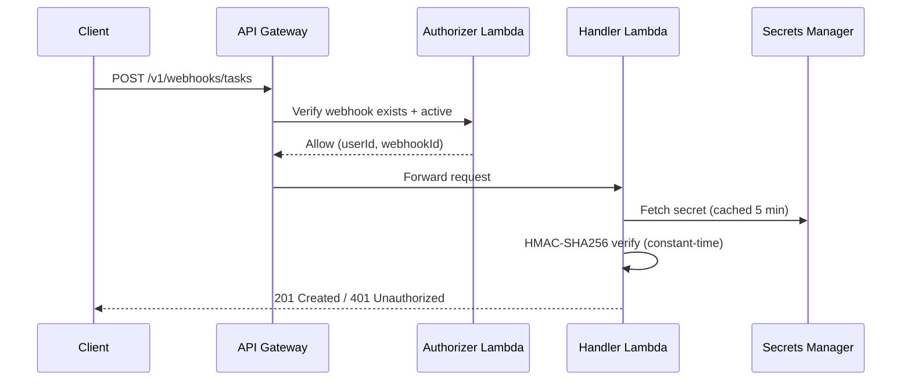

# API Contract

The REST API is the single entry point for all platform interactions. The CLI, webhook integrations, and any future clients use this API to submit tasks, check status, and manage integrations. This is a design-level specification; the source of truth for types is `cdk/src/handlers/shared/types.ts`.

- **Use this doc for:** endpoint paths, payload shapes, auth requirements, and error codes.
- **Related docs:** [INPUT_GATEWAY.md](/sample-autonomous-cloud-coding-agents/architecture/input-gateway) for the gateway's role, [ORCHESTRATOR.md](/sample-autonomous-cloud-coding-agents/architecture/orchestrator) for the task state machine, [SECURITY.md](/sample-autonomous-cloud-coding-agents/architecture/security) for the authentication model.

## Base URL

| Environment | Base URL |
|---|---|
| Production | `https://{api-id}.execute-api.{region}.amazonaws.com/v1` |
| Custom domain | `https://api.{customer-domain}/v1` |

Versioning uses a path prefix (`/v1`). Breaking changes increment the version. New optional fields and endpoints do not require a version bump.

## Authentication

All endpoints require authentication. Two methods are supported:

| Channel | Method | Header |
|---------|--------|--------|
| CLI / REST | Cognito JWT | `Authorization: Bearer <token>` |
| Webhook | HMAC-SHA256 | `X-Webhook-Id` + `X-Webhook-Signature: sha256=<hex>` |

The gateway extracts `user_id` from the authenticated identity and attaches it to all internal messages. Downstream services never see raw tokens.

## Conventions

**Requests:** `application/json`, UTF-8, max 1 MB body. Clients may include an `Idempotency-Key` header on `POST` requests. Deduplication is backed by a sparse `IdempotencyIndex` on the task record, so the key remains bound for the lifetime of that record (its DynamoDB TTL, default 90 days), not a fixed 24-hour window.

**Successful responses:**

```json
{ "data": { ... } }
```

**List responses** include pagination:

```json
{ "data": [ ... ], "pagination": { "next_token": "...", "has_more": true } }
```

**Error responses:**

```json
{ "error": { "code": "TASK_NOT_FOUND", "message": "Task abc-123 not found.", "request_id": "req-uuid" } }
```

**Standard headers:** `X-Request-Id` (ULID, set on all responses). Idempotent replays additionally carry `Idempotent-Replay: true`. (No `X-RateLimit-*` headers are emitted.)

## Endpoints

### Endpoint summary

| Method | Path | Auth | Description |
|--------|------|------|-------------|
| `POST` | `/v1/tasks` | Cognito | Create a task |
| `POST` | `/v1/tasks/{task_id}/confirm-uploads` | Cognito | Confirm presigned uploads and trigger screening |
| `GET` | `/v1/tasks` | Cognito | List tasks (paginated) |
| `GET` | `/v1/tasks/{task_id}` | Cognito | Get task details |
| `DELETE` | `/v1/tasks/{task_id}` | Cognito | Cancel a task |
| `GET` | `/v1/tasks/{task_id}/events` | Cognito | Get task audit trail |
| `POST` | `/v1/tasks/{task_id}/approve` | Cognito | Approve a paused Cedar HITL gate (returns `202`) |
| `POST` | `/v1/tasks/{task_id}/deny` | Cognito | Deny a paused Cedar HITL gate (returns `202`) |
| `POST` | `/v1/tasks/{task_id}/nudge` | Cognito | Send a mid-run nudge message to a running agent (returns `202`) |
| `GET` | `/v1/tasks/{task_id}/trace` | Cognito | Get a presigned download URL for the task's `--trace` artifact |
| `GET` | `/v1/tasks/{task_id}/replay` | Cognito | Get an aggregated operator replay bundle for a task |
| `GET` | `/v1/pending` | Cognito | List the caller's pending approval requests |
| `GET` | `/v1/repos/{repo_id}/policies` | Cognito | List the repo's Cedar hard/soft policy rules |
| `POST` | `/v1/webhooks` | Cognito | Create webhook integration |
| `GET` | `/v1/webhooks` | Cognito | List webhooks (paginated) |
| `DELETE` | `/v1/webhooks/{webhook_id}` | Cognito | Revoke webhook |
| `POST` | `/v1/webhooks/tasks` | HMAC | Create task via webhook |

### Create task

```
POST /v1/tasks
```

Creates a new task. The orchestrator runs admission control, context hydration, and starts the agent session.

**Request body:**

| Field | Type | Required | Description |
|---|---|---|---|
| `repo` | String | Yes | GitHub repository (`owner/repo`) |
| `issue_number` | Number | No | GitHub issue number. Title, body, and comments are fetched during hydration. |
| `task_description` | String | No | Free-text description (max 10,000 chars). At least one of `issue_number`, `task_description`, or `pr_number` required (per the resolved workflow's `required_inputs`). |
| `workflow_ref` | String | No | Workflow selector `<id>[@<constraint>]` (e.g. `coding/new-task-v1`). Replaces `task_type` (#248). Omitted ⇒ the platform default workflow (`default/agent-v1`) is resolved. |
| `pr_number` | Number | No | PR to iterate on or review. Required when the resolved workflow is a pull-request workflow (`coding/pr-iteration-v1`, `coding/pr-review-v1`). |
| `max_turns` | Number | No | Max agent turns (1-500, default 100) |
| `max_budget_usd` | Number | No | Cost ceiling in USD (0.01-100). If omitted, no budget limit. |
| `attachments` | Array | No | Multi-modal attachments (see below) |

**Migration from `task_type` (#248):** `task_type` was removed (no alias). Map
callers one-to-one to `workflow_ref`:

| Old `task_type` | New `workflow_ref` |
|---|---|
| `new_task` | `coding/new-task-v1` |
| `pr_iteration` | `coding/pr-iteration-v1` |
| `pr_review` | `coding/pr-review-v1` |

Responses now carry `resolved_workflow: { id, version }` (the pinned workflow)
in place of `task_type`.

**Attachments:**

| Field | Type | Required | Description |
|---|---|---|---|
| `type` | String | Yes | `image`, `file`, or `url` |
| `content_type` | String | Conditional | MIME type. Required for presigned uploads and URL attachments; auto-detected from magic bytes for inline data. |
| `data` | String | No | Base64-encoded content (max 500 KB decoded per attachment; max 3 MB total inline per request). Mutually exclusive with `url`. |
| `url` | String | No | HTTPS URL to fetch during hydration (max 10 MB, 10s timeout). Required when `type` is `url`. |
| `filename` | String | No | Original filename. Auto-generated if absent. Must not contain path separators or start with `.`. |
| `expected_size_bytes` | Number | Conditional | Declared file size in bytes. Required for presigned uploads (no `data`, no `url`). Used for early budget validation. |

**Supported MIME types:**

| Category | MIME types | Extensions |
|---|---|---|
| Images | `image/png`, `image/jpeg` | `.png`, `.jpg` |
| Text files | `text/plain`, `text/csv`, `text/markdown`, `application/json`, `application/pdf`, `text/x-log` | `.txt`, `.csv`, `.md`, `.json`, `.pdf`, `.log` |

**Attachment limits:**

| Limit | Value |
|---|---|
| Max attachments per task | 10 |
| Max inline data per attachment | 500 KB (decoded) |
| Max total inline data per request | 3 MB (decoded) |
| Max size per attachment (presigned/URL) | 10 MB |
| Max total size per task | 50 MB |
| URL scheme | HTTPS only |
| URL fetch timeout | 10 seconds |

**Upload paths:**

- **Inline** (≤ 500 KB): Include base64-encoded `data` in the request body. Task is created in `SUBMITTED` status.
- **Presigned** (> 500 KB, up to 10 MB): Omit `data` and `url`, include `expected_size_bytes`. Task is created in `PENDING_UPLOADS` status with presigned POST URLs returned in the response. Upload directly to S3, then call `POST /v1/tasks/{task_id}/confirm-uploads`.
- **URL** (deferred): Include `url`. Content is fetched and screened during context hydration.

**Response (inline / URL / no-attachment tasks): `201 Created`**

```json
{
  "data": {
    "task_id": "01HYX...",
    "status": "SUBMITTED",
    "repo": "org/myapp",
    "resolved_workflow": { "id": "coding/new-task-v1", "version": "1.0.0" },
    "issue_number": 42,
    "branch_name": "bgagent/01HYX.../fix-auth-bug",
    "created_at": "2025-03-15T10:30:00Z"
  }
}
```

For PR tasks, `branch_name` is initially `pending:pr_resolution` and resolved to the PR's `head_ref` during hydration.

**Response for presigned upload tasks: `202 Accepted`**

```json
{
  "data": {
    "task_id": "01HYX...",
    "status": "PENDING_UPLOADS",
    "task_expires_at": "2025-03-15T11:00:00Z",
    "upload_instructions": [
      {
        "attachment_id": "01HYX...",
        "filename": "screenshot.png",
        "upload_url": "https://s3.amazonaws.com/...",
        "upload_fields": { "key": "...", "policy": "...", "x-amz-signature": "..." },
        "upload_expires_at": "2025-03-15T10:40:00Z"
      }
    ]
  }
}
```

**Idempotency:** Clients may send `Idempotency-Key` (see [Conventions](#conventions)). The first successful create returns **`201 Created`** (or `202` for presigned tasks). A subsequent request with the same key and the **same authenticated user** returns **`200 OK`** with the full `TaskDetail` reflecting **current** task state, plus response header `Idempotent-Replay: true`. No duplicate task is created and the orchestrator is not invoked again for that replay. If the key is already bound to a task owned by **another** user, the API returns **`409 DUPLICATE_TASK`** without exposing that task (extremely unlikely for high-entropy keys).

**Errors:** `400 VALIDATION_ERROR` (invalid body/parameters, or task description blocked by content screening), `400 ATTACHMENT_INVALID_CONTENT` (content does not match declared MIME type or could not be sanitized), `400 ATTACHMENT_BLOCKED` (inline attachment failed content screening), `400 ATTACHMENT_INLINE_TOO_LARGE` (single inline attachment > 500 KB; total inline > 3 MB surfaces as `VALIDATION_ERROR`), `400 ATTACHMENTS_TOTAL_TOO_LARGE` (aggregate declared size > 50 MB), `401 UNAUTHORIZED`, `409 DUPLICATE_TASK` (idempotency key collision across users only), `422 REPO_NOT_ONBOARDED`, `503 SERVICE_UNAVAILABLE`, `503 ATTACHMENT_SCREENING_UNAVAILABLE`.

> Task-description content screening (Bedrock Guardrails) that intervenes returns `400 VALIDATION_ERROR` with message "Task description was blocked by content policy." — there is no separate `GUARDRAIL_BLOCKED` code.

### Confirm uploads

```
POST /v1/tasks/{task_id}/confirm-uploads
```

Triggers security screening for presigned-upload attachments and transitions the task from `PENDING_UPLOADS` to `SUBMITTED`. No request body required. The call is idempotent: if the task has already advanced past `PENDING_UPLOADS` (e.g. `SUBMITTED`/`HYDRATING`/`RUNNING`), it returns `200 OK` with the current task detail.

**Response: `200 OK`** — Task detail with `status: "SUBMITTED"`.

```json
{
  "data": {
    "task_id": "01HYX...",
    "status": "SUBMITTED",
    "repo": "org/myapp",
    "resolved_workflow": { "id": "coding/new-task-v1", "version": "1.0.0" },
    "issue_number": 42,
    "branch_name": "bgagent/01HYX.../fix-auth-bug",
    "created_at": "2025-03-15T10:30:00Z",
    "updated_at": "2025-03-15T10:36:00Z"
  }
}
```

If the orchestrator dispatch fails after the task is submitted, the response body additionally carries a `warning` field; the task is still picked up by the background reconciler.

**Errors:** `400 VALIDATION_ERROR` (no attachments to confirm), `400 ATTACHMENT_UPLOAD_MISSING` (a declared upload is not present in S3), `400 ATTACHMENT_BLOCKED` (an attachment failed content screening — the task transitions to `FAILED`), `404 TASK_NOT_FOUND`, `409 UPLOADS_NOT_PENDING` (task is in a state that cannot accept upload confirmations), `429 RATE_LIMIT_EXCEEDED` (user concurrency limit reached), `503 ATTACHMENT_SCREENING_UNAVAILABLE`, `503 SCREENING_DEADLINE_EXCEEDED` (screening did not finish within the time limit; retry — already-screened attachments are skipped).

### Get task

```
GET /v1/tasks/{task_id}
```

Returns full details of a task. Users can only access their own tasks.

**Response: `200 OK`**

```json
{
  "data": {
    "task_id": "01HYX...",
    "status": "RUNNING",
    "repo": "org/myapp",
    "resolved_workflow": { "id": "coding/new-task-v1", "version": "1.0.0" },
    "issue_number": 42,
    "task_description": "Fix the authentication bug in the login flow",
    "branch_name": "bgagent/01HYX.../fix-auth-bug",
    "session_id": "sess-uuid",
    "pr_url": null,
    "error_message": null,
    "error_classification": null,
    "max_turns": 100,
    "max_budget_usd": null,
    "cost_usd": null,
    "duration_s": null,
    "build_passed": null,
    "created_at": "2025-03-15T10:30:00Z",
    "updated_at": "2025-03-15T10:31:15Z",
    "started_at": "2025-03-15T10:31:10Z",
    "completed_at": null
  }
}
```

`error_classification` is a derived field computed at response time from `error_message`. When `error_message` is `null`, `error_classification` is `null`. When present, it contains:

| Field | Type | Description |
|---|---|---|
| `category` | String | One of: `auth`, `network`, `concurrency`, `compute`, `agent`, `guardrail`, `config`, `timeout`, `unknown` |
| `title` | String | Human-readable error title |
| `description` | String | Detailed explanation of what went wrong |
| `remedy` | String | Suggested action to resolve the error |
| `retryable` | Boolean | Whether retrying may succeed |

Example for a failed task:

```json
{
  "error_message": "User concurrency limit reached",
  "error_classification": {
    "category": "concurrency",
    "title": "Concurrency limit reached",
    "description": "The maximum number of concurrent tasks for this user has been reached.",
    "remedy": "Wait for an active task to complete, cancel a running task, or ask an admin to increase the limit.",
    "retryable": true
  }
}
```

**Errors:** `401 UNAUTHORIZED`, `403 FORBIDDEN`, `404 TASK_NOT_FOUND`.

### List tasks

```
GET /v1/tasks
```

Returns the authenticated user's tasks, newest first. Paginated.

**Query parameters:**

| Parameter | Type | Default | Description |
|---|---|---|---|
| `status` | String | all | Filter by status (comma-separated: `RUNNING,HYDRATING`) |
| `repo` | String | all | Filter by repository (`owner/repo`) |
| `limit` | Number | 20 | Page size (1-100) |
| `next_token` | String | - | Pagination token from previous response |

Returns a summary subset of fields. Use `GET /v1/tasks/{task_id}` for full details.

**Errors:** `400 VALIDATION_ERROR`, `401 UNAUTHORIZED`.

### Cancel task

```
DELETE /v1/tasks/{task_id}
```

Cancels a task. See [ORCHESTRATOR.md](/sample-autonomous-cloud-coding-agents/architecture/orchestrator) for cancellation behavior by state.

**Response: `200 OK`** — a compact confirmation body (not a full `TaskDetail`):

```json
{ "data": { "task_id": "01HYX...", "status": "CANCELLED", "cancelled_at": "2025-03-15T10:35:00Z" } }
```

**Errors:** `401 UNAUTHORIZED`, `403 FORBIDDEN`, `404 TASK_NOT_FOUND`, `409 TASK_ALREADY_TERMINAL`.

### Get task events

```
GET /v1/tasks/{task_id}/events
```

Returns the audit trail for a task: state transitions, hydration events, session events, and custom step events.

**Query parameters:** `limit` (default 50, max 100), `next_token`.

**Event types:** `task_created`, `uploads_confirmed`, `attachment_blocked`, `admission_rejected`, `preflight_failed`, `hydration_started`, `hydration_complete`, `session_started`, `pr_created`, `task_completed`, `task_failed`, `task_cancelled`, `task_timed_out`. Custom blueprint steps emit `{step_name}_started`, `{step_name}_completed`, `{step_name}_failed`. (There is no `admission_passed` or `session_ended` event — admission success is implicit in the subsequent `hydration_started`, and session end is captured by the terminal event.)

**Correlation envelope (#245):** each event optionally carries top-level `user_id`, `repo`, and `trace_id` (the agent's OTEL trace id) so the event stream joins to structured logs and X-Ray. Each field is present only when the event's source stamped it — `task_created` predates the envelope and carries none; events from `hydration_started` onward carry `user_id`/`repo`, and agent-emitted events additionally carry `trace_id`. Fields are omitted (not `null`) when absent. See [OBSERVABILITY.md](/sample-autonomous-cloud-coding-agents/architecture/observability#correlation-envelope).

**Errors:** `401 UNAUTHORIZED`, `403 FORBIDDEN`, `404 TASK_NOT_FOUND`.

### Approve / deny a Cedar HITL gate

```
POST /v1/tasks/{task_id}/approve
POST /v1/tasks/{task_id}/deny
```

When a task pauses in `AWAITING_APPROVAL` (Cedar soft-deny gate), the owner approves or denies the pending request to resume the agent. Both endpoints accept a request body with the pending `request_id`. `approve` may include an optional `scope` (defaults to `this_call`); `deny` may include an optional `reason` (redacted and truncated to 2,000 chars).

**Response: `202 Accepted`**

`approve`:

```json
{ "data": { "task_id": "01HYX...", "request_id": "...", "status": "APPROVED", "scope": "this_call", "decided_at": "2025-03-15T10:35:00Z" } }
```

`deny`:

```json
{ "data": { "task_id": "01HYX...", "request_id": "...", "status": "DENIED", "decided_at": "2025-03-15T10:35:00Z" } }
```

**Errors:** `400 VALIDATION_ERROR`, `401 UNAUTHORIZED`, `404 REQUEST_NOT_FOUND` (collapses "row missing" and "wrong caller"), `409 REQUEST_ALREADY_DECIDED`, `409 TASK_NOT_AWAITING_APPROVAL`.

### List pending approvals

```
GET /v1/pending
```

Returns the caller's pending Cedar HITL approval requests across all their tasks.

**Response: `200 OK`** — `{ "data": { "pending": [ ... ] } }`.

### Get repo policies

```
GET /v1/repos/{repo_id}/policies
```

Returns the repository's Cedar policy rules grouped into `hard` and `soft` lists (rule id, category, severity, per-rule `approval_timeout_s`, and a human-readable summary).

**Response: `200 OK`** — `{ "data": { "repo_id": "...", "policies": { "hard": [ ... ], "soft": [ ... ] } } }`.

### Nudge a running task

```
POST /v1/tasks/{task_id}/nudge
```

Queues a free-text message for delivery to a running agent. Rate-limited per task (default 10/min).

**Response: `202 Accepted`** — `{ "data": { "task_id": "01HYX...", "nudge_id": "...", "submitted_at": "2025-03-15T10:35:00Z" } }`.

### Get trace URL

```
GET /v1/tasks/{task_id}/trace
```

Issues a short-lived presigned download URL for the task's `--trace` trajectory artifact (only present when the task was submitted with `trace: true`).

**Response: `200 OK`** — `{ "data": { "url": "https://s3...", "expires_at": "2025-03-15T10:40:00Z" } }`.

**Errors:** `401 UNAUTHORIZED`, `403 FORBIDDEN`, `404 TASK_NOT_FOUND`, `404 TRACE_NOT_AVAILABLE`.

### Get replay bundle

```
GET /v1/tasks/{task_id}/replay
```

Returns a single operator-facing **replay bundle** that aggregates a task's existing telemetry — chronological `events`, verification verdict, `--trace` S3 URI, `prompt_version` / `workflow_ref`, OTEL correlation id, and cost — so a task can be post-mortem'd or fed to the eval harness without manually correlating CloudWatch, DynamoDB, and S3. It introduces no new persistence: every field is read from stores that already exist.

Auth is identical to `GET /v1/tasks/{task_id}` — Cognito-authenticated and owner-scoped (the caller must own the task).

Fields sourced from stores that may not have run for a given task are returned as `null`/empty rather than omitted, so consumers see a stable schema:

- `trace_uri` is `null` when the task ran without `--trace` (or the upload had not completed).
- `otel_trace_id` is `null` on tasks created before the field existed or that ran with tracing unavailable; `session_id` is the available correlation id in that case.
- `verification` is `null` when no gate result was persisted (e.g. a repo-less workflow has no build/lint step).
- The embedded `events` list is capped both by count (`MAX_REPLAY_EVENTS`) and by total size (`MAX_REPLAY_EVENT_BYTES`, to stay under Lambda's 6 MB response limit — relevant for `--trace` tasks whose events carry large previews); whichever cap trips first truncates the tail. When that happens, `events_truncation` is non-null (`{ reason: "max_events" | "max_bytes", returned_events }`) so a consumer can detect a partial list; it is `null` when the full list fit. Use `GET /v1/tasks/{task_id}/events` for the full paginated feed.
- Each embedded event has the same shape as the `/events` feed — `event_id`, `event_type`, `timestamp`, `metadata` (always present, `{}` when the event stored none), and the optional correlation envelope (`user_id`, `repo`, `trace_id`) when the source stamped it; the internal `task_id`/`ttl` are stripped.

**Response: `200 OK`**

```json
{
  "data": {
    "task_id": "01HZX...",
    "workflow_ref": "coding/new-task-v1",
    "resolved_workflow": { "id": "coding/new-task-v1", "version": "1" },
    "prompt_version": "coding/new-task-v1@1",
    "events": [
      { "event_id": "01HZX...A", "event_type": "task_started", "timestamp": "2026-06-30T17:00:00.000Z", "metadata": {} }
    ],
    "events_truncation": null,
    "verification": { "build_passed": true, "lint_passed": true },
    "trace_uri": "s3://<trace-bucket>/traces/<user_id>/01HZX....jsonl.gz",
    "otel_trace_id": "1a2b3c4d5e6f70819293a4b5c6d7e8f9",
    "session_id": "sess-01HZX...",
    "cost_usd": 0.0421,
    "collected_at": "2026-06-30T17:05:00.000Z"
  }
}
```

A complete example is checked in at `cdk/test/fixtures/replay-bundle.example.json` (validated against the `ReplayBundle` type in the handler test). CLI: `bgagent replay <task-id> [--json] [--output <file>]`.

**Errors:** `401 UNAUTHORIZED`, `400 VALIDATION_ERROR`, `403 FORBIDDEN`, `404 TASK_NOT_FOUND`, `500 INTERNAL_ERROR`.

## Webhook integration

External systems (CI pipelines, GitHub Actions, custom automation) can create tasks via HMAC-authenticated requests. Webhook integrations are managed through Cognito-authenticated endpoints; task submission uses HMAC.

### Create webhook

```
POST /v1/webhooks
```

Creates a webhook and returns the shared secret (shown only once).

**Request:** `{ "name": "My CI Pipeline" }` (1-64 chars, alphanumeric + spaces/hyphens/underscores).

**Response: `201 Created`**

```json
{
  "data": {
    "webhook_id": "01HYX...",
    "name": "My CI Pipeline",
    "secret": "<64-hex-characters>",
    "created_at": "2025-03-15T10:30:00Z"
  }
}
```

Store the `secret` securely. It cannot be retrieved again.

**Errors:** `400 VALIDATION_ERROR`, `401 UNAUTHORIZED`.

### List webhooks

```
GET /v1/webhooks
```

Returns the authenticated user's webhooks. Paginated.

**Query parameters:** `include_revoked` (default `false`), `limit` (default 20), `next_token`.

**Errors:** `401 UNAUTHORIZED`.

### Revoke webhook

```
DELETE /v1/webhooks/{webhook_id}
```

Soft-revokes a webhook. The secret is scheduled for deletion with a 7-day recovery window. The revoked record is auto-deleted after 30 days.

**Errors:** `401 UNAUTHORIZED`, `404 WEBHOOK_NOT_FOUND`, `409 WEBHOOK_ALREADY_REVOKED`.

### Create task via webhook

```
POST /v1/webhooks/tasks
```

Same request body as `POST /v1/tasks`. Requires `X-Webhook-Id` and `X-Webhook-Signature` headers instead of Cognito JWT.

**Authentication flow:**



HMAC verification runs in the handler (not the authorizer) because API Gateway REST API v1 does not pass the request body to Lambda REQUEST authorizers. Authorizer caching is disabled since each request has a unique signature.

Tasks created via webhook record `channel_source: 'webhook'` with audit metadata (`webhook_id`, `source_ip`, `user_agent`).

**Errors:** `400 VALIDATION_ERROR` (includes task descriptions blocked by content screening), `401 UNAUTHORIZED`, `409 DUPLICATE_TASK`, `422 REPO_NOT_ONBOARDED`, `503 SERVICE_UNAVAILABLE`.

## Rate limiting and throttling

There is no per-user request-rate or "tasks-per-hour" limiter on task creation. The protections that actually exist are:

| Mechanism | Value | Scope | Response |
|---|---|---|---|
| API Gateway stage throttling | `throttlingRateLimit` 60 req/s, burst 100 | Account/stage-wide (not per user) | `429 Too Many Requests` (API Gateway, no body envelope) |
| WAF rate-based rule | 1,000 requests / 5 min | Per source IP | `403` (blocked by WAF) |
| Per-task nudge limit | Default 10/min | Per task (`POST /tasks/{id}/nudge`) | `429 RATE_LIMIT_EXCEEDED` |
| Application rate limiter (`shared/rate-limit`) | Per-endpoint | Used by `approve`, `deny`, `pending`, `nudge`, `policies` and Linear webhook/fan-out paths — **not** task creation | `429 RATE_LIMIT_EXCEEDED` |

**Concurrency (not a rate limit).** Per-user concurrent task count is bounded (configurable, default 3-5). This is enforced by admission control, not by the create-task endpoint:

- `POST /v1/tasks/{task_id}/confirm-uploads` rejects with `429 RATE_LIMIT_EXCEEDED` when the user is already at their concurrency limit.
- For the orchestrator admission path (the `SUBMITTED → HYDRATING` transition), exceeding the limit does not return an HTTP error — the task is already created. The orchestrator drives the task to `FAILED` with `error_message` "User concurrency limit reached" and emits an `admission_rejected` event.

## Error codes

| Code | Status | Description |
|---|---|---|
| `VALIDATION_ERROR` | 400 | Invalid request body or parameters (also returned when a task description is blocked by content screening) |
| `UNAUTHORIZED` | 401 | Missing, expired, or invalid authentication |
| `FORBIDDEN` | 403 | Not authorized (e.g. accessing another user's task) |
| `TASK_NOT_FOUND` | 404 | Task ID does not exist |
| `TRACE_NOT_AVAILABLE` | 404 | Trace artifact does not exist for this task |
| `WEBHOOK_NOT_FOUND` | 404 | Webhook does not exist or belongs to another user |
| `DUPLICATE_TASK` | 409 | Idempotency key already used by another user (`POST /v1/tasks` / webhook create); same-user replays return `200` with the existing task instead |
| `TASK_ALREADY_TERMINAL` | 409 | Cannot cancel a terminal task |
| `WEBHOOK_ALREADY_REVOKED` | 409 | Webhook is already revoked |
| `REPO_NOT_ONBOARDED` | 422 | Repository not registered (onboard via CDK, not runtime API) |
| `REPO_NOT_FOUND_OR_NO_ACCESS` | 422 | Repo onboarded but credentials cannot reach it |
| `PR_NOT_FOUND_OR_CLOSED` | 422 | PR does not exist, is closed, or is inaccessible |
| `INSUFFICIENT_GITHUB_REPO_PERMISSIONS` | 422 | GitHub token lacks required permissions for the task type |
| `ATTACHMENT_BLOCKED` | 400 | Attachment content blocked by security screening |
| `ATTACHMENT_TOO_LARGE` | 400 | Individual attachment exceeds 10 MB size limit |
| `ATTACHMENT_INLINE_TOO_LARGE` | 400 | Inline attachment exceeds 500 KB limit (use presigned upload) |
| `ATTACHMENTS_TOTAL_TOO_LARGE` | 400 | Total attachment size exceeds 50 MB limit |
| `ATTACHMENT_INVALID_TYPE` | 400 | MIME type not in allowlist |
| `ATTACHMENT_INVALID_CONTENT` | 400 | Content does not match declared MIME type (magic bytes mismatch) or could not be sanitized |
| `ATTACHMENT_INVALID_FILENAME` | 400 | Filename contains invalid characters or path traversal |
| `ATTACHMENT_SIZE_MISMATCH` | 400 | Uploaded file size does not match declared `expected_size_bytes` |
| `ATTACHMENT_UPLOAD_MISSING` | 400 | A declared presigned upload was not found in S3 at confirm-uploads time |
| `UPLOADS_NOT_PENDING` | 409 | Task is in a state that cannot accept upload confirmations (not `PENDING_UPLOADS`, and not already advanced) |
| `ATTACHMENT_SCREENING_UNAVAILABLE` | 503 | Screening service unavailable after retries |
| `SCREENING_DEADLINE_EXCEEDED` | 503 | Attachment screening did not complete within the time limit (retry; already-screened attachments are skipped) |
| `GITHUB_UNREACHABLE` | 502 | GitHub API unreachable during pre-flight (transient) |
| `RATE_LIMIT_EXCEEDED` | 429 | Rate/concurrency gate exceeded — per-task nudge limit, the application rate limiter on approval endpoints, or the user concurrency limit on confirm-uploads |
| `REQUEST_NOT_FOUND` | 404 | Cedar HITL approval request not found (also returned when the caller does not own it) |
| `REQUEST_ALREADY_DECIDED` | 409 | Cedar HITL approval request was already approved or denied |
| `TASK_NOT_AWAITING_APPROVAL` | 409 | Task is not in `AWAITING_APPROVAL`, so the approval decision does not apply |
| `INTERNAL_ERROR` | 500 | Unexpected server error |
| `SERVICE_UNAVAILABLE` | 503 | Downstream dependency unavailable (retry with backoff) |

## Pagination

List endpoints use token-based pagination (consistent with DynamoDB's `ExclusiveStartKey`).

- `pagination.next_token` (opaque string) and `pagination.has_more` (boolean) in responses
- Pass `next_token` as query parameter for the next page
- Tokens are short-lived and should not be stored
- Results ordered by `created_at` descending (newest first)
