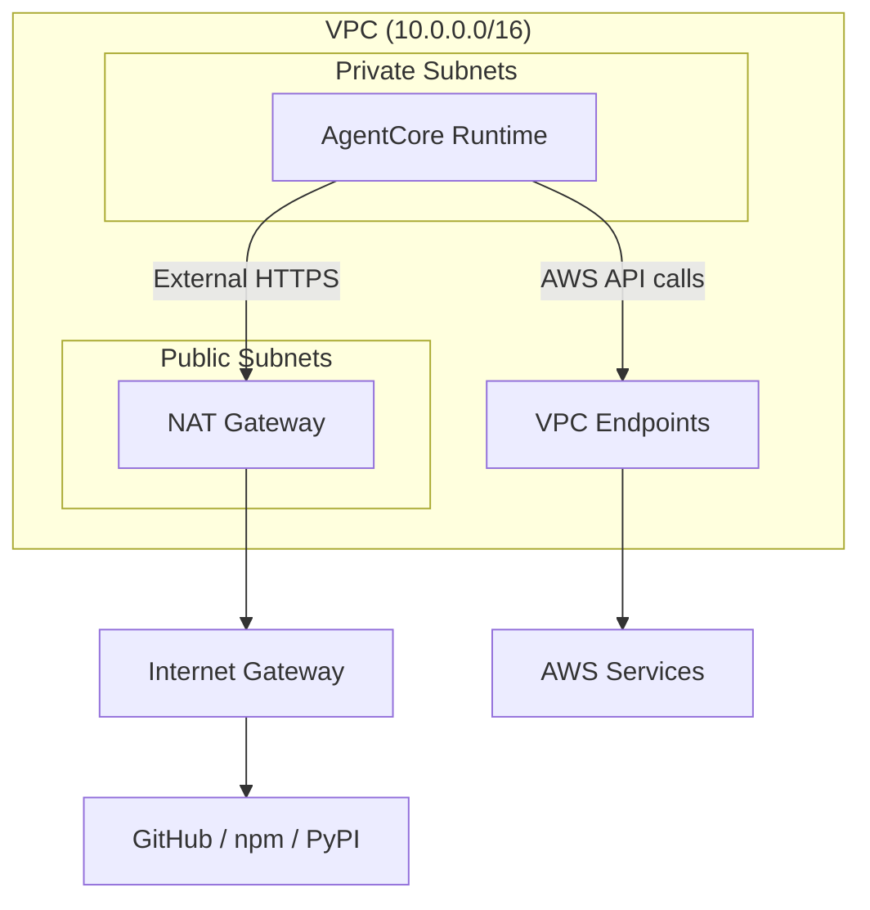

# Compute

Every task runs in an isolated cloud compute environment. Nothing runs on the user's machine. The agent clones the repo, writes code, runs tests, and opens a PR inside a MicroVM that is created for the task and destroyed when it ends.

- **Use this doc for:** understanding the compute environment, agent harness, network architecture, and the constraints that shape the platform's design.
- **Related docs:** [ORCHESTRATOR.md](/architecture/orchestrator) for session management and liveness monitoring, [SECURITY.md](/architecture/security) for isolation and egress controls, [REPO_ONBOARDING.md](/architecture/repo-onboarding) for per-repo compute configuration.

## Compute options

The default runtime is **Amazon Bedrock AgentCore Runtime**, which runs each session in a Firecracker MicroVM with per-session isolation, managed lifecycle, and built-in health monitoring. For repos that exceed AgentCore's constraints (2 GB image limit, no GPU), the `ComputeStrategy` interface allows switching to alternative backends per repo.

| | AgentCore Runtime | ECS on Fargate | ECS on EC2 | EKS | AWS Batch | Lambda | Custom EC2 + Firecracker |
|---|---|---|---|---|---|---|---|
| **Isolation** | MicroVM (Firecracker) | Task-level (Firecracker) | Container on shared nodes | Pod on shared nodes | Backend-dependent | Function env (Firecracker) | MicroVM (you own it) |
| **Image limit** | 2 GB (non-adjustable) | No hard cap | No hard cap | No hard cap | Backend-dependent | 10 GB | N/A (you define) |
| **Filesystem** | Ephemeral + persistent mount (preview) | 20-200 GB ephemeral | Node disk + EBS/EFS | Node disk + PVs | Backend-dependent | 512 MB-10 GB `/tmp` | You choose (EBS/NVMe) |
| **Max duration** | 8 hours | No hard cap | No hard cap | No hard cap | Configurable | **15 minutes** | Unlimited |
| **Startup** | Service-managed | Slim images help | Warm ASGs + pre-pull | Karpenter + pre-pull | Backend-dependent | Provisioned concurrency | Snapshot pools (DIY) |
| **GPU** | No | No | Yes | Yes | Yes (EC2/EKS backend) | No | Yes (with passthrough) |
| **Ops burden** | Low (managed) | Low | Medium | High | Low-Medium | Low | **Very high** |
| **Cost model** | vCPU-hrs + GB-hrs | vCPU + mem/sec | EC2 + EBS | EKS control + EC2 | Underlying compute | Request + duration | EC2 metal + your ops |
| **Fit** | **Default choice** | Repos > 2 GB image | GPU, heavy toolchains | Max flexibility | Queued batch jobs | **Poor** (15 min cap) | Best potential, highest cost |

The backend is selected per repo via `compute_type` in the Blueprint config. The orchestrator resolves the strategy and delegates session start, polling, and termination to the strategy implementation. See [REPO_ONBOARDING.md](/architecture/repo-onboarding) for the `ComputeStrategy` interface.

## What runs in the session

Each session:

- **Runs the agent harness** (Claude Agent SDK) with the foundation model inference loop
- **Clones the repo**, creates or checks out a branch, edits files, runs shell commands (build, test, lint)
- **Makes outbound API calls** to GitHub (clone, push, PR), Bedrock (model invocation), and tool services (AgentCore Gateway, Memory)
- **Reads/writes memory** via AgentCore Memory for cross-session learning

Code durability comes from the agent committing and pushing to the remote branch. Cross-session state uses external storage (Memory, DynamoDB).

## AgentCore Runtime constraints

### 2 GB image limit

The most significant constraint. The image must fit the agent code, runtimes, and tools in 2 GB.

| Layer | Estimated size |
|-------|---------------|
| Base OS (slim Linux) | ~50-100 MB |
| Python 3.x + pip | ~100-150 MB |
| Node.js 20.x + npm | ~100-150 MB |
| Git + CLI tools | ~50-80 MB |
| Agent code + SDK | ~100-200 MB |
| **Available for repo deps** | **~1.3-1.6 GB** |

When repos exceed 2 GB: the onboarding pipeline warns the operator, attempts optimization (multi-stage builds, slim bases), falls back to runtime install (slower cold start), or flags the repo for an alternate compute backend.

### Session storage

AgentCore supports persistent session storage (preview): a per-session filesystem mounted at `/mnt/workspace` that survives stop/resume cycles (14-day TTL). However, the S3-backed FUSE mount does not support `flock()`, which breaks build tools like `uv`.

The platform works around this by splitting storage:

| What | Location | Why |
|------|----------|-----|
| Repo clone | `/workspace` (ephemeral) | Build tools need `flock()` |
| npm cache | `/mnt/workspace` (persistent) | npm uses lockless atomic ops |
| Claude Code config | `/mnt/workspace` (persistent) | No `flock()` needed |
| mise data, uv cache | `/tmp/` (ephemeral) | Both use `flock()` internally |

### Timeouts

| Limit | Value | Notes |
|-------|-------|-------|
| Max session duration | 8 hours | Hard limit enforced by AgentCore |
| Idle timeout | 15 minutes | Agent must report `HealthyBusy` via `/ping` to stay alive |

See [ORCHESTRATOR.md](/architecture/orchestrator) for how the orchestrator handles these timeouts.

## Agent harness

The agent harness is the layer around the LLM that manages the execution loop: context, tools, guardrails, and lifecycle. It is not the agent itself but the infrastructure that makes long-running autonomous agents reliable.

### Claude Agent SDK

The platform uses the [Claude Agent SDK](https://github.com/anthropics/claude-agent-sdk-python) as the harness. It provides the agent loop, built-in tools (filesystem, shell), and streaming message reception for per-turn trajectory capture (token usage, cost, tool calls).

**Execution model:** Tasks are fully unattended and one-shot. The agent loop runs in a background thread so the FastAPI `/ping` endpoint stays responsive on the main thread. The agent thread uses `asyncio.run()` with the stdlib event loop (uvicorn is configured with `--loop asyncio` to avoid uvloop conflicts with subprocess SIGCHLD handling).

**System prompt:** Selected by task type from a shared base template (`agent/prompts/base.py`) with per-task-type workflow sections (`new_task`, `pr_iteration`, `pr_review`). The platform defines what the agent should do; the harness executes it.

**Result contract:** The agent does not call back to the platform. It follows the contract (push work, create PR) and exits. The orchestrator infers the outcome from GitHub state and the agent's poll response.

### Tool set

| Tool | Source | Description |
|------|--------|-------------|
| Shell execution | Native (MicroVM) | Build, test, lint via bash |
| File system | Native (MicroVM) | Read/write code |
| GitHub | AgentCore Gateway + Identity | Clone, push, PR, issues |
| Web search | AgentCore Gateway | Documentation lookups |

Plugins, skills, and MCP servers are out of scope for MVP. Additional tools can be added via Gateway integration.

### Policy enforcement

The harness enforces tool-call policy via Cedar-based hooks:

- **PreToolUse** (`agent/src/hooks.py` + `agent/src/policy.py`) - Evaluates tool calls before execution. `pr_review` agents cannot use `Write`/`Edit`. Writes to `.git/*` are blocked. Destructive bash commands are denied. Fail-closed: if Cedar is unavailable, all calls are denied.
- **PostToolUse** (`agent/src/hooks.py` + `agent/src/output_scanner.py`) - Screens tool outputs for secrets and redacts before re-entering agent context.

Per-repo custom Cedar policies are supported via Blueprint `security.cedarPolicies`. See [SECURITY.md](/architecture/security) for the full policy enforcement model.

## Network architecture

The agent runtime runs inside a VPC with private subnets. AWS service traffic stays on the private network via VPC endpoints. External traffic (GitHub, package registries) goes through a NAT Gateway.

### Egress paths

| Destination | Path | Examples |
|---|---|---|
| AWS services | VPC endpoints (private network) | Bedrock, DynamoDB, S3, Secrets Manager, ECR, CloudWatch, STS, X-Ray |
| GitHub | NAT Gateway -> internet | `github.com`, `api.github.com`, `*.githubusercontent.com` |
| Package registries | NAT Gateway -> internet | `registry.npmjs.org`, `pypi.org`, `files.pythonhosted.org` |
| Everything else | Blocked by security group (TCP 443 only) + DNS Firewall (domain allowlist) | - |

### VPC endpoints

| Endpoint | Type | Purpose |
|---|---|---|
| S3, DynamoDB | Gateway (free) | Image layers, task state |
| ECR API + Docker | Interface | Container image pull |
| CloudWatch Logs | Interface | Runtime logs |
| Secrets Manager | Interface | GitHub token |
| Bedrock Runtime | Interface | Model invocation |
| STS | Interface | Temporary credentials |
| X-Ray | Interface | Distributed tracing |

### DNS Firewall

Route 53 Resolver DNS Firewall provides domain-level egress filtering. Three rules evaluate in priority order:

1. **Priority 100** - ALLOW platform baseline (GitHub, npm, PyPI, `*.amazonaws.com`)
2. **Priority 200** - ALLOW additional domains from Blueprint `networking.egressAllowlist`
3. **Priority 300** - ALERT or BLOCK everything else

**Current state: observation mode.** Non-allowlisted domains are logged but not blocked. The rollout process:

1. Deploy with `observationMode: true` (default)
2. Analyze DNS query logs over 1-2 weeks
3. Add missing domains to baseline or Blueprint `egressAllowlist`
4. Switch to `observationMode: false` to enforce blocking

Configured with `FirewallFailOpen: ENABLED` so a DNS Firewall outage does not kill running sessions.

**Limitations:**
- **VPC-wide, not per-session** - All sessions share one DNS Firewall rule group. Per-repo `egressAllowlist` values are aggregated (union).
- **DNS-only** - Direct IP connections bypass DNS filtering. Acceptable for confused-agent threats, not for sophisticated adversaries.
- **Broad wildcards** - `*.amazonaws.com` and `*.githubusercontent.com` are necessary but broad.

### Security layers

Multiple layers restrict egress, each catching what the others miss:

1. **Security group** - TCP 443 only (always enforced)
2. **DNS Firewall** - Domain allowlist (observation or enforcement mode)
3. **VPC endpoints** - AWS traffic stays on private network
4. **VPC flow logs** - All traffic (ACCEPT + REJECT) logged to CloudWatch (30-day retention)

**Remaining gap:** DNS Firewall does not block direct IP connections. AWS Network Firewall (SNI filtering) would close this at ~$274/month/endpoint.

### NAT Gateway

Single NAT Gateway (~$32/month) provides internet egress for GitHub and package registries. Single-AZ deployment minimizes cost but creates an availability risk: if that AZ fails, running sessions lose egress. Configurable via `natGateways` prop for production deployments that need multi-AZ.

### Network cost

| Resource | Monthly cost |
|---|---|
| NAT Gateway (1x, fixed + data) | ~$32 |
| Interface endpoints (7x, 2 AZs) | ~$102 |
| Flow logs (CloudWatch) | ~$3 |
| DNS Firewall + query logs | ~$2-4 |
| WAFv2 (3 rules) | ~$6 |
| **Total** | **~$145-150** |
