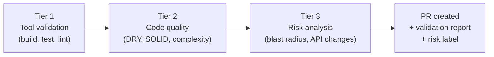

# Evaluation

The evaluation pipeline measures agent performance and feeds learnings back into prompts, memory, and configuration. In MVP, evaluation is manual (inspect PRs and logs). Automated evaluation is built incrementally across iterations.

- **Use this doc for:** understanding what gets evaluated, the tiered validation pipeline, memory effectiveness metrics, and the feedback loop.
- **Related docs:** [MEMORY.md](/architecture/memory) for how evaluation insights are stored, [OBSERVABILITY.md](/architecture/observability) for telemetry data sources, [ORCHESTRATOR.md](/architecture/orchestrator) for prompt versioning in the data model.

## What to evaluate

The evaluation pipeline categorizes task outcomes to identify systemic issues and improvement opportunities:

| Category | Description |
|----------|-------------|
| Reasoning errors | Agent misunderstood the task or made incorrect assumptions |
| Instruction non-compliance | Task spec was clear but agent did not follow it (skipped tests, wrong scope) |
| Missing verification | Agent did not run tests, linters, or document how to verify the change |
| Timeout | Hit 8-hour or idle timeout before completing; partial work may be on the branch |
| Environment failure | GitHub API errors, clone failures, build failures the agent could not recover from |

## Data sources

Evaluation consumes the same data that observability and code attribution capture:

| Source | What it provides |
|--------|-----------------|
| Task outcomes | Status, error message, PR URL, branch state |
| TaskEvents | Audit log: state transitions, step events, guardrail events |
| Agent logs and traces | CloudWatch logs, X-Ray spans, tool calls, reasoning steps |
| Code artifacts | PR description, commits, diff, repo/branch/issue links |
| PR outcome signals | Merged vs. closed-without-merge (via GitHub webhooks). Positive/negative signal on task episodes. |
| Review feedback | PR review comments captured via the review feedback memory loop (see [MEMORY.md](/architecture/memory)) |

## Agent self-feedback

At task end, the platform prompts the agent: *"What information, context, or instructions were missing that would have helped you complete this task more effectively?"* The response is stored in long-term memory with `insight_type: "agent_self_feedback"` and retrieved during context hydration for future tasks on the same repo.

Recurring themes (e.g. "I needed to know this repo uses a custom linter") are surfaced in evaluation dashboards and used to update per-repo system prompts or onboarding artifacts. The cost is a single additional turn per task.

## Prompt versioning

System prompts are treated as versioned, testable artifacts. Each task records the `prompt_version` (SHA-256 hash of deterministic prompt parts) in the task record, enabling correlation: "did merge rates improve after prompt version X?"

- **A/B comparison (planned)** - Run the same task type with two prompt variants and compare outcomes (merge rate, failure rate, token usage). Requires variant assignment, outcome tracking per variant, and a comparison dashboard.
- **Change tracking** - Prompt diffs between versions are reviewable. Versions stored in a versioned store for audit and rollback.

## Memory effectiveness metrics

The primary measure of memory's value: **does the agent produce better PRs over time?**

| Metric | How to measure | Improvement signal |
|--------|----------------|-------------------|
| First-review merge rate | % of PRs merged without revision requests | Increases over time |
| Revision cycles | Average review rounds before merge | Decreases over time |
| CI pass rate on first push | % of PRs where CI passes on initial push | Increases as agent learns build quirks |
| Review comment density | Reviewer comments per PR | Decreases over time |
| Repeated mistakes | Same reviewer feedback across multiple PRs | Drops to zero after feedback loop captures the rule |
| Time to PR | Duration from task submission to PR creation | Decreases as agent reuses past approaches |

**Repeated mistakes** is the most telling metric. If a reviewer says "don't use `any` types" on PR #10 and the agent repeats it on PR #15, the review feedback memory has failed. Detection requires embedding-based similarity between review comments (simple string matching is insufficient). The review feedback extraction prompt normalizes comments into canonical rule forms, and new comments are compared against stored rules via semantic search.

## Tiered validation pipeline

The platform validates agent-created content through three sequential tiers before PR finalization. Each tier targets a different class of defect. Tiers run as post-agent steps in the blueprint execution framework.

### Tier 1 - Tool validation

Deterministic, binary pass/fail signals from the repo's own tooling: test suites, linters, type checkers, SAST scanners, and build verification. Validation commands are discovered during onboarding or configured in the blueprint's `custom_steps`.

**On failure:** Tool output is fed back to the agent for a fix cycle (up to 2 retries). If unresolved, the PR is created with failures documented in the validation report.

### Tier 2 - Code quality analysis

Structural and design quality beyond what linters catch, using a combination of static analysis tools and LLM-based review:

| Dimension | Example finding |
|-----------|----------------|
| DRY violations | "Lines 45-62 in `auth.ts` duplicate logic in `session.ts:30-47`" |
| SOLID violations | "`TaskHandler` handles both validation and persistence - consider splitting" |
| Pattern adherence | "Existing services use repository pattern, but `UserService` queries DynamoDB directly" |
| Complexity | "`processTask` has cyclomatic complexity 18 (threshold: 10)" |
| Naming conventions | "`get_data` uses snake_case but codebase convention is camelCase" |
| Repo-specific rules | "TypeScript `any` type used - repo policy requires explicit types" |

Findings have severity levels: `error` (blocking, triggers fix cycle), `warning`/`info` (advisory, included in PR report). The blocking severity threshold is configurable per repo.

### Tier 3 - Risk and blast radius analysis

Scope, impact, and regression risk of the agent's changes:

| Dimension | Method |
|-----------|--------|
| Change surface area | Files, lines added/removed, modules touched |
| Dependency graph impact | Import/export analysis, downstream consumers of changed code |
| Public API changes | Exported functions, types, interfaces, endpoints, schemas |
| Shared infrastructure | Changes to shared utilities, base classes, CI/CD, config |
| Test coverage gaps | Cross-reference changes with existing test coverage |
| New external dependencies | Additions to package manifests (license, maintenance, security metadata) |

### PR risk level

Every agent-created PR receives a computed risk level:

| Risk level | Criteria | PR behavior |
|------------|----------|-------------|
| Low | Small change, no API changes, high test coverage | Normal PR with `risk:low` label |
| Medium | Moderate surface, some dependents, partial coverage | `risk:medium` label + risk summary |
| High | Large surface, API changes, shared infra, low coverage | `risk:high` label + blast radius report |
| Critical | Breaking API changes, schema modifications, CI/CD changes | `risk:critical` label + optional hold for human approval |

Risk level is stored in the task record and emitted as a `TaskEvent`, enabling trending by repo, user, and prompt version.

The combined output of all three tiers is posted to the PR as a structured validation report (comment or GitHub Check Run).

## Phasing

| Phase | What it adds |
|-------|-------------|
| Current | No automated evaluation. Manual inspection of PRs and logs. |
| Next | Agent self-feedback. Prompt versioning (hash stored with task records). Tiered validation pipeline (Tiers 1-3). PR risk level and validation reports. |
| Later | Review feedback memory loop. PR outcome tracking. Failure categorization. Memory effectiveness metrics. |
| Future | LLM-based trace analysis. A/B prompt comparison. Learned rules from memory in Tier 2. Historical risk correlation in Tier 3. Risk trending dashboards. |
