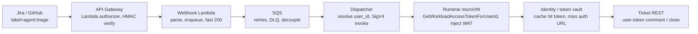

# Identity and authentication — worked examples

ABCA today carries its own inbound identity (Amazon Cognito for the CLI and REST API, HMAC-SHA256 for webhooks) and resolves outbound credentials per integration through hand-rolled Secrets Manager resolvers (`resolve_github_token`, `resolve_linear_api_token`, the new Jira resolver in PR #302). This doc maps each of those integration shapes onto the [Amazon Bedrock AgentCore Identity](https://docs.aws.amazon.com/bedrock-agentcore/latest/devguide/identity.html) primitives: workload identity, the token vault, and the three outbound flows. A contributor adding a new integration can then see which flow to pick and what the wire looks like at each hop. Every code block below is grounded in the [AgentCore developer guide](https://docs.aws.amazon.com/bedrock-agentcore/latest/devguide/identity.html) and the [CreateOauth2CredentialProvider API reference](https://docs.aws.amazon.com/bedrock-agentcore-control/latest/APIReference/API_CreateOauth2CredentialProvider.html); the binding decision for ABCA is captured in [ADR-016](/sample-autonomous-cloud-coding-agents/architecture/adr-016-pluggable-identity-and-auth).

- **Use this doc for:** picking the right outbound flow (USER_FEDERATION / M2M / OBO) for a new integration, reading the principal at each hop of a webhook-triggered async agent, and seeing the Linear before/after the token vault replaces.
- **Related docs:** [SECURITY.md](/sample-autonomous-cloud-coding-agents/architecture/security) for the security boundaries and the shared-PAT limitation, [ADR-016](/sample-autonomous-cloud-coding-agents/architecture/adr-016-pluggable-identity-and-auth) for the two-seam pluggable-auth decision, and the Authentication page (`/using/authentication`) for ABCA's current inbound auth.

## Design principle

**One vault, two seams, three flows.** Inbound identity and outbound credentials are two separate seams. A single token vault holds every outbound credential keyed to `(workload_identity, user_id)`, and exactly three outbound flows cover every integration. Pick the flow from the integration's identity shape, not from the vendor.

## The model in one line

- **One vault.** AgentCore Identity stores every outbound OAuth token in a managed token vault, keyed to `(workload_identity, user_id)`. Client secrets live in Secrets Manager under `arn:aws:secretsmanager:<region>:<account>:secret:bedrock-agentcore-identity!default/oauth2/<provider>*`; user access and refresh tokens live inside the vault with service-managed encryption.
- **Two seams.** Inbound is `SigV4` (default; the end-user identity rides in the `X-Amzn-Bedrock-AgentCore-Runtime-User-Id` header) or a `CUSTOM_JWT` authorizer (`Authorization: Bearer <jwt>`, identity in the `iss`+`sub` claims). They are mutually exclusive per resource and chosen at create time. Workload identity is a first-class non-human subject, not an IAM role: the IAM role still governs AWS-API access, the workload identity governs access to the vault.
- **Three flows.** Outbound is `USER_FEDERATION` (3LO authorization code, user consents in a browser), `M2M` (client_credentials, no user), or `ON_BEHALF_OF_TOKEN_EXCHANGE` (RFC 8693 / RFC 7523, the agent acts as the inbound user against a downstream API).

## ABCA today

The before-state, verified at `origin/main`. Inbound is ABCA's own Cognito and HMAC, not AgentCore's inbound authorizers. Outbound is per-integration Secrets Manager resolvers behind one `resolve_<integration>_token()` shape. The AgentCore workload-access-token path is wired through the whole pipeline but stays dormant.

| Integration | Inbound | Outbound credential | File | Scope |
|---|---|---|---|---|
| CLI / REST API | Cognito User Pool JWT, validated by API Gateway Cognito authorizer; handler reads `sub` as `user_id` | n/a | `using/Authentication.md` | per-user |
| Webhooks (GitHub, Linear, Jira) | HMAC-SHA256, per-integration shared secret in Secrets Manager, Lambda REQUEST authorizer | n/a | `using/Authentication.md` | per-tenant |
| GitHub | n/a | Single shared PAT from Secrets Manager (`GITHUB_TOKEN_SECRET_ARN`), cached in `os.environ["GITHUB_TOKEN"]` | `agent/src/config.py:resolve_github_token()` | one token, all repos and users |
| Linear | n/a | Per-workspace OAuth token (`actor=app`), DDB registry keyed by `linearWorkspaceId` → Secrets Manager, Lambda resolver refreshes within 60s of expiry | `cdk/src/handlers/shared/linear-oauth-resolver.ts` (594 LOC) + `agent/src/config.py:resolve_linear_api_token()` | per-workspace, not per-user |
| Jira (PR #302) | n/a | Per-tenant OAuth 3LO → Secrets Manager, same pattern as Linear | `cdk/src/handlers/shared/jira-oauth-resolver.ts` + `cli/src/jira-oauth.ts` | per-tenant |

**The dormant AgentCore path.** ABCA runs on AgentCore Runtime and the workload-access-token (WAT) propagation path is wired through the whole pipeline but unused. The orchestrator sets `runtimeUserId` on `InvokeAgentRuntimeCommand` (`agentcore-strategy.ts:56`), holds `InvokeAgentRuntimeForUser` (`task-orchestrator.ts:288-289`), and the agent reads the `WorkloadAccessToken` header and re-injects it across the pipeline thread (`server.py:283-310, 387-413`). `bedrock-agentcore` stays in `agent/pyproject.toml` as a vestigial dependency. ADR-016 resumes this path; it does not build from scratch.

> The `agent/src/config.py` comment records why the path is dormant: *"Phase 2.0a (parked) used AgentCore Identity. Phase 2.0b-O2 reads Secrets Manager directly because AgentCore Identity's USER_FEDERATION flow has an open service-side bug."* OBO reached GA in April 2026 across 14 regions, so the post-GA re-validation in ADR-016 Phase 0 is the gate that reopens this path.

## The seams

Who calls whom across the three planes: the credential plane is Identity, the execution plane is Runtime, the tool plane is Gateway. Read top to bottom for one request's path.

| Caller | Callee | API / payload | Credential |
|---|---|---|---|
| Browser / client | Runtime data plane | `POST /runtimes/<escapedArn>/invocations?qualifier=DEFAULT` | SigV4 or Bearer JWT |
| Runtime (internal) | Identity | `GetWorkloadAccessTokenForJWT(workloadName, userToken)` | Service-linked role (`runtime-identity.bedrock-agentcore`) |
| Runtime | Agent process | invocation payload with `WorkloadAccessToken` header | internal |
| Agent (`@requires_access_token`) | Identity | `GetResourceOauth2Token(providerName, workloadIdentityToken, oauth2Flow, scopes, resourceOauth2ReturnUrl?)` | WAT |
| Agent (`@requires_api_key`) | Identity | `GetResourceApiKey(providerName, workloadIdentityToken)` | WAT |
| Agent (as MCP client) | Gateway | `POST /mcp {jsonrpc, method:tools/call}` | Bearer JWT |
| Gateway (internal) | Identity | `GetResourceOauth2Token` per target provider | Gateway service role |
| Gateway | Backend | signed SigV4 or injected Bearer / API key | per target type |

The WAT is the only key the agent needs. Runtime exchanges the inbound JWT for it via `GetWorkloadAccessTokenForJWT`, injects it as the `WorkloadAccessToken` payload header, and the `@requires_access_token` decorator carries it into every outbound vault call. The WAT binds `(workload_identity, end_user_identity)` and is not usable against external APIs. It only buys vault tokens.

## Example A — user-initiated 3LO (GitHub PR assistant)

A user asks the agent to act on their GitHub PRs. The agent needs the user's GitHub identity, so it runs the 3LO authorization-code flow: the user consents once in a browser, AgentCore caches the token keyed to that user, and later invocations hit the cache.

One-time setup creates the credential provider and copies the vault's callback URL into the GitHub OAuth App:

```python
provider = cp.create_oauth2_credential_provider(
    name="github-provider",
    credentialProviderVendor="GithubOauth2",
    oauth2ProviderConfigInput={
        "githubOauth2ProviderConfig": {
            "clientId": GITHUB_CLIENT_ID,
            "clientSecret": GITHUB_CLIENT_SECRET,
        }
    },
)
# Copy provider['callbackUrl'] —
# https://bedrock-agentcore.<region>.amazonaws.com/identities/oauth2/callback/<uuid>
# into the GitHub OAuth App's "Authorization callback URL".
```

The agent function is decorated; the decorator injects `access_token`:

```python
@requires_access_token(
    provider_name="github-provider",
    scopes=["repo", "read:user"],
    auth_flow="USER_FEDERATION",
    on_auth_url=lambda url: stream_to_caller(url),
    force_authentication=False,
)
async def list_my_prs(*, access_token: str):
    # GET https://api.github.com/issues?state=open&filter=created
    # Authorization: Bearer {access_token}
    ...
```

The wire flow, first call (no cached token):

1. Browser sends a Cognito JWT to Runtime.
2. Runtime validates the JWT against `discoveryUrl`, extracts `iss`+`sub`.
3. Runtime calls `GetWorkloadAccessTokenForJWT`, injects the WAT into the agent.
4. The decorator calls `GetResourceOauth2Token(...)`.
5. The vault has no cached token for `(workload, cognito+user123)`, so it returns `{authorizationUrl, sessionUri}`.
6. The decorator invokes `on_auth_url`; the user consents on `github.com`.
7. GitHub redirects to the vault `callbackUrl` with an authorization code; AgentCore exchanges it for access + refresh tokens keyed to `(workload, cognito+user123)`.
8. The poller calls `GetResourceOauth2Token` again with the same `sessionUri` and gets `{accessToken}`. Future invocations return the cached token, refreshing automatically.

> **Namespace your user IDs.** Vault keys are not auto-namespaced by IdP. If two IdPs issue the same `sub`, their tokens collide. Prefix `user_id` yourself: `cognito+user123`, `auth0+user123`. This is the same IdP-namespaced form ABCA uses for log attribution (#245), so token binding and log attribution stay aligned.

## Example B — M2M scheduled job (no user)

A nightly ingest fires from EventBridge at 04:00 UTC. There is no user, so there is no consent step. Use `M2M` (client_credentials): the vault returns an app token immediately and caches it until expiry.

Setup creates a workload identity manually (not Runtime-managed) and a `CustomOauth2` provider for the internal data API:

```python
cp.create_workload_identity(name="nightly-ingest-agent")  # MANUAL, not Runtime-managed

cp.create_oauth2_credential_provider(
    name="data-api-m2m",
    credentialProviderVendor="CustomOauth2",
    oauth2ProviderConfigInput={
        "customOauth2ProviderConfig": {
            "oauthDiscovery": {"discoveryUrl": DATA_API_DISCOVERY_URL},
            "clientId": DATA_API_CLIENT_ID,
            "clientSecret": DATA_API_CLIENT_SECRET,
            "clientAuthenticationMethod": "CLIENT_SECRET_BASIC",
        }
    },
)
```

```python
@requires_access_token(
    provider_name="data-api-m2m",
    scopes=["api:read", "api:ingest"],
    auth_flow="M2M",
)
async def run_nightly_ingest(*, access_token: str):
    # accessToken returned immediately — no consent URL, no poll
    ...
```

The seams differ from 3LO. The SDK calls `GetWorkloadAccessToken(workloadName)` with no `userToken`, using the scheduler host's ambient IAM role; the token binds to the *workload* only. The scheduler role needs `bedrock-agentcore:GetWorkloadAccessToken` on the workload-identity ARN plus `bedrock-agentcore:GetResourceOauth2Token` on the provider ARN.

> **Cognito as an M2M IdP.** A Cognito user pool used for M2M needs `generate_secret=true`, `client_credentials` in `allowed_oauth_flows`, and custom scopes with a resource-server prefix (for example `data-api/read`). `client_credentials` issues no refresh tokens; the vault caches the app token client-side.

## Example C — OBO token exchange (Microsoft Graph)

A user is logged in and the agent calls a downstream API that needs the *user's* identity (Microsoft Graph). Use `ON_BEHALF_OF_TOKEN_EXCHANGE`: the vault exchanges the inbound JWT for a downstream token scoped to that user, not to the agent.

```python
cp.create_oauth2_credential_provider(
    name="graph-obo",
    credentialProviderVendor="MicrosoftOauth2",
    oauth2ProviderConfigInput={
        "microsoftOauth2ProviderConfig": {
            "clientId": GRAPH_CLIENT_ID,
            "clientSecret": GRAPH_CLIENT_SECRET,
            "onBehalfOfTokenExchangeConfig": {"grantType": "JWT_AUTHORIZATION_GRANT"},
        }
    },
)
```

```python
@requires_access_token(
    provider_name="graph-obo",
    scopes=["User.Read", "Mail.Read"],
    auth_flow="ON_BEHALF_OF_TOKEN_EXCHANGE",
)
async def read_user_mail(*, access_token: str):
    # access_token is scoped to the original user, not the agent
    ...
```

**When to pick what.** Use `USER_FEDERATION` when the downstream is a *different* tenant or app and the user must consent there (GitHub, Slack). Use `ON_BEHALF_OF` when the downstream is the *same* identity ecosystem and you want the user's identity to propagate (Microsoft Graph, AWS Identity Center, Okta-native). Use `M2M` when there is no user.

The OBO grant maps to one of two RFCs:

| Axis | RFC 8693 (Token Exchange) | RFC 7523 + Microsoft OBO |
|---|---|---|
| Published | Jan 2020, vendor-neutral, modern | May 2015, older; Microsoft predates 8693 and never migrated |
| Wire grant | `urn:ietf:params:oauth:grant-type:token-exchange` | `urn:ietf:params:oauth:grant-type:jwt-bearer` |
| Inputs | `subject_token` (the who), optional `actor_token` (who is acting) | `assertion` = inbound JWT; auto-appends `requested_token_use=on_behalf_of` |
| AgentCore `grantType` | `TOKEN_EXCHANGE` | `JWT_AUTHORIZATION_GRANT` |

The config field is `grantType`, singular. The nested actor field is `actorTokenContent`, which takes `M2M`, `AWS_IAM_ID_TOKEN_JWT`, or `NONE` and decides delegation versus impersonation. With `M2M` the issued token carries an `act` claim, a nested JWT-in-JWT recording `user ← agent`, so the audit chain stays intact. That is delegation. With `NONE` the issued token looks like the user acted directly and the audit chain is lost. That is impersonation. Pick delegation for agentic systems.

## Example D — ticket-label → async agent

A human creates a ticket and adds a label (`agent:triage` on Jira; the same shape covers the GitHub-issue-label trigger the ABCA team is discussing in #abca). Automation fires a webhook, the agent triages, comments, and maybe closes, acting on the user's behalf where write-back matters. This is the realistic trigger pattern: no interactive browser, identity arrives as webhook payload, and consent happens later when the agent calls back.

The architecture chain:



The dispatcher invokes Runtime with a user-scoped session ID:

```python
agentcore.invoke_agent_runtime(
    agentRuntimeArn=AGENT_RUNTIME_ARN,
    runtimeSessionId=f"jira-{issue_key}-{uuid.uuid4().hex}",  # >= 33 chars
    payload=payload,
    qualifier="DEFAULT",
)
```

The principal at each hop:

| Hop | Authenticated principal | Credential on wire | Trust level |
|---|---|---|---|
| Jira → webhook | `jira:<tenant>` | HMAC-SHA256 of body (shared secret) or Atlassian Connect JWT | tenant proven, user only asserted |
| Webhook Lambda → SQS | Lambda execution role | IAM SigV4 | full AWS trust |
| Dispatcher → Runtime | Dispatcher IAM role (InvokeAgentRuntime + InvokeAgentRuntimeForUser) | SigV4 + X-Amzn-Bedrock-AgentCore-Runtime-User-Id | your org asserts the user |
| Runtime → agent process | Runtime-managed workload identity (SLR) | WorkloadAccessToken payload header | internal |
| Agent → Jira REST | user via 3LO cached token OR workload identity via M2M | Authorization: Bearer <user-token \| service-token> | consent-gated at the real OAuth boundary |

**The honest caveat.** A plain webhook authenticates *the tenant*, not the user. The user identity (`user.accountId`) arrives as *data* in the payload, not as a verifiable credential. A malicious tenant admin could fabricate events. Treat the webhook's authenticated identity and the user identity as two different things and reconcile downstream. The real OAuth consent moment happens when the agent calls the ticket system back, not at the webhook.

Two mitigations:

1. **Prefer a signed app over a plain webhook.** An Atlassian Connect / Forge app receives a JWT signed by Atlassian carrying `sub` = the user account ID, verifiable against Atlassian's keys.
2. **Gate write-back on fresh consent.** If `(workload, user_id)` has no cached token, post a consent URL as a ticket comment and wait. Read-only triage can run under `M2M` with a service account.

**The IAM gate on impersonation.** The dispatcher role needs `bedrock-agentcore:InvokeAgentRuntimeForUser` to send the user header. Keep two IAM statements separate, each with explicit resource ARNs: `InvokeAgentRuntime` invokes as self, `InvokeAgentRuntimeForUser` invokes while asserting a user. A too-broad policy lets any caller act as any user.

> For a headless or batch variant with no user, skip OBO. Run under a manually-created workload identity, configure a service-account OAuth provider with pre-consented scopes, and use `auth_flow="M2M"` against your own IdP. Atlassian Cloud does not expose `client_credentials` to tenant apps, so proxy through a resource server rather than calling Atlassian directly.

## Example E — raw boto3 without the helper

The `@requires_access_token` decorator is convenient, not required. AgentCore Identity is a standalone primitive that works on ECS and Lambda, not only on Runtime. Dropping the decorator means two explicit boto3 calls and rolling your own poller, in exchange for the full agent loop composed with anything else (FastAPI middleware, tracing, durable queues, custom retry). The two implementations below run the same agent code; the delta is who validates the inbound JWT and where the WAT comes from.

**Impl A — ECS Fargate behind an ALB.** A long-lived FastAPI service. Cognito verifies the JWT at the ALB edge; the ECS task role authenticates the Identity calls; the workload identity is created manually and *can* self-vend tokens.

```python
# main.py — ALB already verified the JWT; decode the user and namespace it.
user_id = f"{iss.split('/')[-1]}+{sub}"

# Step 1: exchange the inbound JWT for a WAT (task-role IAM authenticates this call)
wat = identity.get_workload_access_token_for_jwt(
    workloadName=WORKLOAD_NAME, userToken=user_token
)["workloadAccessToken"]

# Step 2: buy the outbound OAuth token
resp = identity.get_resource_oauth2_token(
    workloadIdentityToken=wat,
    resourceCredentialProviderName="github-provider",
    oauth2Flow="USER_FEDERATION",
    scopes=["repo", "read:user"],
    resourceOauth2ReturnUrl=RETURN_URL,
)
if "accessToken" not in resp:
    return {  # first call: send the user to consent
        "authorization_required": True,
        "authorization_url": resp["authorizationUrl"],
        "session_uri": resp["sessionUri"],
    }
# Step 3: run the claude-agent-sdk loop, binding the downstream call as a tool
```

For the M2M variant, swap step 1 for `identity.get_workload_access_token(workloadName)` (no JWT, no user) and set step 2's `oauth2Flow="M2M"`.

**Impl B — same code inside AgentCore Runtime.** Ship the same container as ARM64. Runtime does JWT validation and the WAT exchange for you; the agent lifts the WAT off the request header and goes straight to step 2.

```python
wat = request.headers["WorkloadAccessToken"]  # literal name, no X-Amzn- prefix
resp = identity.get_resource_oauth2_token(workloadIdentityToken=wat, ...)
```

Side by side:

| Axis | Impl A (ECS Fargate) | Impl B (AgentCore Runtime) |
|---|---|---|
| Who validates inbound JWT | your ALB / app code | Runtime via `customJWTAuthorizer` |
| Who calls `GetWorkloadAccessTokenForJWT` | you, via task-role IAM | Runtime, via SLR |
| WAT source | boto3 result (step 1) | `request.headers["WorkloadAccessToken"]` |
| Workload-identity provenance | manually created, self-vendable | auto-created, refuses self-vend |
| Scheduled M2M variant | `GetWorkloadAccessToken` (no user) | wrong substrate — put M2M on ECS / Lambda / Batch |
| Execution-role Identity actions | 5 | 2 (`GetResourceOauth2Token`, `GetResourceApiKey`) |
| Architecture | AMD64 or ARM64 | ARM64 only |

**Picker.** Pick ECS when you want boring: you already have FastAPI + ALB + Cognito, you need full control of cold start, concurrency, and request-response shape, your workloads do not map to an 8-hour sticky microVM session, or AMD64 is a hard constraint. Pick Runtime when you want the platform to do the work: per-session microVM isolation and 8-hour session affinity for free, automatic JWT validation and WAT exchange, you are fine building ARM64, and you want OBO / 3LO / M2M via the decorator or its boto3 equivalents.

The five execution-role Identity actions for Impl A (same list works pre- and post-SLR-cutover): `GetWorkloadAccessToken`, `GetWorkloadAccessTokenForJWT`, `GetWorkloadAccessTokenForUserId`, `GetResourceOauth2Token`, `GetResourceApiKey`, on the workload-identity-directory and token-vault ARNs.

## Linear before/after

**Before (shipped).** Linear is a per-workspace OAuth token in Secrets Manager with manual refresh. `cli/src/jira-oauth.ts`'s sibling, `bgagent linear setup`, runs the Linear 3LO flow with `actor=app` and writes a per-workspace secret keyed by `linearWorkspaceId` in a DDB registry. The Lambda resolver (`cdk/src/handlers/shared/linear-oauth-resolver.ts`, 594 LOC) fetches the secret, refreshes it within 60 seconds of expiry with one-shot refresh-rotation race handling, and writes the new token back. The token is workspace-scoped, not user-scoped.

**After (proposed).** Linear becomes a vault `CustomOauth2` provider reached through `@requires_access_token`. There is no built-in `LinearOauth2` vendor in the `credentialProviderVendor` enum (verified against the bedrock-agentcore-control service model, API version 2023-06-05), so Linear is wired as `CustomOauth2` with Linear's own endpoints. The 594-LOC resolver and its refresh-rotation race handling are replaced by the vault's managed refresh, and tokens isolate per `(workload, user_id)` instead of per workspace.

```python
cp.create_oauth2_credential_provider(
    name="linear-provider",
    credentialProviderVendor="CustomOauth2",
    oauth2ProviderConfigInput={
        "customOauth2ProviderConfig": {
            # Linear has no OIDC discovery doc — set the endpoints explicitly.
            "authorizationEndpoint": "https://linear.app/oauth/authorize",
            "tokenEndpoint": "https://api.linear.app/oauth/token",
            "clientId": LINEAR_CLIENT_ID,
            "clientSecret": LINEAR_CLIENT_SECRET,
            "clientAuthenticationMethod": "CLIENT_SECRET_POST",
        }
    },
)
# Copy provider['callbackUrl'] into the Linear OAuth app's redirect URIs.
```

Linear's authorize URL takes `actor=app` (and `prompt=consent`) to mint app/workspace-actor tokens, matching the `actor=app` flow `linear-oauth-resolver.ts` already runs. Pass these as extra authorization-request parameters. Use `auth_flow="USER_FEDERATION"` for the per-workspace consent:

```python
@requires_access_token(
    provider_name="linear-provider",
    scopes=LINEAR_SCOPES,  # illustrative; set to the scopes your Linear OAuth app grants
    auth_flow="USER_FEDERATION",
    on_auth_url=lambda url: stream_to_caller(url),
)
async def triage_linear_issue(*, access_token: str):
    ...
```

The scope list is illustrative: set it to the scopes configured on your Linear OAuth app. The grounding sources do not fix a specific Linear scope set, so treat the values as a placeholder rather than a verified list.

This is the same `CustomOauth2` shape as the Example B M2M data API, with a 3LO flow instead of client_credentials.

## Gotchas

- **ARM64 only on Runtime.** AMD64-only container images fail to start. ECS and Lambda accept either.
- **JWT inbound callers cannot use boto3.** A `CUSTOM_JWT` authorizer means raw HTTPS with a Bearer token; the SDK boto3 path is SigV4 only.
- **The WAT header name is exactly `WorkloadAccessToken`** with no `X-Amzn-` prefix and no suffix. Any other name is a custom bridge, not AgentCore Runtime.
- **Session IDs must be 33–256 chars.** `runtimeSessionId` rejects short UUIDs; pad it (the `jira-{issue_key}-{uuid}` form in Example D clears the floor).
- **Semantic tool search is create-time only.** Set `protocolConfiguration.mcp.searchType="SEMANTIC"` at Gateway creation; it cannot be toggled later, and it is rate-limited to 25 transactions per minute per account.
- **Runtime-managed workload identities cannot self-vend.** A Runtime auto-created identity refuses to vend its own tokens; M2M needs a manually-created workload identity, so put scheduled jobs on ECS / Lambda / Batch.
- **AgentCore cannot detect out-of-band revocation.** If a token is revoked upstream, use `forceAuthentication=true` on the *first* call of a session to purge and re-consent. Never set it globally, or users loop through consent on every invocation.
- **Microsoft Entra can issue encrypted tokens.** App registrations with confidential optional claims or audience-scoped encryption produce tokens the JWT authorizer cannot decrypt, and it fails silently. Configure the Entra app to issue plain JWTs (v2 with a custom exposed API scope, or v1 with `<application-id>/.default`).
- **OpenAPI Gateway targets are constrained.** Each operation needs an `operationId`; Swagger 2.0 is rejected; only `application/json`, `application/xml`, and form-encoded bodies are accepted.
- **One credential provider per Gateway target.** `credentialProviderConfigurations` is a one-element array by API contract. To expose the same backend with two credential models, create two targets.

## Pricing to budget

| Item | Price | API |
|---|---|---|
| Token-vault fetch | $0.010 / 1,000 | `GetResourceOauth2Token`, `GetResourceApiKey` |
| Gateway ordinary tool call | $0.005 / 1,000 | `tools/call` |
| Gateway semantic search | $0.025 / 1,000 | `x_amz_bedrock_agentcore_search` |
| Gateway tool indexing | $0.02 / 100 tools / month | — |
| WAT exchange | included | `GetWorkloadAccessTokenForJWT` |

Runtime per-session pricing is separate; verify it on the official pricing page (it was sparse at the 2026-05-06 capture).

## Decision tree

Pick the outbound flow with four questions:

1. **Is there a user in the loop?** No → `M2M` (client_credentials, no consent). Yes → continue.
2. **Is the downstream the same identity ecosystem, and do you want the user's identity to propagate?** Yes → `ON_BEHALF_OF_TOKEN_EXCHANGE` (Microsoft Graph, AWS Identity Center, Okta-native). No → continue.
3. **Does the downstream need the user to consent in its own app?** Yes → `USER_FEDERATION` (3LO; GitHub, Slack, Linear via `CustomOauth2`).
4. **Is the vendor in the `credentialProviderVendor` enum?** Yes → use the built-in vendor (`GithubOauth2`, `SlackOauth2`, `MicrosoftOauth2`, `AtlassianOauth2`, …). No → `CustomOauth2` with explicit endpoints or an `oauthDiscovery` URL (this is the Linear case).
