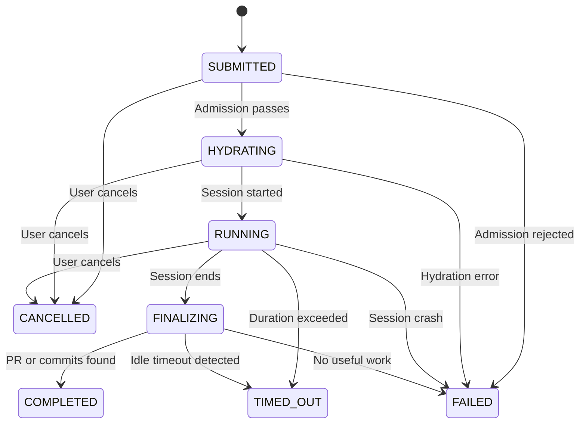
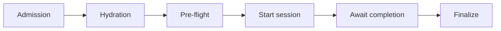
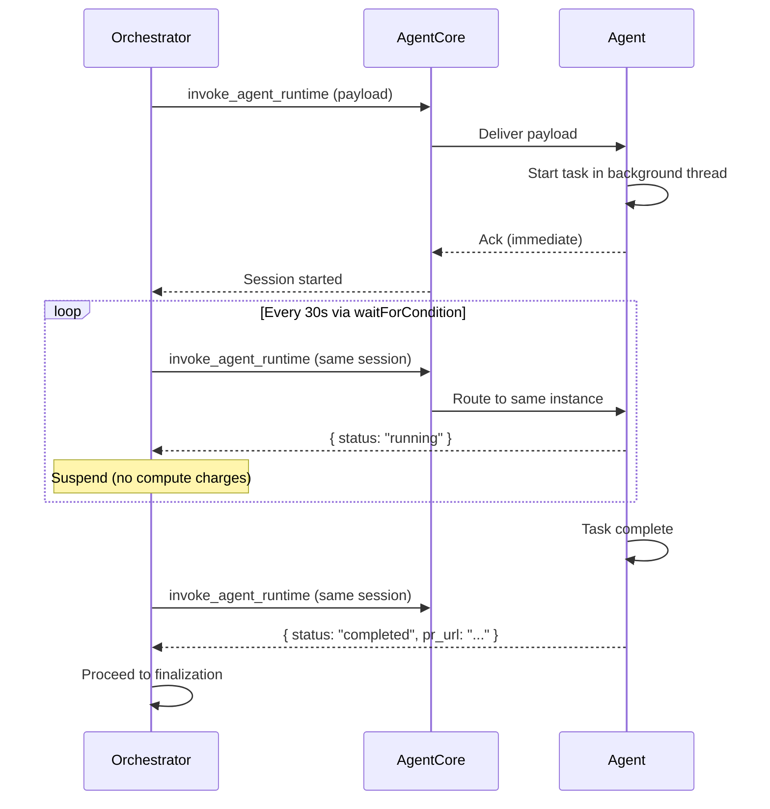

# Orchestrator

The orchestrator drives the task lifecycle from submission to completion. It runs every deterministic step (admission, context hydration, session start, result inference, cleanup) and delegates the non-deterministic step (the agent workload) to an isolated compute session. This separation keeps bookkeeping cheap and predictable while containing the expensive, unpredictable agent work inside the compute environment.

The orchestrator is implemented as a Lambda Durable Function. Durable execution provides checkpoint/replay across process restarts, suspension without compute charges during long waits, and condition-based polling for session completion. See the Implementation section for details.

- **Use this doc for:** task state machine, admission/finalization flow, cancellation behavior, failure recovery, and concurrency management.
- **Related docs:** [ARCHITECTURE.md](/architecture/architecture) for the high-level blueprint model, [COMPUTE.md](/architecture/compute) for the session runtime, [MEMORY.md](/architecture/memory) for context sources, [REPO_ONBOARDING.md](/architecture/repo-onboarding) for per-repo customization.

## API and agent contracts

The orchestrator sits between the API layer and the agent runtime. Changes to task submission, the CLI, or the container image touch these boundaries, so knowing where each contract lives avoids drift.

| Concern | Location | Notes |
|---------|----------|-------|
| REST request/response types | `cdk/src/handlers/shared/types.ts` | Mirror in `cli/src/types.ts` |
| HTTP handlers and orchestration | `cdk/src/handlers/` | Tests under `cdk/test/handlers/` |
| Agent runtime | `agent/src/` (`pipeline.py`, `runner.py`, `config.py`, `hooks.py`, `prompts/`) | See `agent/README.md` for env vars and local run |

## Responsibilities

The orchestrator is deliberately scoped. It handles coordination and bookkeeping but never touches agent logic, compute infrastructure, or memory storage. This clear boundary means a crashed agent does not leave orphaned state, and platform invariants (concurrency limits, event audit, cancellation) cannot be bypassed by agent code.

### What the orchestrator owns

| Responsibility | Description |
|---|---|
| Task lifecycle | Accept tasks, drive them through the state machine to a terminal state, persist state at each transition |
| Admission control | Validate repo onboarding, concurrency limits, rate limits, idempotency |
| Context hydration | Assemble the agent prompt from user input, GitHub data, memory, and repo config |
| Session management | Start the compute session, monitor liveness via heartbeat, detect completion |
| Result inference | Determine success or failure from agent response, DynamoDB record, and GitHub state |
| Finalization | Update status, emit events, release concurrency, persist audit records |
| Cancellation | Stop the session and drive the task to CANCELLED at any point |
| Concurrency | Track per-user and system-wide running task counts with atomic counters |

### What the orchestrator does NOT own

| Component | Owner | Reference |
|---|---|---|
| Request authentication | Input gateway | [INPUT_GATEWAY.md](/architecture/input-gateway) |
| Agent logic (clone, code, test, PR) | Agent runtime | [COMPUTE.md](/architecture/compute) |
| Compute session lifecycle (VM, image pull) | AgentCore Runtime | [COMPUTE.md](/architecture/compute) |
| Memory storage and retrieval | AgentCore Memory | [MEMORY.md](/architecture/memory) |
| Repository onboarding | Blueprint construct | [REPO_ONBOARDING.md](/architecture/repo-onboarding) |

## Task state machine

Every task moves through a finite set of states from creation to a terminal outcome. The state machine is the backbone of the orchestrator: it determines what actions are valid at each point, when resources are acquired or released, and how the platform recovers from failures. Four of the eight states are terminal, meaning the task is done and no further transitions occur.

### States

| State | Description | Duration |
|---|---|---|
| `SUBMITTED` | Task accepted, awaiting orchestration | Milliseconds |
| `HYDRATING` | Fetching GitHub data, querying memory, assembling prompt | Seconds |
| `RUNNING` | Agent session active in compute environment | Minutes to hours |
| `FINALIZING` | Result inference and cleanup in progress | Seconds |
| `COMPLETED` | Terminal. Task finished successfully | - |
| `FAILED` | Terminal. Task could not complete | - |
| `CANCELLED` | Terminal. Cancelled by user or system | - |
| `TIMED_OUT` | Terminal. Exceeded duration or idle timeout | - |

### State transitions

### Transition details

| From | To | Trigger | Condition |
|---|---|---|---|
| `SUBMITTED` | `HYDRATING` | Admission passes | Concurrency slot acquired |
| `SUBMITTED` | `FAILED` | Admission rejected | Repo not onboarded, rate/concurrency limit, validation error |
| `HYDRATING` | `RUNNING` | Hydration complete | `invoke_agent_runtime` returns session ID |
| `HYDRATING` | `FAILED` | Hydration error | GitHub API failure, guardrail blocks content, Bedrock unavailable |
| `RUNNING` | `FINALIZING` | Session ends | Response received or session terminated |
| `RUNNING` | `TIMED_OUT` | Max duration exceeded | Wall-clock timer (default 8h, matching AgentCore max) |
| `RUNNING` | `FAILED` | Session crash | Heartbeat lost (see Liveness monitoring) |
| `FINALIZING` | `COMPLETED` | Success inferred | PR exists or commits on branch |
| `FINALIZING` | `FAILED` | Failure inferred | No commits, no PR, or agent reported error |

### Cancellation

Users can cancel a task at any point. The orchestrator's response depends on how far the task has progressed. The key guarantee: every cancel request either transitions the task to `CANCELLED` or is rejected because the task already reached a terminal state. No task is left in limbo.

| State when cancel arrives | Action |
|---|---|
| `SUBMITTED` | Transition to `CANCELLED`. No cleanup needed. |
| `HYDRATING` | Abort hydration, release concurrency slot, transition to `CANCELLED`. |
| `RUNNING` | Call `stop_runtime_session`, wait for confirmation, release concurrency, transition to `CANCELLED`. Partial work on GitHub remains for the user to inspect. |
| `FINALIZING` | Let finalization complete. Mark `CANCELLED` only if the terminal state was not yet written. |
| Terminal | Reject the cancel request. |

### Timeouts

Multiple timeout mechanisms work together to prevent runaway tasks. Time-based limits (session duration, idle) are enforced by AgentCore; cost-based limits (turns, budget) are enforced by the agent SDK. The orchestrator acts as a safety net when external timeouts fire.

| Type | Default | Effect |
|---|---|---|
| Max session duration | 8 hours | AgentCore terminates session. Task transitions to `TIMED_OUT`. |
| Idle timeout | 15 minutes | AgentCore terminates if agent is idle. See Liveness monitoring. |
| Max turns | 100 (range 1-500) | Agent stops after N model invocations. Configurable per task or per repo. |
| Max cost budget | $0.01-$100 | Agent stops when budget is reached. Per-task or per-repo via Blueprint. |
| Hydration timeout | 2 minutes | Fail the task if context assembly takes too long. |

## Blueprint execution

Every task follows a blueprint: a sequence of deterministic steps wrapping one agentic step. The default blueprint is the sequence described in [ARCHITECTURE.md](/architecture/architecture). Per-repo customization (see [REPO_ONBOARDING.md](/architecture/repo-onboarding)) changes which steps run without affecting the framework guarantees.

### Step 1: Admission control

Validates the task before any compute is consumed. Checks run in order:

1. **Repo onboarding** - `GetItem` on `RepoTable`. If not found or inactive, reject with `REPO_NOT_ONBOARDED`. This runs at the API handler level (`createTaskCore`) for fast rejection.
2. **User concurrency** - Atomic check-and-increment on `UserConcurrency` counter. If at limit (default 3-5), reject.
3. **System concurrency** - Compare total running + hydrating tasks to system limit (bounded by AgentCore quotas).
4. **Rate limiting** - Sliding window counter (10 tasks/hour per user). Exceeded tasks are rejected, not queued.
5. **Idempotency** - If the request includes an idempotency key and a task with that key exists, return the existing task.

On acceptance, the concurrency slot is acquired and the task transitions to `HYDRATING`.

### Step 2: Context hydration

Assembles the agent's user prompt. The implementation lives in `context-hydration.ts`. What it does, by task type:

**`new_task`:** Fetches the GitHub issue (title, body, comments) if `issue_number` is set, loads memory from past tasks, and combines everything with the user's task description.

**`pr_iteration` / `pr_review`:** Fetches PR metadata, conversation comments, changed files (REST), and inline review comments (GraphQL, resolved threads filtered out) in four parallel calls. Extracts `head_ref` and `base_ref` for branch resolution.

Regardless of task type, the assembled prompt is screened through Amazon Bedrock Guardrails for prompt injection (fail-closed: unscreened content never reaches the agent). A token budget (default 100K tokens, ~4 chars/token heuristic) trims oldest comments first when exceeded.

A **pre-flight** sub-step verifies the GitHub token has sufficient permissions for the task type, catches inaccessible PRs, and confirms GitHub API reachability. This fails fast with clear errors like `INSUFFICIENT_GITHUB_REPO_PERMISSIONS` before compute is consumed.

### Step 3: Session start

The orchestrator calls `invoke_agent_runtime` with the hydrated payload. The agent receives it, starts the coding task in a background thread (via `add_async_task`), and returns an acknowledgment immediately. The orchestrator records the `(task_id, session_id)` mapping and transitions to `RUNNING`.

The session ID is pre-generated and reused on retry, making session start idempotent after a crash.

### Step 4: Await completion

The orchestrator polls for completion using `waitForCondition` from the Durable Execution SDK. At configurable intervals (default 30s), it re-invokes on the same session (sticky routing). The agent responds with its current status:

- `running` - Orchestrator suspends until next interval (no compute charges)
- `completed` - Orchestrator resumes to finalization with the result
- `failed` - Same, with error payload

If the session is terminated externally (crash, timeout, cancellation), the poll detects it and the orchestrator proceeds to finalization using GitHub-based result inference as fallback.

### Step 5: Finalization

After the session ends, the orchestrator determines the outcome from multiple signals.

**Completion signals (layered reliability):**

| Layer | Mechanism | Purpose |
|---|---|---|
| Primary | Poll response | Agent returns status directly |
| Secondary | DynamoDB completion record | Agent writes before exiting, survives poll failures |
| Fallback | GitHub inspection | Branch exists? PR exists? Commits? |

**Decision matrix:**

| Agent says | PR exists | Commits | Outcome |
|---|---|---|---|
| success | Yes | > 0 | `COMPLETED` |
| success | No | > 0 | `COMPLETED` (partial, no PR) |
| success | No | 0 | `FAILED` (nothing done) |
| error | Yes | > 0 | `COMPLETED` (with warning) |
| error | No | any | `FAILED` |
| unknown | - | - | `FAILED` |

**Cleanup:** Update task status with metadata (PR URL, cost, duration). Set TTL for data retention (default 90 days). Emit task events. Release concurrency counter. Send notifications. Persist code attribution to memory.

### Step execution contract

Every step in the pipeline satisfies these properties:

- **Idempotent** - Safe to retry after crashes. Context hydration produces the same prompt for the same inputs; session start reuses a pre-generated session ID.
- **Timeout-bounded** - Each step has a configurable timeout to prevent blocking the pipeline.
- **Failure-aware** - Returns `success` or `failed`. Infrastructure failures (throttle, transient errors) trigger exponential backoff retries (default: 2 retries, base 1s, max 10s). Explicit failures transition to `FAILED` without retry.
- **Least-privilege input** - Each step receives only the `blueprintConfig` fields it needs. Custom Lambda steps get credential ARNs stripped.
- **Bounded output** - `StepOutput.metadata` is limited to 10KB. `previousStepResults` is pruned to the last 5 steps to stay within the 256KB checkpoint limit.

### Extension points

Per [REPO_ONBOARDING.md](/architecture/repo-onboarding), blueprints customize execution through three layers:

1. **Parameterized strategies** - Select built-in implementations without code. Example: `compute.type: 'agentcore'` vs `compute.type: 'ecs'`.
2. **Lambda-backed custom steps** - Inject custom logic at `pre-agent` or `post-agent` phases. Example: SAST scan before the agent, custom lint after.
3. **Custom step sequences** - Override the default step order entirely via an ordered `step_sequence` list.

The framework enforces state transitions, event emission, cancellation checks, concurrency management, and timeouts regardless of customization.

## Session management

Agent sessions run for minutes to hours inside isolated compute environments. The orchestrator does not control the agent's behavior, but it needs to know whether the session is alive, healthy, and eventually done. This section covers how the orchestrator maintains that visibility without blocking or burning compute.

### Liveness monitoring

Two mechanisms keep the orchestrator informed about session health:

**DynamoDB heartbeat.** The agent writes `agent_heartbeat_at` every 45 seconds via a daemon thread. The orchestrator applies two thresholds during polling:

- **Grace period** (120s) - After entering `RUNNING`, the orchestrator waits before expecting heartbeats (covers container startup).
- **Stale threshold** (240s) - If the heartbeat exists but is older than this, the session is treated as lost.
- **Early crash** - If no heartbeat is ever set after the combined window (360s), the agent died before the pipeline started.

When the session is unhealthy, the task transitions to `FAILED` with "Agent session lost: no recent heartbeat."

**`/ping` health endpoint.** The agent's FastAPI server responds to AgentCore's `/ping` calls while the coding task runs in a separate thread. AgentCore sees `HealthyBusy` and keeps the session alive.

### The idle timeout problem

AgentCore terminates sessions after 15 minutes of inactivity. Since coding tasks may have long pauses between tool calls (builds, complex reasoning), the agent uses `add_async_task` to register background work. The SDK reports `HealthyBusy` via `/ping` while any async task is active, preventing idle termination.

Risk: if the agent process becomes entirely unresponsive (not just a thread), `/ping` may not respond, triggering termination. The defense is running the coding task in a separate thread that does not starve the main thread.

## Failure modes and recovery

Long-running distributed systems fail. The orchestrator is designed so that every failure mode has a defined recovery path and every task eventually reaches a terminal state. The table below maps each step to its known failure modes and what the orchestrator does about them.

### By pipeline step

| Step | Failure | Recovery |
|---|---|---|
| Admission | DynamoDB unavailable | Retry 3x with backoff, then reject |
| Admission | Concurrency counter drifted | Reconciliation Lambda corrects every 15 minutes |
| Hydration | GitHub API down/rate limited | Retry with backoff. Fail if issue is essential; degrade if user also provided a description |
| Hydration | Memory service unavailable | Proceed without memory (it is enrichment, not required) |
| Hydration | Guardrail blocks content | Fail the task (content is adversarial, no retry) |
| Hydration | Guardrail API unavailable | Fail the task (fail-closed: unscreened content never reaches agent) |
| Session start | `invoke_agent_runtime` throttled | Exponential backoff. Fail after retries exhausted. |
| Session start | Session crashes immediately | Heartbeat never set. Detected after 360s grace window. |
| Running | Agent crashes mid-task | Heartbeat goes stale. Finalization inspects GitHub for partial work. |
| Running | Agent hits turn or budget limit | Session ends normally. Finalize based on what was produced. |
| Running | Idle for 15 min | AgentCore kills session. Task transitions to `TIMED_OUT`. |
| Finalization | GitHub API down | Retry 3x. If still failing, mark `FAILED` with infrastructure reason. |
| Orchestrator | Crash during any step | Durable execution replays from last checkpoint. |

### Recovery mechanisms

1. **Durable execution** - Lambda Durable Functions checkpoints at each state transition and replays after crashes.
2. **Idempotent operations** - All steps are safe to retry.
3. **Stuck-task scanner** - Periodic Lambda detects tasks stuck beyond expected durations and either resumes or fails them.
4. **Counter reconciliation** - Lambda runs every 15 minutes, compares counters to actual running task counts, corrects drift. Emits `counter_drift_corrected` CloudWatch metric.
5. **Dead-letter queue** - Tasks that exhaust retries go to DLQ for investigation.

## Concurrency and scaling

Each task runs in its own isolated compute session with no shared mutable state at the compute layer. The orchestrator manages concurrency purely at the coordination layer: atomic counters track how many tasks are active per user and system-wide, and admission control enforces limits before resources are consumed.

### Capacity limits

| Limit | Value | Source |
|---|---|---|
| `invoke_agent_runtime` TPS | 25 per agent/account | AgentCore quota (adjustable) |
| Concurrent sessions | Account-level limit | AgentCore quota |
| Per-user concurrency | Configurable (default 3-5) | Platform config |
| System-wide max tasks | Configurable | Bounded by AgentCore session limit |

### Counter management

- **UserConcurrency** - DynamoDB item per user with `active_count`. Incremented atomically (`active_count < max`) at admission, decremented at finalization.
- **SystemConcurrency** - Single DynamoDB item, same pattern.

The heartbeat-detected crash path guards against double-decrement by only releasing the counter after a successful state transition. If the transition fails (task already terminal), it re-reads and acts accordingly.

## Implementation

The orchestrator needed a runtime that survives hours-long waits without burning compute, recovers from crashes without losing progress, and expresses the blueprint as readable code rather than a DSL. [Lambda Durable Functions](https://docs.aws.amazon.com/lambda/latest/dg/durable-functions.html) fits all three requirements. The blueprint is written as sequential TypeScript with durable operations (`step`, `wait`, `waitForCondition`). Each operation creates a checkpoint; if the function is interrupted, it suspends without compute charges and replays from the last checkpoint on resumption.

Key properties:
- **No compute during waits.** The orchestrator pays nothing while the agent runs for hours. At 30-second poll intervals over an 8-hour session, total orchestrator compute is minutes.
- **Execution duration up to 1 year.** Far exceeds the 8-hour agent session limit.
- **Sequential code, not a DSL.** The blueprint maps naturally to TypeScript with durable operations. No Amazon States Language or state machine abstractions.
- **Built-in retry with checkpointing.** Steps support configurable retry strategies without re-executing completed work.

### Session monitoring pattern

### Poll cost at scale

| Concurrent tasks | Polls/day (30s, 8h avg) | Peak TPS | Lambda cost/month |
|---|---|---|---|
| 10 | ~9,600 | ~0.3 | ~$0.002 |
| 50 | ~48,000 | ~1.7 | ~$0.01 |
| 200 | ~192,000 | ~6.7 | ~$0.04 |
| 500 | ~480,000 | ~16.7 | ~$0.10 |

At 500 concurrent tasks, peak TPS is ~16.7 - well within the 25 TPS AgentCore quota. The bottleneck is the concurrent session quota, not the poll mechanism.

## Data model

Three DynamoDB tables back the orchestrator: one for task state, one for the audit log, and one for concurrency counters. The Tasks table is the source of truth for every task; the orchestrator reads and writes it at every state transition. TaskEvents is append-only and powers the `GET /v1/tasks/{id}/events` API. UserConcurrency is a lightweight counter table used only during admission and finalization.

### Tasks table (DynamoDB)

| Field | Type | Description |
|---|---|---|
| `task_id` (PK) | String (ULID) | Unique, sortable task ID |
| `user_id` | String | Cognito sub |
| `status` | String | Current state |
| `repo` | String | `owner/repo` |
| `task_type` | String | `new_task`, `pr_iteration`, or `pr_review` |
| `issue_number` | Number? | GitHub issue number |
| `pr_number` | Number? | PR number (required for PR task types) |
| `task_description` | String? | Free-text description |
| `branch_name` | String | `bgagent/{task_id}/{slug}` for new tasks; PR's `head_ref` for PR tasks |
| `session_id` | String? | AgentCore session ID |
| `execution_id` | String? | Durable execution ID |
| `pr_url` | String? | PR URL (set during finalization) |
| `error_message` | String? | Error reason if FAILED |
| `error_code` | String? | Machine-readable error code (e.g. `SESSION_START_FAILED`) |

> **Derived field:** `error_classification` is not stored in DynamoDB. It is computed at API response time by passing `error_message` through the runtime error classifier (`error-classifier.ts`). This returns a structured object with `category` (auth/network/concurrency/compute/agent/guardrail/config/timeout/unknown), `title`, `description`, `remedy`, and `retryable` flag. The derived-field pattern means classifier updates take effect immediately for all existing tasks without data migration.
| `max_turns` | Number? | Turn limit (per-task overrides per-repo default) |
| `max_budget_usd` | Number? | Cost ceiling (per-task overrides per-repo default) |
| `model_id` | String? | Foundation model ID |
| `prompt_version` | String | System prompt hash for evaluation correlation |
| `blueprint_config` | Map? | Snapshot of `RepoConfig` at task creation |
| `cost_usd` | Number? | Agent cost from SDK |
| `duration_s` | Number? | Total duration |
| `ttl` | Number? | DynamoDB TTL (default: created_at + 90 days) |
| `created_at` / `updated_at` | String | ISO 8601 timestamps |

**GSIs:** `UserStatusIndex` (PK: `user_id`, SK: `status#created_at`), `StatusIndex` (PK: `status`, SK: `created_at`), `IdempotencyIndex` (PK: `idempotency_key`, sparse).

### TaskEvents table

Append-only audit log. See [OBSERVABILITY.md](/architecture/observability).

| Field | Type | Description |
|---|---|---|
| `task_id` (PK) | String | Task ID |
| `event_id` (SK) | String (ULID) | Sortable event ID |
| `event_type` | String | `task_created`, `hydration_complete`, `session_started`, `pr_created`, `task_completed`, etc. |
| `timestamp` | String | ISO 8601 |
| `metadata` | Map? | Event-specific data |
| `ttl` | Number | Same retention as tasks |

### UserConcurrency table

| Field | Type | Description |
|---|---|---|
| `user_id` (PK) | String | User ID |
| `active_count` | Number | Running task count |

Increment: `SET active_count = active_count + 1` with `ConditionExpression: active_count < :max`.
Decrement: `SET active_count = active_count - 1` with `ConditionExpression: active_count > 0`.
