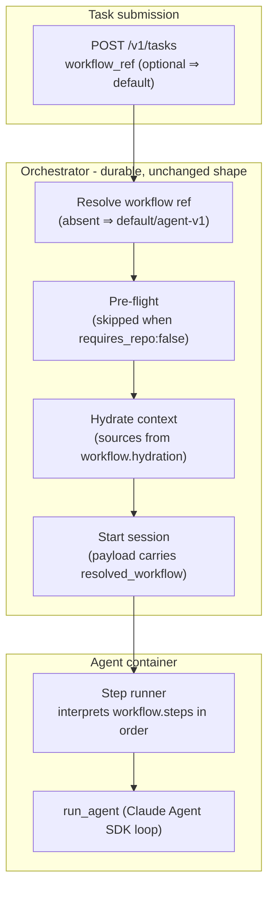

# Workflows (workflow-driven tasks)

A **workflow** is a versioned, declarative document that describes how the agent should execute one *kind* of task: the ordered steps to run inside the container, the system prompt, the agent configuration (tools, MCP servers, skills, plugins, rules, Cedar policy), what context to hydrate, the post-execution gates, and what "done" means. Workflows replaced the hardcoded `task_type` branches that used to be scattered across the Python agent runtime (`pipeline.py`, `post_hooks.py`, `repo.py`, `prompts/`) with a single **step runner** that interprets the workflow file.

The three former task types — `new_task`, `pr_iteration`, `pr_review` — are now first-party workflows (`coding/new-task-v1`, `coding/pr-iteration-v1`, `coding/pr-review-v1`). The `task_type` enum is **removed**; `workflow_ref` is the only task-selection field on the API. New domains (research, document drafting, data analysis) are new workflow files, not new orchestrator branches. A workflow can declare `requires_repo: false`, enabling **repo-optional tasks**: knowledge work with no GitHub clone and no PR scaffolding.

- **Use this doc for:** the workflow file schema, step-kind catalog, the agent-side step runner model, and how a `workflow_ref` flows from API to agent.
- **Related docs:** [ARCHITECTURE.md](/sample-autonomous-cloud-coding-agents/architecture/architecture) for the deterministic-steps-wrapping-one-agentic-step model, [ORCHESTRATOR.md](/sample-autonomous-cloud-coding-agents/architecture/orchestrator) for the durable lifecycle the workflow runs inside, [REPO_ONBOARDING.md](/sample-autonomous-cloud-coding-agents/architecture/repo-onboarding) for the per-repo **Blueprint** (a distinct concept — see [Naming](#naming-workflow-vs-blueprint)), [CEDAR_HITL_GATES.md](/sample-autonomous-cloud-coding-agents/architecture/cedar-hitl-gates) for the policy engine a workflow's `agent_config` feeds, [SECURITY.md](/sample-autonomous-cloud-coding-agents/architecture/security) for tool tiers, and [API_CONTRACT.md](/sample-autonomous-cloud-coding-agents/architecture/api-contract) for the `workflow_ref` wire field.
- **Decision record:** [ADR-014](/sample-autonomous-cloud-coding-agents/architecture/adr-014-workflow-driven-tasks).
- **Tracking issue:** [#248](https://github.com/aws-samples/sample-autonomous-cloud-coding-agents/issues/248). Pairs with the agent asset registry ([#246](https://github.com/aws-samples/sample-autonomous-cloud-coding-agents/issues/246)) and attribution ([#245](https://github.com/aws-samples/sample-autonomous-cloud-coding-agents/issues/245)). Scoped-down, current-architecture track of the broader AKW vision ([#99](https://github.com/aws-samples/sample-autonomous-cloud-coding-agents/issues/99)).

## Background: what workflows replaced

Before #248, the platform supported exactly three task types, fixed at the type level (`TaskType = 'new_task' | 'pr_iteration' | 'pr_review'`) and enforced by an exhaustiveness assert in `validation.ts`. Behavior for each type was not centralized — it was spread across eight Python files in the agent runtime plus a Cedar policy, each branching on the literal string:

| Where | What used to branch on `task_type` |
|---|---|
| `agent/src/models.py` | `TaskType` enum + `is_pr_task` / `is_read_only` properties |
| `agent/src/config.py` | `PR_TASK_TYPES` frozenset; required-input rules (PR ⇒ `pr_number`; else `issue`/`description`) |
| `agent/src/server.py` | duplicate required-input validation on the `/invocations` payload |
| `agent/src/prompts/__init__.py` | `_PROMPTS` lookup table → workflow-fragment injection |
| `agent/src/runner.py` | `PolicyEngine(task_type=...)` — task_type became the Cedar principal |
| `agent/src/repo.py` | branch selection: resume existing branch (PR tasks) vs create new |
| `agent/src/post_hooks.py` | PR finalization: create / push+resolve / resolve-only |
| `agent/src/pipeline.py` | skip safety-net commit and treat build as informational for `pr_review` |
| `agent/policies/hard_deny.cedar` | read-only enforced by literal `Agent::TaskAgent::"pr_review"` |

Adding a fourth task type meant touching all of these. Adding a *non-coding* task type was impossible: every task unconditionally cloned a repo, and the create-task API hard-required an onboarded `repo` (`422 REPO_NOT_ONBOARDED`). "Requires a repo" was an implicit, universal assumption, not a declared property.

Workflows **invert** that model: per-task-type behavior is *data* (a workflow file) interpreted by one generic runner, so new task types — coding or not — are authored, not coded.

## Naming: Workflow vs Blueprint

The platform already uses **Blueprint** for a different concept, and conflating the two would be a costly mistake. The distinction is by *scope*:

| Concept | Scope | Answers | Authored by | Stored as | Lifecycle |
|---|---|---|---|---|---|
| **Blueprint** (existing) | Per **repository** | "How does the platform run tasks *for this repo*?" — compute backend, model, turn/budget limits, GitHub credentials, egress, Cedar policy extensions, poll interval | Operators, via the `Blueprint` CDK construct | `RepoConfig` row in DynamoDB (deploy-time `PutItem`) | CDK deploy |
| **Workflow** (new) | Per **task type** | "What steps does *this kind of task* run?" — ordered steps, system prompt, agent config (tools/MCP/skills/plugins/rules/Cedar), hydration sources, terminal outcomes | Workflow authors / operators | Workflow file (YAML), resolved at task start; published to the registry (#246) in Phase 4 | Versioned + promoted (`draft → validated → production → deprecated`) |

The two compose orthogonally: **a Blueprint pins which Workflows a repo may run**, and a Workflow is repo-agnostic. The same `web_research` workflow runs identically regardless of repo (or with no repo at all); the same `acme/api` Blueprint applies its model and credentials to whichever workflow a task selects.

> **Wire-field note.** Issue #248 names the request field `capability_ref`; the shipped field is **`workflow_ref`** (and recorded metadata is **`resolved_workflow`**) to keep the user-facing vocabulary consistent with "workflow." `workflow_ref` is the single task-selection field — it **replaces** `task_type`, which is removed (see [Replacing `task_type`](#replacing-task-types)). Internally the registry (#246) classifies these artifacts under its `capability` asset *kind*; "workflow" is the ABCA-facing name for a capability of kind `workflow`.

## Concepts



### Workflow file

A versioned document (**YAML** for authoring; validated against a **JSON Schema** — see [Schema](#workflow-file-schema)). It declares identity, domain, repo-dependence, the ordered `steps`, the agent configuration (`agent_config`), the prompt, hydration requirements, and terminal outcomes. (Post-agent gates are expressed as `steps`, not a separate `post_hooks` list — see the note under [the schema](#workflow-file-schema).) Workflow files live under `agent/workflows/<domain>/<id>.yaml` in the container image for first-party workflows, and are resolvable from the registry (#246) for published ones.

### Step runner

A new agent-side component (`agent/src/workflow/runner.py`) that loads the resolved workflow and executes its `steps` list in order, dispatching each step kind to a deterministic handler or to the agentic `run_agent` loop. It replaces the inline `if task_type ==` checks. A step failure surfaces exactly as today: terminal `FAILED` with a structured error and the failing step recorded on task metadata.

### Domain & `requires_repo`

Two declared properties drive admission and scaffolding defaults:

- **`domain`** — `coding` | `knowledge` | `hybrid`. Sets sensible defaults (a `coding` workflow defaults `requires_repo: true`; `knowledge` defaults `false`) and tags the task for cost/eval segmentation.
- **`requires_repo`** — the explicit switch. When `false`, the orchestrator skips repo onboarding enforcement and GitHub pre-flight, hydration assembles from `task_description` + attachments + declared sources instead of issue/PR fetches, and the step runner skips `clone_repo` and any PR-finalization steps.

> **Repo-optionality is a wider refactor than it looks** — `repo` is a *required* field today across `CreateTaskRequest`, `TaskRecord`, `TaskSummary`, `TaskDetail` (TS) and the agent's `TaskConfig.repo_url` validator. Making it optional therefore touches ~6 TS interfaces + their mappers, the agent config validator, and the ECS bootCommand (`repo_url=p.get("repo_url","")`). Three platform assumptions also break and must be handled, not deferred: (1) **memory actorId** is `repo` today (`memory.py`) — a repo-less task has no actor namespace and will fail without a fallback (per-user or per-workflow); (2) the agent **SessionRole tenant tags** include `repo`; (3) `deliver_artifact` needs a defined S3 bucket, key scheme (`task_id`-scoped), IAM grant, and size limit. These are tracked in [Open questions](#open-questions) and are the real cost of Phase 3 — the phasing table's one-line "API + CLI" entry understates them deliberately for brevity, not because they're small.

## Workflow file schema

A workflow file has the following top-level fields. (Full machine-readable schema: `agent/workflows/schema/workflow.schema.json`, referenced by the Python loader and a CDK synth-time validator.)

| Field | Type | Req | Purpose |
|---|---|---|---|
| `id` | string | ✓ | Stable identity, `"<domain>/<name>-v<major>"` (e.g. `coding/new-task-v1`). |
| `version` | string (semver) | ✓ | Immutable per published version. Pinned by ref / Blueprint. |
| `domain` | enum | ✓ | `coding` \| `knowledge` \| `hybrid`. Drives admission defaults + eval tags. |
| `description` | string | – | One-line natural-language summary, read by humans **and** by an agent selecting a workflow. Powers registry search / `bgagent workflow list` (#246). Distinct from `prompt` (machine-facing). |
| `guidance` | string | – | Optional longer "how to use this workflow" note (patterns, examples, constraints) surfaced at discovery time, not injected into the agent prompt. |
| `requires_repo` | boolean | – | Mandatory GitHub clone / PR finalization. Default from `domain`. |
| `read_only` | boolean | – | Agent may not mutate the working tree (sets `context.read_only` for the Cedar Write/Edit hard-deny, drops `Write`/`Edit` from `allowed_tools`, and skips safety-net commit). Default `false`. |
| `prompt` | object | ✓ | `{ template: <inline string \| registry ref>, placeholders: [...] }`. The system-prompt fragment injected into the base template. |
| `hydration` | object | ✓ | Which context sources to assemble: any of `issue`, `pull_request`, `memory`, `attachments`, `urls`, `task_description`. Repo-less workflows omit `issue`/`pull_request`. |
| `agent_config` | object | ✓ | Everything that shapes the SDK session: `{ tier, model?, allowed_tools, mcp_servers, cedar_policy_modules, skills, plugins, subagents, prompt_fragments }`. Asset kinds mirror the [#246](https://github.com/aws-samples/sample-autonomous-cloud-coding-agents/issues/246) registry vocabulary. See [Agent configuration: the three planes](#agent-configuration-the-three-planes). `tier`+`allowed_tools` required; the rest optional. `skills`/`plugins`/`subagents`/`prompt_fragments` are **registry-resolved (Phase 4)** — declared now, ignored by the runner until #246. |
| `agent_config.model` | object | – | Optional preferred Bedrock model `{ id, allow_task_override? }` — see [Model selection](#model-selection). A *suggestion*, bounded by the repo Blueprint / platform allow-list and per-task budget; omit to inherit the default. |
| `repo_config` | object | – | How this workflow relates to a **source-control repository**: `{ provider (default github), discover (default true), ignore: [claude_md\|rules\|subagents\|settings\|mcp] }`. `provider` is a VCS abstraction (see [VCS provider abstraction](#vcs-provider-abstraction)); `discover`/`ignore` gate config discovered from the cloned repo (`CLAUDE.md`, `.claude/`, `.mcp.json`). Must be `discover:false` (and `provider` is N/A) when `requires_repo:false`. |
| `steps` | Step[] | ✓ | Ordered pipeline phases (see [Step kinds](#step-kinds)). |
| `required_inputs` | object | – | Validation contract, e.g. `{ one_of: [issue_number, task_description] }` or `{ all_of: [pr_number] }`. Replaces the scattered required-input checks. |
| `terminal_outcomes` | object | ✓ | What "done" *produces* — `pr_url` \| `review_posted` \| `artifact` \| `comment`. Records the expected artifact; it does **not** override success inference (see [Success inference](#success-inference-and-terminal-outcomes)). |
| `limits` | object | – | `{ max_turns, max_budget_usd }` defaults (per-task / per-repo still override, per [override precedence](/sample-autonomous-cloud-coding-agents/architecture/repo-onboarding#override-precedence)). |
| `promotion_gate` | object | – | The check contract a version must pass to reach `production` (see [Promotion is earned, not set](#promotion-is-earned-not-set)). `{ requires: [<check ids>] }` — pre-#236 a concrete test target (`tests:agent/new_task`); post-#236 an eval id (`eval:web-research-quality`). Optional until #236; absent ⇒ test-tier fallback. |
| `status` | enum | ✓ | `draft` \| `validated` \| `production` \| `deprecated`. Only `production` resolves for normal tasks. |

> `post_hooks` (named in issue #248) is **reserved and not interpreted** — the schema pins it to empty. Post-agent gates are authored as `steps` (`verify_build`, `ensure_pr`, `deliver_artifact`, …) to avoid two ways to express the same thing with undefined precedence.

### Step kinds

Steps are the unit the runner interprets. Each has a `kind`, an optional `name`, and kind-specific fields. The catalog is **extensible** — new kinds register a handler in the runner.

| Step kind | Side | Purpose | Notes |
|---|---|---|---|
| `clone_repo` | deterministic | Clone + `mise trust`/`install` + initial build/lint; select branch | Forbidden when `requires_repo:false`. Replaces `setup_repo`. |
| `hydrate_context` | deterministic | Assemble prompt from declared `hydration` sources | Mostly done orchestrator-side; this step consumes the `HydratedContext` payload. |
| `run_agent` | agentic | The Claude Agent SDK loop with the workflow's prompt + `agent_config` | Exactly one per workflow. Today only one `run_agent` is ever called (`pipeline.py`), so this is an emergent property the schema now *promotes to an enforced constraint*; multi-agent loops are out of scope (#99). |
| `verify_build` | deterministic | Run `mise run build`; gate or inform | Gating declared per step via `gate` (see below). `read_only` workflows treat result as informational. Forbidden when `requires_repo:false`. |
| `verify_lint` | deterministic | Run `mise run lint` | Optional gate (`gate` field, see below); advisory unless declared. |
| `ensure_pr` | deterministic | Create / push+resolve / resolve-only a PR | Strategy chosen by step config (`create` \| `push_resolve` \| `resolve`), replacing the `post_hooks.ensure_pr` task_type branch. |
| `post_review` | deterministic | Post a GitHub review (Reviews API) | For review workflows (e.g. `coding/pr-review-v1`). |
| `deliver_artifact` | deterministic | Upload a produced artifact (S3) / post a comment | Repo-less terminal delivery for knowledge work. |

Each step declares `on_failure: fail | continue | skip_remaining` (default `fail`) so the runner's error behavior is explicit and matches today's fail-closed default.

**The `gate` field (`verify_build` / `verify_lint`).** A verify step declares how its result affects the task verdict: `strict` (any failure gates), `regression_only` (gates only when the check was passing before the agent ran and fails after — the default when unset, matching the legacy pipeline behavior), or `informational` (never gates). A `read_only` workflow never gates regardless of `gate`. The semantics live in exactly one place — `gate_status` in `agent/src/workflow/runner.py` — used by both lanes (#301): the repo-less lane through the runner's `verify_*` step handlers, and the coding lane through the inline post-hook resolution (`pipeline._apply_post_hook_gates`), which consults each declared step's `gate` and `on_failure` (`continue`/`skip_remaining` steps are advisory for the verdict, matching the runner). On the coding lane an *undeclared* `verify_lint` never gates (the legacy behavior — lint is advisory unless a workflow opts in by declaring the step), and the inline ordering is preserved: `ensure_pr` still runs after a gating verify failure so the agent's work surfaces as a reviewable PR even when the task is marked failed. Routing the coding post-hooks bodily through the runner's step handlers (which would stop *before* `ensure_pr` on a gating failure) is the broader runner unification deferred out of #301's scope.

### Example: shipped coding workflow (`new_task`)

```yaml
id: coding/new-task-v1
version: 1.0.0
domain: coding
description: Implement a GitHub issue or free-text task and open a pull request.
requires_repo: true
read_only: false
prompt:
  template: registry://prompt/coding-new-task-workflow   # or inline string
  placeholders: [repo_url, task_id, workspace, branch_name, default_branch, max_turns, setup_notes, memory_context]
hydration:
  sources: [issue, memory, task_description]
agent_config:
  tier: standard
  allowed_tools: [Bash, Read, Write, Edit, Glob, Grep, WebFetch]
  cedar_policy_modules: [builtin/hard_deny, builtin/soft_deny]
repo_config:
  provider: github          # the only implemented provider today; named explicitly so multi-provider is non-breaking later
  discover: true            # load the repo's CLAUDE.md / .claude/rules / .mcp.json and layer agent_config on top
required_inputs:
  one_of: [issue_number, task_description]
steps:
  - { kind: clone_repo,     name: setup }
  - { kind: hydrate_context, name: context }
  - { kind: run_agent,      name: implement }
  - { kind: verify_build,   name: build, gate: regression_only }
  - { kind: ensure_pr,      name: open_pr, strategy: create }
terminal_outcomes: { primary: pr_url }
limits: { max_turns: 100 }
promotion_gate: { requires: [tests:agent/new_task] }   # concrete test target; becomes eval:new_task once #236 lands
status: production
```

### Example: non-coding reference workflow (`web_research`, repo-optional)

```yaml
id: knowledge/web-research-v1
version: 1.0.0
domain: knowledge
description: Research a topic from a description and attachments; deliver a cited summary artifact. No repo required.
requires_repo: false        # ← no clone, no PR scaffolding
read_only: false
prompt:
  template: registry://prompt/web-research-workflow
  placeholders: [task_description, memory_context, min_sources]
hydration:
  sources: [task_description, attachments, urls, memory]
agent_config:
  tier: elevated
  allowed_tools: [Read, WebFetch]
  mcp_servers: [registry://mcp/web-search-v1]   # Phase 4
  cedar_policy_modules: [builtin/hard_deny, builtin/soft_deny]
  skills: [registry://skill/research-synthesis-v1]   # Phase 4 — ignored until #246
repo_config:
  discover: false           # no repo to discover config from
required_inputs:
  all_of: [task_description]
steps:
  - { kind: hydrate_context,  name: context }
  - { kind: run_agent,        name: research }
  - { kind: deliver_artifact, name: deliver, target: s3_and_comment }
terminal_outcomes: { primary: artifact }
limits: { max_turns: 25, max_budget_usd: 5 }
promotion_gate: { requires: [eval:web-research-quality] }   # min-sources / citation-quality eval
status: production
```

This second example is the **target shape** for repo-less execution — the acceptance criterion it proves is that a task runs end-to-end with no `repo`: `attachments` + `task_description` are sufficient, no `clone_repo`/`ensure_pr` steps run, and the terminal outcome is a delivered artifact/comment rather than a PR. **This path is implemented (#248 Phase 3):** the create-task boundary admits a repo-less submission, the pipeline branches to a repo-less flow that drives `hydrate_context → run_agent → deliver_artifact` through the workflow runner, and the two platform assumptions that gated it are **decided** (ADR-014 addendum 2026-06-08):

- **Memory actorId** → per-user `user:{cognito_sub}` fallback when `repo` is absent ([Open questions](#open-questions) #1, resolved). No schema field. The agent writes the episode to the `user:{user_id}` namespace; the orchestrator hydration reads it back.
- **Artifact delivery** → `deliver_artifact.target` names a registered Python deliverer (`agent/src/workflow/deliverers.py`); the `s3` deliverer uploads the agent's result text to `artifacts/{task_id}/result.md` (SessionRole `s3:PutObject` grant scoped to `artifacts/${task_id}/*`, 5 MiB cap), surfaced on `TaskDetail.artifact_uri`; the `comment` deliverer records a `delivered_comment` milestone (visible via `bgagent watch`). Rendering that milestone to an external channel (Slack/email/GitHub) is not yet wired — it is not in the fan-out's `ROUTABLE_MILESTONES` — so the S3 artifact is the load-bearing deliverable today ([Open questions](#open-questions) #2, resolved).

## The agent-side step runner

Per [ADR-014](/sample-autonomous-cloud-coding-agents/architecture/adr-014-workflow-driven-tasks), the runner is **agent-side**: it lives in the container and interprets `workflow.steps`. The orchestrator's durable shape (`admission-control → pre-flight → hydrate-context → start-session → await-agent-completion → finalize`) is unchanged — the workflow drives *what happens inside* the `RUNNING` state, not the platform lifecycle. This keeps the blast radius off durable orchestration and matches the issue's "executes steps in order *inside the container*."

```python
# agent/src/workflow/runner.py  (shape, not final code)
def run_workflow(workflow: Workflow, config: TaskConfig, hc: HydratedContext) -> WorkflowResult:
    ctx = StepContext(config=config, hydrated=hc, workflow=workflow)
    for step in workflow.steps:
        handler = STEP_HANDLERS[step.kind]          # registry of kind → handler
        progress.write_agent_milestone(f"step:{step.name or step.kind}:start")
        outcome = handler(step, ctx)                # deterministic or wraps run_agent
        ctx.record(step, outcome)
        if outcome.failed and step.on_failure == "fail":
            return WorkflowResult.failed(step, outcome)   # terminal FAILED + structured error
    return WorkflowResult.from_outcomes(ctx, workflow.terminal_outcomes)
```

`pipeline.run_task` becomes a thin caller: resolve the workflow, build config + system prompt from it, then `run_workflow(...)`. The existing helpers (`setup_repo`, `run_agent`, `verify_build`, `ensure_pr`, `post_*`) become step handlers rather than inline calls — minimal logic change, maximal structural change. The `_PROMPTS` lookup and `PR_TASK_TYPES` frozenset are deleted; their semantics move into workflow fields (`prompt`, `requires_repo`/`read_only`).

### Step execution semantics

The step runner runs inside the compute substrate, which is **not** a throwaway container: AgentCore provides persistent session storage — a per-session filesystem at `/mnt/workspace` that survives stop/resume cycles (14-day TTL, see [COMPUTE.md](/sample-autonomous-cloud-coding-agents/architecture/compute)) — and the Claude Agent SDK supports resuming a prior session by its session UUID (the runner already captures that UUID from the first `ResultMessage`). So the durability model the runner should target is **resume from where the workflow stopped**, not replay from the beginning. The runner is designed resume-aware from the start so the structured "steps" become the natural checkpoint boundaries:

- **Step completion is checkpointed; resume skips completed steps.** The runner records each step's outcome to a small `workflow_state.json` on the persistent mount (`/mnt/workspace`) as it goes. On resume (orchestrator re-invokes the same session, or — when shipped — a replacement worker rehydrates from the [S3-backed SDK session store](#relationship-to-portable-resume)), the runner reads that checkpoint, **skips already-completed deterministic steps** (`clone_repo` need not re-clone a populated `/workspace`; a completed `verify_build` is not re-run), and **resumes the agent loop** via the persisted SDK session UUID rather than restarting it from turn 0. This is the same property the orchestrator already relies on for session start being idempotent (pre-generated, reused session id).
- **Side-effecting steps remain idempotent.** Independent of resume, `clone_repo`, `ensure_pr`, `post_review`, and `deliver_artifact` must tolerate a partial prior run (a resume can re-enter the step that was in flight when the worker died). Each documents its idempotency key — PR branch, review id, artifact S3 key = `task_id` — so re-entry reconciles rather than duplicates (today's `ensure_pr` already does this: it checks `gh pr view` before creating).
- **`on_failure: continue` is forbidden after side effects** (validation rule 10). A failed `ensure_pr` (commits pushed, PR-create failed) must not reach a *succeeded* terminal — committed work with no PR and no compensation. `continue` is permitted only for non-side-effecting, advisory steps (e.g. an informational `verify_lint`). `skip_remaining` ends the workflow cleanly and runs terminal-outcome resolution against whatever completed; `fail` (default) is terminal `FAILED`.
- **Granularity boundary.** Resume is *workflow-step granular on the agent side*, not a new orchestrator-side durable checkpoint per step — the orchestrator still treats the whole session as one `await-agent-completion` step, so platform invariants stay agent-external ([ADR-014](/sample-autonomous-cloud-coding-agents/architecture/adr-014-workflow-driven-tasks)). What changes versus today is that the agent-side runner makes its *own* progress recoverable across a stop/resume, which today's monolithic `run_task` does not.

#### Relationship to portable resume

This depends on two capabilities, one shipped-in-preview and one planned — the design assumes the first and is forward-compatible with the second:

| Capability | Status | What the runner uses it for |
|---|---|---|
| Persistent session storage (`/mnt/workspace`, survives stop/resume) | Shipped (preview) — COMPUTE.md | Holds `workflow_state.json` checkpoint + the populated workspace so a resumed session skips completed work. |
| Claude Agent SDK session resume (by session UUID) | SDK feature; UUID already captured by the runner | Resume the agent loop mid-task instead of from turn 0. |
| S3-backed SDK session store (`task_id` ↔ session UUID, portable transcript) | **Planned** — [GitHub issues](https://github.com/aws-samples/sample-autonomous-cloud-coding-agents/issues) | Resume on a *different* worker (e.g. after node loss), not just the same session. The workflow checkpoint should live alongside the session transcript so the two resume together. |

Until the S3 session store lands, resume is bounded to what persistent session storage + same-session re-invoke provide; a total worker loss still re-runs from step 0 (mitigated by step idempotency above). When it lands, the workflow checkpoint rides with the session transcript and resume becomes worker-portable. Per-step *compensation/rollback* of completed side effects is a non-goal for this issue — called out so it is a recorded decision, not an oversight.

### Agent configuration: the three planes

A Claude Agent SDK session here is shaped by more than tools — it loads **skills, plugins, subagents, rules/prompt-fragments, MCP servers, settings, and Cedar policy**. Today these arrive from two places: the agent's own code (`runner.py` hardcodes `allowed_tools`; `setting_sources=["project"]`) and the **cloned repo** (`prompt_builder.discover_project_config` reads `CLAUDE.md`, `.claude/rules/*.md`, `.claude/agents/*.md`, `.claude/settings.json`, `.mcp.json`). A workflow adds a third plane. The model is three layers, lowest-to-highest precedence — deliberately parallel to the existing platform/repo/task [override precedence](/sample-autonomous-cloud-coding-agents/architecture/repo-onboarding#override-precedence):

| Plane | Source | What it carries | Precedence |
|---|---|---|---|
| **Blueprint** (per-repo) | `RepoConfig` (CDK) | compute, model, credentials, egress, repo Cedar extensions | lowest |
| **Workflow** (`agent_config`, per-task-type) | the workflow file | `tier`, `allowed_tools`, `mcp_servers`, `cedar_policy_modules`, and (Phase 4) `skills`, `plugins`, `subagents`, `prompt_fragments` | middle |
| **Repo-discovered** (`repo_config`) | the cloned repo's `.claude/` + `.mcp.json` | repo-specific rules, subagents, MCP, settings | highest (repo wins for repo-specific guidance) |

The mechanisms in `agent_config` map 1:1 onto the **#246 registry asset kinds** (capability/skill/plugin/mcp_server/prompt_fragment/cedar_policy_module), so a workflow is the first concrete consumer of that vocabulary. Two boundaries:

- **What ships in #248 vs Phase 4.** `tier`/`allowed_tools`/`cedar_policy_modules` and *builtin* `mcp_servers` (e.g. the existing Linear server) are interpreted by the runner in Phases 1–3. `skills`, `plugins`, `subagents`, `prompt_fragments`, and `registry://` refs are **declared in the schema now but ignored by the runner until the registry (#246) can resolve them** — they are forward-declarations, not Phase-1 behavior. The schema marks each accordingly.
- **A workflow can gate repo-discovered config.** `repo_config.discover` (default `true`) loads the repo's `.claude/`/`.mcp.json` and layers `agent_config` underneath it; `repo_config.ignore: [settings, mcp, ...]` opts out of specific sources (e.g. a locked-down workflow that refuses repo `.mcp.json`, or a knowledge workflow with `discover:false` because there's no repo). This is why repo-less workflows must set `discover:false` (validation rule).
- **`subagents` does not lift the single-`run_agent` invariant.** They are SDK-internal delegations within the one agent loop, not additional top-level agent steps; multi-agent workflows remain out of scope (#99).

#### Model selection

A workflow may declare a preferred Bedrock model via `agent_config.model`, because model fit is genuinely task-type-specific (a cheap model for triage, a stronger one for implementation). But the workflow's choice is a **suggestion, not an authority** — it sits in the middle of the existing model-resolution precedence and is bounded on both sides:

| Source | Role | Precedence |
|---|---|---|
| Platform / repo **Blueprint allow-list + `model_id`** | What models the account/repo permits and its default | bounds + lowest default |
| **Workflow `agent_config.model.id`** | Preferred model for this task type | middle |
| **Per-task override** (if the API exposes one) | Caller's explicit choice | highest, unless `allow_task_override:false` |

Resolution rules: the workflow's `model.id` is validated against the platform/Blueprint **allow-list at the create-task boundary** — an unpermitted id **fails admission** rather than silently downgrading (consistent with fail-closed elsewhere). The per-task `max_budget_usd` still caps spend regardless of model. A workflow that omits `model` inherits the Blueprint/platform default exactly as today (`model_id` flows through the existing payload). This keeps model choice expressible per task type without letting a workflow file escalate to an unapproved or unaffordable model.

### VCS provider abstraction

Everything repo-related in ABCA today is **GitHub-specific**: `repo` is an `owner/repo` slug, auth is a GitHub token secret, the agent shells out to `gh`, pre-flight checks GitHub permissions, and "done" means a GitHub **PR**. That is fine for today, but baking "GitHub" into the workflow vocabulary would make multi-provider support a breaking change later. So the schema is **provider-neutral from the start**: `repo_config.provider` is an enum (`github` today; `gitlab`, `bitbucket`, `codecommit`, `generic_git` reserved), and the workflow's repo-touching steps name *provider-neutral intents*, not GitHub operations.

The mapping from intent → provider implementation lives behind a **`VcsProvider` interface** (a platform concern, not a per-workflow one), so a workflow stays the same across providers:

| Provider-neutral concept (workflow) | GitHub impl (today) | Future impl (e.g. GitLab) |
|---|---|---|
| `clone_repo` step | `git clone` + `gh auth` | `git clone` + GitLab token |
| `ensure_pr` step → "open a change proposal" | `gh pr create` / Pull Request | Merge Request |
| `post_review` step → "post a review" | GitHub Reviews API | MR discussions/approvals |
| `terminal_outcomes.primary: pr_url` | PR URL | MR URL |
| repo permission pre-flight | GitHub GraphQL `viewerPermission` | provider equivalent |
| token | `github_token_secret_arn` (Blueprint) | provider token secret |

Scope discipline for #248: **`github` is the only implemented provider** — adding others is explicitly out of scope and is its own issue. What #248 buys is the *naming*: the schema field exists, `ensure_pr`/`post_review`/`pr_url` are understood as the GitHub realization of generic "change proposal" / "review" / "proposal URL" concepts, and the agent-side handlers dispatch through a `VcsProvider` seam rather than calling `gh` inline. The validator rejects any `provider` other than `github` for now (a clear "not yet implemented" error, not a silent fallback). This is a low-cost forward-compatibility investment: name the abstraction now, implement one backend, avoid a schema/contract break when a second provider is funded.

### Replacing the Cedar principal

Read-only is enforced by Cedar hard-deny rules. **As of #248 Phase 2a** these key off the `context.read_only` attribute (`read_only_forbid_write`, `read_only_forbid_edit`), not a principal literal — and `read_only: true` *also* makes the runner drop `Write`/`Edit` from the SDK `allowed_tools` list. Two layers:

- **Defense in depth.** `read_only: true` makes the runner drop `Write`/`Edit` from `allowed_tools` *and* sends `context.read_only == true` on every Cedar request — closing the earlier gap where read-only was enforced only by a Cedar string-match on the principal, not by the tool list.
- **Property-keyed enforcement (security-relevant — was precise, not hand-waved).** Read-only enforcement attaches to the *property*, not a per-task-type literal: the principal keeps the legacy `Agent::TaskAgent::"<id>"` identity scheme (audit/attribution only), while the two hard-deny rules forbid `Write`/`Edit` **whenever `context.read_only == true`**. So the deny applies uniformly to *every* read-only workflow — not just `coding/pr-review` — and there is no literal a new read-only workflow could fail to match. This was a deliberate, recorded behavior change (see [ADR-014](/sample-autonomous-cloud-coding-agents/architecture/adr-014-workflow-driven-tasks) addendum 2026-06-08), gated by the `contracts/cedar-parity/` fixtures (`read-only-forbid-write`, `read-only-forbid-edit`, `read-only-false-permits-write`) run against *both* the `cedarpy` and `cedar-wasm` engines.

  This is the migration step where an error *silently weakens* enforcement (the rule stops matching) rather than failing loudly. The original plan was to ship it as an isolated PR ahead of the Phase 2b workflow migrations; because 2b shipped first behind a `read_only ⇒ "pr_review"` principal bridge (so read-only was never unprotected), Phase 2a instead removes that bridge and lands the property-keyed rules + parity fixtures together on the #248 branch. See the ADR-014 addendum and [Phasing](#phasing).

**Policy floor (no privilege escalation by config).** `agent_config` and its `cedar_policy_modules` are author-supplied, so the schema/validator must enforce a floor rather than trusting the file:

- Built-in **hard-deny is always on** and not selectable (per [CEDAR_HITL_GATES.md](/sample-autonomous-cloud-coding-agents/architecture/cedar-hitl-gates)).
- Built-in **soft-deny (`builtin/soft_deny`) is mandatory** for any workflow that can write (`read_only: false`); a workflow may *add* modules but may not drop the soft-deny floor. Removing it (e.g. to suppress the force-push / write-credentials HITL gates) requires an admin-approved exception, not a field edit. (Validation rule added below.)
- `tier: elevated` + `read_only: false` + a permissive `allowed_tools` (or an `mcp_servers`/`plugins`/`skills` set granting reach) is exactly the shape that warrants governance — see [Authorship & governance](#authorship--governance). `tier` is the ceiling: the validator rejects an `agent_config` whose declared reach exceeds its `tier`.

Registry-sourced `cedar_policy_modules` / `mcp_servers` are trusted content loaded at task start, same as blueprint-supplied Cedar policies today; the `initial_approvals` re-validation at HYDRATING (CEDAR_HITL_GATES.md) still applies.

### Authorship & governance

A workflow file selects the agent's tool surface and policy posture, so **who may publish a `production` workflow is a trust decision, not a convenience**. Per [ADR-003](/sample-autonomous-cloud-coding-agents/architecture/adr-003-contribution-governance), publishing or promoting a first-party workflow follows the same issue → approval → review → merge path as any code change — a workflow YAML in `agent/workflows/**` is reviewed like code, and the synth-time validator (the [validation rules](#validation-rules)) is a required CI gate. When the registry (#246) makes workflows publishable out-of-band, publish/promote ACLs are Cedar-governed per #246 Phase 3; until then, the only way a `production` workflow exists is through a reviewed merge. The `description`/`guidance` discovery fields are author-controlled free text; when they feed an agent's workflow-*selection* context (Phase 4), they are treated as untrusted-external input and screened like other hydrated content.

## Wire contract: `workflow_ref` from API to agent

`workflow_ref` travels the path `task_type` does today and **replaces it** at each boundary (see ORCHESTRATOR.md "API and agent contracts"); the touch points:

| Layer | File | Change |
|---|---|---|
| REST types | `cdk/src/handlers/shared/types.ts` | **Remove** `task_type`/`TaskType`; add `workflow_ref?: string` to `CreateTaskRequest`/`TaskRecord` and `resolved_workflow?: { id, version }` to `TaskRecord`/`TaskDetail`/`TaskSummary` (+ mappers). |
| CLI types | `cli/src/types.ts` | Mirror exactly — drop `TaskType`, add `workflow_ref`/`resolved_workflow` (sync-checked in CI). |
| CLI flag | `cli/src/commands/submit.ts` | Add `--workflow <id>[@<constraint>]`; rework `--pr`/`--review-pr` to set `workflow_ref` (+`pr_number`) instead of a `task_type`. |
| Validation | `cdk/src/handlers/shared/validation.ts` | **Delete** `VALID_TASK_TYPES`/`isValidTaskType` + the exhaustiveness assert; add `isValidWorkflowRef`; relax `isValidRepo`/`hasTaskSpec` when the resolved workflow has `requires_repo:false`. |
| Create core | `cdk/src/handlers/shared/create-task-core.ts` | Apply [resolution order](#replacing-task-types) → falls through to `default/agent-v1`; bypass `REPO_NOT_ONBOARDED` for repo-less; validate `agent_config.model.id` against the allow-list; persist `workflow_ref` + `resolved_workflow` (no `task_type`). |
| Orchestrator | `cdk/src/handlers/orchestrate-task.ts` | Guard `runPreflightChecks` (skip when `requires_repo:false`). |
| Pre-flight | `cdk/src/handlers/shared/preflight.ts` | **Net-new:** add a `requires_repo` parameter and early-return `{ passed: true, checks: [] }` for repo-less tasks. Drop the `taskType` parameter (permission level now comes from the resolved workflow). |
| Hydration | `cdk/src/handlers/shared/context-hydration.ts` | Replace the `isPrTaskType` branch with workflow-driven hydration; repo-less branch assembles from `task_description`/attachments; memory actorId fallback for no-repo. |
| Payload | orchestrator `hydrateAndTransition` | Replace the `task_type` payload field with `resolved_workflow`. |
| ECS strategy | `cdk/src/handlers/shared/strategies/ecs-strategy.ts` | Swap `task_type=p.get(...)` for `resolved_workflow=p.get(...)` in the hand-built `run_task(...)` kwargs string. Must move in lockstep with `run_task`'s signature. AgentCore (`agentcore-strategy.ts`) needs no change — it delivers the full payload wholesale. |
| Agent | `agent/src/pipeline.py` (`run_task` signature), `config.py`, `server.py`, `models.py`, `prompts/`, new `agent/src/workflow/` | Remove the `TaskType` enum / `_PROMPTS` / `task_type` params; parse `resolved_workflow`; load workflow file; run step runner. |

**Resolution lives at the API/create-core boundary** (the same place that validates `task_type` today), so the orchestrator and agent always receive a fully-resolved `{ id, version }`. The agent loads the pinned file from the image (Phase 1–3) or registry bundle (Phase 4). Recording `resolved_workflow` on task metadata satisfies the audit/eval acceptance criterion.

## Replacing task types

This work **removes** the `task_type` enum; it is not preserved as a legacy alias. After this change, `workflow_ref` is the only task-selection field. This is an intentional **breaking API change** — acceptable because the platform is pre-1.0 (per [ORCHESTRATOR.md](/sample-autonomous-cloud-coding-agents/architecture/orchestrator), the API surface is not frozen) and because carrying a dual `task_type`/`workflow_ref` surface would defeat the whole point of centralizing per-task-type behavior in one place.

What is removed, repo-wide:

- The `TaskType` union and its exhaustiveness assert (`cdk/src/handlers/shared/validation.ts`), the `TaskType` mirror in `cli/src/types.ts`, and the `task_type` field on `CreateTaskRequest`/`TaskRecord`/`TaskDetail`/`TaskSummary` (replaced by `workflow_ref` + `resolved_workflow`).
- The Python `TaskType` enum (`agent/src/models.py`), `PR_TASK_TYPES`, the `_PROMPTS` lookup, and every `if task_type ==` branch — their semantics move into workflow fields (`prompt`, `requires_repo`, `read_only`, the `steps` list).
- The Cedar `Agent::TaskAgent::"<task_type>"` principal scheme (see [Replacing the Cedar principal](#replacing-the-cedar-principal)).

**Resolution order (there is always a workflow).** Because there's no `task_type` to fall back to, `create-task-core` resolves to exactly one workflow from a short ladder, first match wins:

1. **Explicit `workflow_ref`** (the issue's `capability_ref` is just this field's #248 name) → resolve that ref + constraint.
2. **A Blueprint-configured default** (Phase 4) → if the repo's Blueprint pins a `default_workflow`, use it.
3. **The platform default workflow** → `default/agent-v1` (below).

So a submission with no `workflow_ref` lands on the repo default or the platform default — never coerced into the heavyweight `new_task` (clone + build + open-PR) path that the old `task_type` default implied.

**Migration for callers.** Existing callers that send `task_type` must move to `workflow_ref`. The mapping is one-to-one and published in [API_CONTRACT.md](/sample-autonomous-cloud-coding-agents/architecture/api-contract): `new_task → coding/new-task-v1`, `pr_iteration → coding/pr-iteration-v1`, `pr_review → coding/pr-review-v1`. The CLI's `--pr <n>` / `--review-pr <n>` flags are reworked to set `workflow_ref` (plus `pr_number`) instead of inferring a `task_type`; `--workflow <id>[@<constraint>]` is the general form. Because each migrated workflow must pass its promotion gate (see [Promotion is earned, not set](#promotion-is-earned-not-set)) before shipping, functional fidelity of the three coding paths is verified by tests/eval — but it is a *goal*, not a hard constraint: where a migrated workflow deliberately does the *right* thing differently from today (e.g. tighter read-only enforcement), that divergence is a recorded decision in the migration PR, not a regression to avoid.

### The default workflow (`default/agent-v1`)

The platform ships one minimal fallback workflow: **run the user's request through the agent and deliver the result, with no assumptions about repos, PRs, or builds.** It is the safe lowest-common-denominator when no other workflow is selected.

```yaml
id: default/agent-v1
version: 1.0.0
domain: hybrid
description: Run the user's request through the agent and deliver the result. Minimal default — no repo, build, or PR assumptions.
requires_repo: false        # no clone; if a repo is supplied it is hydrated as context, not scaffolded
read_only: false
prompt:
  template: registry://prompt/default-agent-workflow
  placeholders: [task_description, memory_context, max_turns]
hydration:
  sources: [task_description, attachments, memory]
agent_config:
  tier: standard
  allowed_tools: [Read, Glob, Grep, WebFetch]   # conservative; no Bash/Write/Edit by default
  cedar_policy_modules: [builtin/hard_deny, builtin/soft_deny]
repo_config:
  discover: false
required_inputs:
  all_of: [task_description]
steps:
  - { kind: hydrate_context,  name: context }
  - { kind: run_agent,        name: respond }
  - { kind: deliver_artifact, name: deliver, target: s3_and_comment }
terminal_outcomes: { primary: artifact }
limits: { max_turns: 30 }
promotion_gate: { requires: [tests:agent/default] }
status: production
```

Design choices, deliberately conservative because this runs when *nothing* was specified:

- **`requires_repo: false`, `tier: standard`, a read-leaning tool set** (`Read/Glob/Grep/WebFetch`, no `Bash`/`Write`/`Edit`). The default must not silently mutate a filesystem or push code on a submission that never asked for it; a caller who wants coding selects (or maps to) a coding workflow. `builtin/soft_deny` is still mandatory (it's `read_only:false` so a future tool addition stays gated).
- **One agentic step, deliver via `s3_and_comment`** (primary outcome `artifact`). The S3 upload to `artifacts/{task_id}/` is the always-retrievable deliverable — the default often runs for `api`-origin tasks that have no notification channel — while the comment milestone is recorded for the event stream (external-channel rendering of `delivered_comment` is not yet wired; see [Open questions](#open-questions) #2).
- **Reached only by the resolution fallback** — it is the last rung of the [resolution ladder](#replacing-task-types), used when no `workflow_ref` and no Blueprint default apply.
- It is a real, governed, promotion-gated workflow like any other (not a hardcoded escape hatch), so its behavior is auditable and overridable per-repo via the Blueprint default.

## Registry integration (#246)

Workflows are the first concrete consumer of the agent asset registry. Alignment:

- A workflow is a registry asset of **kind `capability`** (registry vocabulary) surfaced to users as a "workflow." Its `descriptor` carries the tool surface, egress domains, Cedar actions, and minimum compute profile that #246 requires at publish time.
- **Phasing matches #246:** filesystem-backed workflows shipped in the container image first (Phases 1–3), registry-resolved workflows with semver pinning later (Phase 4). The `resolve` contract (`ref + constraint → pinned {id, version}`) is the same one #246 defines; ABCA resolves at the create-task boundary and records the pin.
- **Blueprint references workflows (Phase 4).** The `Blueprint` construct gains an allow-list of workflow refs a repo may run, pinned by constraint — the integration point #246 Phase 2 describes.

Until #246 lands, resolution is a static lookup over the image's `agent/workflows/` tree; the resolver interface is designed so the registry backend is a drop-in replacement (mirroring the unmerged `RegistryService` ABC on `origin/merge/akw-integration`, scoped down — no LTM `CapabilityIndex`, no Mem0, no meta-agents).

## Validation rules

Enforced at author time (CDK synth / CI lint over `agent/workflows/**`) and at resolution time:

1. `id` matches `^[a-z][a-z0-9-]*/[a-z][a-z0-9-]*-v\d+$`; `version` is valid semver; the two are consistent (`-vN` ↔ major `N`).
2. Exactly one `run_agent` step (current single-agentic-step invariant).
3. `requires_repo:false` ⇒ no `clone_repo`, `ensure_pr`, `post_review`, `verify_build`, or `verify_lint` steps; `hydration.sources` excludes `issue`/`pull_request`.
4. `read_only:true` ⇒ `agent_config.allowed_tools` excludes `Write`/`Edit`; no `ensure_pr` with `strategy: create|push_resolve`.
5. **Policy floor:** `read_only:false` ⇒ `agent_config.cedar_policy_modules` includes `builtin/soft_deny` (and always-on `builtin/hard_deny`). Dropping the soft-deny floor requires an admin-approved exception, not a field edit (see [Replacing the Cedar principal](#replacing-the-cedar-principal)).
6. **Tier ceiling:** the declared reach of `agent_config` (tools, `mcp_servers`, `plugins`, `skills`) may not exceed its `tier` (`standard` < `elevated`; `read-only` excludes mutating tools).
7. **Repo-config gating:** `requires_repo:false` ⇒ `repo_config.discover` is `false` and `repo_config.provider` is absent (no repo to clone or discover from).
8. Every step `kind` has a registered handler; every `cedar_policy_module` / `mcp_server` / `skill` / `plugin` / `subagent` / `prompt_fragment` ref resolves (builtin now; Phase 4: against the registry).
9. `required_inputs` is satisfiable from the declared `hydration.sources`.
10. Only one `production` version per workflow **id lineage** (the `<domain>/<name>` part, ignoring the `-vN`/semver); promotion to `production` auto-deprecates the previous production version of that lineage (matching the registry promotion contract).
11. `terminal_outcomes.primary` is consistent with the steps (e.g. `pr_url` requires an `ensure_pr` step; `artifact` requires a `deliver_artifact` step).
12. A side-effecting step (`ensure_pr`, `post_review`, `deliver_artifact`) may not declare `on_failure: continue` (see [Step execution semantics](#step-execution-semantics)).
13. **Model allow-list:** `agent_config.model.id`, if set, is on the platform/Blueprint allow-list (checked at the create-task boundary; unpermitted ⇒ admission failure, not silent downgrade).
14. **VCS provider:** `repo_config.provider` must be `github` until other backends are implemented; any other value is a clear "provider not yet supported" error.

> The `id`/`version` consistency (`-vN` ↔ semver major) in rule 1 and the cross-field rules above are checked by the **loader/validator**, not by JSON Schema alone (Schema validates each field's shape; the conditional `allOf` blocks cover rules 3–4 and 7).

### Single source of truth and validator parity

A workflow file is validated on more than one side of the platform (CDK synth-time over `agent/workflows/**`, the Python runtime loader, and — Phase 4 — registry publish), so without discipline the cross-field rules would be re-implemented per side and **drift** — the same `(workflow file) → (valid? / which error)` hazard the repo already learned the hard way with the two Cedar engines (see the cedar-parity note in `CLAUDE.md` / [CEDAR_HITL_GATES.md](/sample-autonomous-cloud-coding-agents/architecture/cedar-hitl-gates) §15.6). The defense is deliberately the same:

1. **The JSON Schema is the one canonical *shape* contract.** `agent/workflows/schema/workflow.schema.json` is the single artifact for field shape and for the schema-expressible conditionals (rules 3, 4, 7 via `allOf`). Both sides consume *that same file* through a standard library — `ajv` in TypeScript at synth, `jsonschema`/`check-jsonschema` in Python at load — so shape validation is never re-implemented, only re-run.
2. **The cross-field rules are implemented once, at author/CI time — not duplicated at runtime.** Rules not expressible in JSON Schema (1, 2, 5, 6, 8, 9, 11, 12, 13, 14) live in a **single validator module** that runs at CDK synth / CI lint over `agent/workflows/**`. In Phases 1–3 every workflow is a first-party file baked into the image and already cleared by that CI gate, so the **runtime Python loader performs only JSON-Schema shape validation** (defense-in-depth against a corrupt bundle) and *trusts* the CI-gated cross-field verdict rather than re-deriving it. There is therefore exactly **one** cross-field implementation in Phases 1–3, eliminating the drift surface before it exists.
3. **A golden corpus locks any future second implementation to parity.** When Phase 4 adds an out-of-band publish path that must validate cross-field rules in a *second* language (registry publish, likely Python), the two implementations are pinned by `contracts/workflow-validation/` — a fixture set of workflow files each annotated with its expected verdict (`valid`, or a specific failing rule id), run against **every** validator implementation in CI. This is exactly the `contracts/cedar-parity/` mechanism applied to the workflow validator, and it is the only thing that catches cross-language drift that per-side unit tests miss. The corpus ships **from Phase 1** (against the single TS validator) so the expected-verdict contract is fixed *before* a second implementation can diverge from it.

So: JSON Schema = canonical shape, consumed not copied; cross-field rules = one implementation until Phase 4 forces a second, at which point the golden corpus is the contract both must satisfy. The validator is a required CI gate (see [Authorship & governance](#authorship--governance)).

## Promotion is earned, not set

`status: production` is not a label an author flips — it is a state a version *earns* by passing its declared `promotion_gate`. This makes the promotion lifecycle (`draft → validated → production → deprecated`) a machine-checked quality gate rather than a human's say-so, and it slots directly onto the existing [tiered validation pyramid](/sample-autonomous-cloud-coding-agents/architecture/adr-013-tiered-validation-pyramid):

| Workflow status | Gate that must pass | Validation tier (ADR-013) |
|---|---|---|
| `draft → validated` | Schema valid; static [validation rules](#validation-rules) pass | Tier 0–1 (synth/CI lint over `agent/workflows/**`) |
| `validated → production` | The `promotion_gate.requires` checks pass | Tier 2–3 (handler/agent tests now; #236 E2E + eval harness later) |
| `production → deprecated` | Auto-triggered when a newer version of the same workflow **id lineage** (`<domain>/<name>`) reaches `production` | — |

The gate verifies the workflow does the *right* thing — not that it reproduces today's behavior byte-for-byte (see [Replacing `task_type`](#replacing-task-types)).

**Bootstrapping (be honest about it).** The full vision — a behavioral eval per workflow — depends on the eval harness in [#236](https://github.com/aws-samples/sample-autonomous-cloud-coding-agents/issues/236), which does not exist yet. So the "earned, not set" guarantee lands in stages, and **for the phases that ship first (1–2) the gate is the existing test suite, not an eval**:

- **Now (pre-#236):** a check id resolves to a concrete CI target — e.g. `tests:agent/new_task` runs the existing `agent/tests` + handler suite against the workflow runner. This is a real, machine-checked gate (not a phantom), just a weaker one than an eval. A `production` promotion whose `tests:` target is red fails CI.
- **Later (post-#236):** the same `promotion_gate.requires` entry is swapped to an `eval:` id; the workflow file changes, the runner does not.
- **If `promotion_gate` is omitted entirely:** promotion falls back to the test tier and is gated by human review in the promoting PR. This is the one case where promotion is partly a human's say-so — and it is the exception, flagged here rather than hidden.

Where a migration deliberately changes behavior, the gate's expected output is updated alongside the change as a recorded decision. New non-coding workflows declare their own check (e.g. `web-research` → a minimum-sources / citation-quality eval once #236 exists).

## Success inference and terminal outcomes

`terminal_outcomes` declares what a workflow is *expected to produce*; it does not replace the agent's deliberately-defensive success model. Today `_resolve_overall_task_status` (`pipeline.py`) keys success off the agent SDK result status plus the build gate, and explicitly refuses to infer success from PR/build presence when the SDK never emitted a `ResultMessage` (so a crashed agent that happens to have left a branch is not reported `COMPLETED`). That refusal stays. `terminal_outcomes` layers on top as the *artifact* check, not a replacement:

- **`pr_url` / `review_posted`** — agent status is authoritative; the terminal outcome is the artifact the orchestrator's existing finalization decision matrix (ORCHESTRATOR.md) already inspects (PR exists? commits?). No change to that matrix.
- **`artifact` (repo-less)** — there is no PR/branch to fall back on, so success = agent status `success`/`end_turn` **and** the `deliver_artifact` step recorded a delivered artifact (S3 key present). If the agent reports success but no artifact was delivered, the task is `FAILED` (nothing produced) — the repo-less analog of "success, no commits, no PR ⇒ FAILED."
- **`comment`** — success = agent status success **and** the comment post succeeded.

The point: `terminal_outcomes` makes "what counts as done" declarative *per workflow* without weakening the existing guard against false-positive completion.

## Observability & metadata

- `resolved_workflow: { id, version }` is persisted on the `TaskRecord` and returned in `TaskDetail` — for audit, eval correlation (alongside `prompt_version`), and cost segmentation by `domain`.
- The step runner emits a `step:<name>:start` / `step:<name>:complete` milestone per step boundary via the existing `progress_writer` (free-form milestone strings — no schema change to `TaskEventsTable`).
- On failure, the failing step `name`/`kind` is recorded in the structured error, so terminal `FAILED` states are attributable to a step.
- **Pulling a bad workflow version:** because resolution pins `{id, version}` at submit time and `production` is single-winner per id lineage, a regressed version is withdrawn by promoting a fixed version (auto-deprecating the bad one) or by marking it `deprecated`; in-flight tasks keep their pinned version, new tasks get the replacement. No data migration (mirrors the `error_classification` derived-field pattern).

## Phasing

Adapted from the issue's phases (the issue framed Phase 1 as a `task_type` *alias*; per the decision to remove `task_type`, the `workflow_ref` wire change and the enum removal move earlier and are explicit):

| Phase | Deliverable | Primary files |
|---|---|---|
| 0 | This design doc + [ADR-014](/sample-autonomous-cloud-coding-agents/architecture/adr-014-workflow-driven-tasks) + JSON Schema + step-runner skeleton | `docs/design/WORKFLOWS.md`, `docs/decisions/`, `agent/workflows/schema/` |
| 1 | Step runner + `default/agent-v1` + migrate `new_task` to a workflow file; introduce `workflow_ref` and **remove the `task_type` enum** end-to-end (API/CLI/agent); the single workflow validator + `contracts/workflow-validation/` golden corpus | `agent/src/workflow/`, `agent/workflows/coding/new-task-v1.yaml`, `cdk/src/handlers/`, `cli/src/`, `contracts/workflow-validation/` |
| 2b | Migrate `pr_iteration`, `pr_review` onto workflows behind a `read_only ⇒ "pr_review"` principal bridge (read-only stays enforced by the existing literal rules throughout) | `agent/workflows/coding/*`, `agent/tests/` |
| 2a | **Cedar property-keyed read-only migration** — literal `"pr_review"` hard-deny → `context.read_only == true` rules (`read_only_forbid_write/edit`), threaded via `context.read_only`; removes the 2b bridge; adds `read-only-*` `contracts/cedar-parity/` fixtures verified on *both* engines. (Originally planned as an isolated PR ahead of 2b; reordered after 2b shipped first behind the bridge — see [ADR-014](/sample-autonomous-cloud-coding-agents/architecture/adr-014-workflow-driven-tasks) addendum.) | `agent/policies/`, `cdk/src/handlers/shared/builtin-policies.ts`, `contracts/cedar-parity/`, `agent/src/policy.py`, `agent/src/workflow/loader.py` |
| 3 | Repo-optional `web_research` workflow (the repo-optional refactor — see [the requires_repo note](#domain--requiresrepo)) | `cdk/src/handlers/`, `agent/workflows/knowledge/` |
| 4 | Registry-native workflows (#246); Blueprint workflow allow-list + `default_workflow`; inline/repo-local for dev | depends on #246 |

## Out of scope

Per #248, the following remain out of scope (deferred to #99 / separate issues): meta-agents that *generate* workflows at runtime (ToolBuilder/BlueprintBuilder), Mem0 / alternate memory backends and the LTM `CapabilityIndex`, full replacement of Cedar tool-level HITL with event rules (#230), auto-spawning child tasks for unknown workflows, and multi-`run_agent` (multi-agent) workflows.

## Open questions

These are genuine forks; the repo-optional items (1–2) were **prerequisites for Phase 3** and have been **resolved as recorded decisions in the [ADR-014](/sample-autonomous-cloud-coding-agents/architecture/adr-014-workflow-driven-tasks) addendum (2026-06-08)**, with the one implied schema reshape applied — so the Phase-0 schema is now **frozen**. They are kept here (struck-through) for traceability.

1. ~~**Memory actorId for repo-less tasks.**~~ **RESOLVED (ADR-014 addendum):** per-user `actorId = user:{cognito_sub}` (caller-scoped, no cross-tenant bleed; mirrors the per-user trace prefix). Cross-workflow knowledge pooling is explicitly not adopted. **No schema field added** (fixed platform fallback, not author-configurable) — a Phase-3 `memory.py` change keys on `user:{user_id}` when `repo` is absent. Coordinate with [MEMORY.md](/sample-autonomous-cloud-coding-agents/architecture/memory).
2. ~~**Artifact delivery contract.**~~ **RESOLVED (ADR-014 addendum):** `deliver_artifact.target` is an **open string naming a registered Python deliverer** (`workflow/deliverers.py` → `DELIVERERS`), not a closed enum — new delivery methods are registered deliverers, not schema changes. Shared plumbing is **pinned**: task-scoped key `artifacts/{task_id}/`, a prefix-scoped SessionRole IAM grant, a per-artifact size limit, and `TaskDetail` URL surfacing; the SessionRole `repo` tenant tag gains a `workflow:{id}` repo-less form. Each deliverer declares the outcomes it `produces`; validator rule 11 consults that registry. Implementations land in Phase 3; only the contract is frozen here.
3. **Inline vs registry-only refs.** Should dev-time tasks accept an *inline* workflow body in the request (sandboxed, never `production`), or only refs? Leaning ref-only for production with an inline escape hatch gated behind a feature flag.
4. **Hydration ownership for steps.** `hydrate_context` is largely orchestrator-side today (and appears as both an orchestrator box and a step in the [Concepts](#concepts) diagram — intentionally, pending this decision). Keep it orchestrator-side with the step as a no-op consumer, or move source-specific fetching (esp. repo-less `urls`) into agent-side handlers? Current lean: orchestrator hydrates declared sources; the agent step only consumes.
5. **Tool-level vs step-level budgets.** `limits` is workflow-level. Once `agent_config.mcp_servers` are real (Phase 4), the more useful altitude is likely a **per-tool / per-MCP-server budget** rather than a per-step budget — an MCP tool with unbounded cost is a bigger risk than an over-long step. Deferred to the registry phase; lean per-tool.

## Prior art

This design is a scoped-down reconciliation of the unmerged AKW port on `origin/merge/akw-integration`. That branch already ports a YAML registry, `Blueprint`/`ToolEntry` models, a `resolve_task()` contract, and nine example blueprints. We adopt its proven *data shapes* — per-file YAML structure, `task_mode` → our `domain` + `requires_repo`, `read_only`, the `draft → validated → production → deprecated` promotion lifecycle, and the `RegistryService` resolver interface — and **drop** what overshoots #248: the LTM `CapabilityIndex`, Mem0, `quality_checkpoints`, meta-agents, and multi-agent loops. The resolver interface is kept so #246's registry backend is a drop-in replacement for the filesystem one.

Two refinements layered on top of that port are worth calling out, because they shape the schema:

1. **Discovery is separate from execution.** A workflow carries optional `description` / `guidance` fields — a human- and agent-readable selection surface for registry search and workflow-selection (#246) — kept distinct from the machine-facing `prompt`.
2. **Promotion is earned, not set** — see [Promotion is earned, not set](#promotion-is-earned-not-set). `production` is gated by a declared `promotion_gate`, reusing the [ADR-013](/sample-autonomous-cloud-coding-agents/architecture/adr-013-tiered-validation-pyramid) validation pyramid rather than being a label an author flips.
