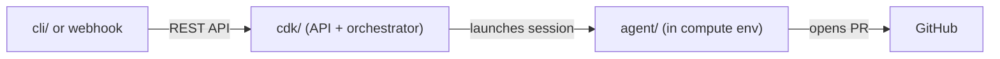

The repository is a monorepo with four packages. Each one owns a piece of the platform and has its own build, tests, and mise tasks.

```
sample-autonomous-cloud-coding-agents/
├── cdk/          # Infrastructure and API (TypeScript, AWS CDK)
├── agent/        # Agent runtime (Python, Docker)
├── cli/          # CLI client (TypeScript, commander)
├── docs/         # Documentation site (Astro/Starlight)
├── mise.toml     # Monorepo task runner config
└── package.json  # Yarn workspace root
```

A task flows through these packages in order: the **CLI** (or webhook) sends a request to the **CDK**-deployed API, the orchestrator Lambda prepares the task and launches an **agent** session in an isolated compute environment, and the agent works autonomously until it opens a PR or the task ends. The **docs** package is independent and only affects the documentation site.



Below is a task-oriented guide for each package: "I want to change X - where do I look?"

### `cdk/` - Infrastructure and API (TypeScript)

Everything that runs on AWS: the CDK stack, Lambda handlers, and DynamoDB table definitions. This is where most backend changes happen.

| I want to... | Look at |
|---|---|
| Add or change an API endpoint | `cdk/src/handlers/` for the Lambda, `cdk/src/constructs/task-api.ts` for the API Gateway wiring |
| Change task validation or admission | `cdk/src/handlers/shared/validation.ts`, `cdk/src/handlers/shared/create-task-core.ts` |
| Modify the orchestration flow | `cdk/src/handlers/orchestrate-task.ts`, `cdk/src/handlers/shared/orchestrator.ts` |
| Change how context is assembled for the agent | `cdk/src/handlers/shared/context-hydration.ts` |
| Add a DynamoDB table or modify a schema | `cdk/src/constructs/` (one construct per table) |
| Onboard repos or change Blueprint behavior | `cdk/src/constructs/blueprint.ts`, `cdk/src/stacks/agent.ts` |
| Change webhook authentication | `cdk/src/handlers/webhook-authorizer.ts`, `cdk/src/handlers/webhook-create-task.ts` |
| Add or update tests | `cdk/test/` mirrors `cdk/src/` - each handler and construct has a colocated test file |

Key convention: API request/response types live in `cdk/src/handlers/shared/types.ts`. If you change them, also update `cli/src/types.ts` to keep the CLI in sync.

Build and test: `mise //cdk:build` (compile + lint + test + synth).

### `agent/` - Agent runtime (Python)

The code that runs inside the compute environment (AgentCore MicroVM). This is the agent itself: the execution loop, system prompts, tool configuration, memory writes, and the Docker image.

| I want to... | Look at |
|---|---|
| Change what the agent does during a task | `agent/src/pipeline.py` (execution flow), `agent/src/runner.py` (CLI invocation) |
| Modify system prompts | `agent/prompts/` - base template and per-task-type variants (`new_task`, `pr_iteration`, `pr_review`) |
| Change agent configuration or environment | `agent/src/config.py` |
| Add or modify hooks (pre/post execution) | `agent/src/hooks.py` |
| Change the Docker image (add runtimes, tools) | `agent/Dockerfile` |
| Run agent quality checks | `mise //agent:quality` (lint, type check, tests) |

Build and test: `mise //agent:quality`. The CDK build bundles the agent image, so agent changes are picked up by `mise run build`.

### `cli/` - CLI client (TypeScript)

The `bgagent` command-line tool. Authenticates via Cognito, calls the REST API, and formats output.

| I want to... | Look at |
|---|---|
| Add a new CLI command | `cli/src/commands/` (one file per command), `cli/src/bin/bgagent.ts` (program setup) |
| Change how the CLI calls the API | `cli/src/api-client.ts` |
| Modify authentication or token handling | `cli/src/auth.ts` |
| Update API types | `cli/src/types.ts` (must match `cdk/src/handlers/shared/types.ts`) |

Build and test: `mise //cli:build`.

### `docs/` - Documentation site (Astro/Starlight)

Source docs live in `docs/guides/` and `docs/design/`. The Starlight site under `docs/src/content/docs/` is generated - do not edit it directly.

| I want to... | Look at |
|---|---|
| Update a user-facing guide | `docs/guides/` (USER_GUIDE.md, DEVELOPER_GUIDE.md, QUICK_START.md, PROMPT_GUIDE.md, ROADMAP.md) |
| Update an architecture doc | `docs/design/` |
| Change the sidebar or site config | `docs/astro.config.mjs` |
| Change how docs are synced | `docs/scripts/sync-starlight.mjs` |

After editing source docs, run `mise //docs:sync` or `mise //docs:build` to regenerate the site.