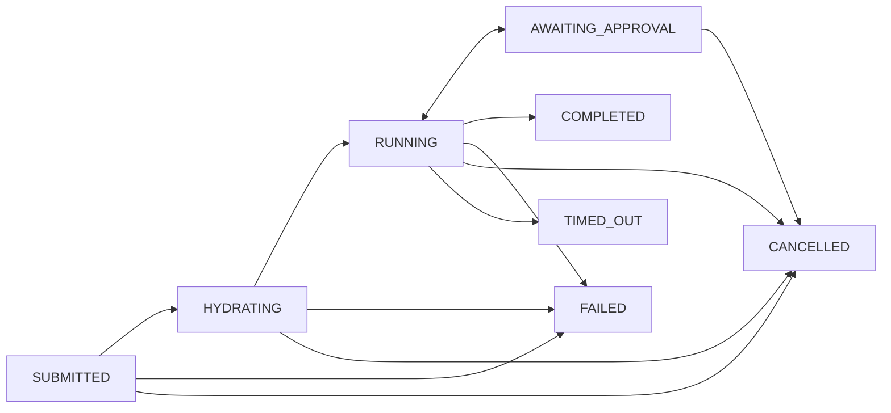

When you create a task, the platform orchestrates it through these states:



The orchestrator uses Lambda Durable Functions to manage the lifecycle durably - long-running tasks (up to 9 hours) survive transient failures and Lambda timeouts. The agent commits work regularly, so partial progress is never lost.

| Status | Meaning |
|---|---|
| `PENDING_UPLOADS` | Initial state while presigned attachment uploads are pending confirmation |
| `SUBMITTED` | Task accepted; orchestrator invoked asynchronously |
| `HYDRATING` | Orchestrator passed admission control; assembling the agent payload |
| `RUNNING` | Agent session started and actively working on the task |
| `AWAITING_APPROVAL` | Agent paused at a Cedar HITL gate; waiting for your `approve` or `deny` decision. See [Approval gates](#approval-gates-cedar-hitl). |
| `FINALIZING` | Agent session ended; task is wrapping up (post-session hooks / PR finalization) before reaching a terminal state |
| `COMPLETED` | Agent finished and created a PR (or determined no changes were needed) |
| `FAILED` | Something went wrong - pre-flight check failed, concurrency limit reached, guardrail blocked the content, or the agent encountered an error |
| `CANCELLED` | Task was cancelled by the user |
| `TIMED_OUT` | Task exceeded the maximum allowed duration (~8 hours, the AgentCore max session duration; the orchestrator safety-net timer is slightly longer) |

Terminal states: `COMPLETED`, `FAILED`, `CANCELLED`, `TIMED_OUT`. `AWAITING_APPROVAL` is not terminal — a decision (or an approval-timeout) always flips it back to `RUNNING` or onto a terminal state.

Task records in terminal states are automatically deleted after 90 days (configurable via `taskRetentionDays`).

### Concurrency limits

Each user can run up to 3 tasks concurrently by default (configurable via `maxConcurrentTasksPerUser` on the `TaskOrchestrator` CDK construct). If you exceed the limit, the task fails with a concurrency message. Wait for an active task to complete, or cancel one, then retry.

There is no system-wide cap - the theoretical maximum is `number_of_users * per_user_limit`. The hard ceiling is the AgentCore concurrent sessions quota for your AWS account (check the [AWS Service Quotas console](https://console.aws.amazon.com/servicequotas/) for Bedrock AgentCore in your region).

### Task events

Each lifecycle transition is recorded as an audit event. Query them with:

```bash
curl "$API_URL/tasks/<TASK_ID>/events" -H "Authorization: $TOKEN"
```

Available events:

- **Lifecycle** - `task_created`, `session_started`, `task_completed`, `task_failed`, `task_cancelled`, `task_timed_out`
- **Orchestration** - `admission_rejected`, `hydration_started`, `hydration_complete`
- **Checks** - `preflight_failed`, `guardrail_blocked`
- **Interactive** - `nudge_acknowledged`, `agent_milestone`
- **Approvals (Cedar HITL)** - `approval_requested`, `approval_recorded`, `approval_timed_out`
- **Output** - `pr_created`, `pr_updated`

**Error classifiers** on terminal failure events provide a specific reason:

| Classifier | Meaning |
|---|---|
| `error_max_turns` | Agent exhausted its turn limit without completing |
| `error_max_budget_usd` | Agent hit the cost budget ceiling |
| `error_during_execution` | Agent encountered a runtime error during execution |

Event records follow the same 90-day retention as task records.

### Troubleshooting preflight failures

If a task fails with a `preflight_failed` event, the platform rejected the run before the agent started - no compute was consumed. Check the event's `reason` field to understand what went wrong:

- `GITHUB_UNREACHABLE` - The platform could not reach the GitHub API. Check network connectivity and GitHub status.
- `REPO_NOT_FOUND_OR_NO_ACCESS` - The GitHub PAT does not have access to the target repository, or the repo does not exist.
- `INSUFFICIENT_GITHUB_REPO_PERMISSIONS` - The PAT lacks the required permissions for the workflow. For `coding/new-task-v1` and `coding/pr-iteration-v1`, you need Contents (read/write) and Pull requests (read/write). For `coding/pr-review-v1`, Triage or higher is enough.
- `PR_NOT_FOUND_OR_CLOSED` - The specified PR does not exist or is already closed.

To fix permission issues, update the GitHub PAT in AWS Secrets Manager and submit a new task. See [Developer guide - Repository preparation](/sample-autonomous-cloud-coding-agents/developer-guide/repository-preparation) for the full permissions table.

### Viewing logs

Each task record includes a `logs_url` field with a direct link to filtered CloudWatch logs. You can get this URL from the task status output or from the `GET /tasks/{task_id}` API response.

Alternatively, the application logs are in the CloudWatch log group:

```
/aws/vendedlogs/bedrock-agentcore/runtime/APPLICATION_LOGS/jean_cloude
```

Filter by task ID to find logs for a specific task.

### Notifications (GitHub edit-in-place)

When a task targets a pull request (`coding/pr-iteration-v1` or `coding/pr-review-v1`), the platform automatically posts a status comment on the PR and edits it in place as the task progresses. This gives collaborators visibility into the agent's work without polling the CLI or API.

The notification plane uses DynamoDB Streams to fan out task events to channel-specific dispatchers. Currently the GitHub edit-in-place dispatcher is active; Slack and Email dispatchers are planned.

The status comment shows: current phase, last milestone, cost so far, and a link to the task. It updates on key events (`session_started`, `pr_created`, `task_completed`, `task_failed`, `nudge_acknowledged`, and routable agent milestones).

### Preview-deploy screenshots (optional)

If your repo is wired to a deploy provider that publishes GitHub `deployment_status` events (Vercel, Amplify Hosting, Netlify, GitHub Actions custom CD, etc.), ABCA can capture a full-page screenshot of each preview URL and post it as an image comment on the open PR — and on the linked Linear issue if Linear is configured.

This runs independently of the agent: there's no LLM involved, just a Lambda that drives a headless browser via AgentCore Browser. End-to-end latency is typically 10–15 seconds after the deploy provider reports success.

Setup is opt-in and per-repo. See the [Deploy preview screenshots guide](/sample-autonomous-cloud-coding-agents/using/deploy-preview-screenshots-guide) for the wiring (one webhook on the repo, one secret pasted into AWS).