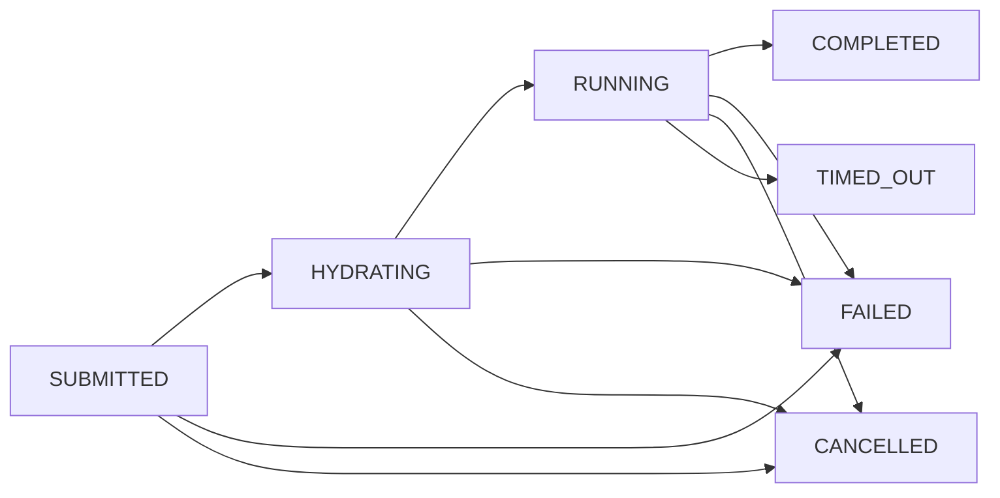

When you create a task, the platform orchestrates it through these states:



The orchestrator uses Lambda Durable Functions to manage the lifecycle durably - long-running tasks (up to 9 hours) survive transient failures and Lambda timeouts. The agent commits work regularly, so partial progress is never lost.

| Status | Meaning |
|---|---|
| `SUBMITTED` | Task accepted; orchestrator invoked asynchronously |
| `HYDRATING` | Orchestrator passed admission control; assembling the agent payload |
| `RUNNING` | Agent session started and actively working on the task |
| `COMPLETED` | Agent finished and created a PR (or determined no changes were needed) |
| `FAILED` | Something went wrong - pre-flight check failed, concurrency limit reached, guardrail blocked the content, or the agent encountered an error |
| `CANCELLED` | Task was cancelled by the user |
| `TIMED_OUT` | Task exceeded the maximum allowed duration (~9 hours) |

Terminal states: `COMPLETED`, `FAILED`, `CANCELLED`, `TIMED_OUT`.

Task records in terminal states are automatically deleted after 90 days (configurable via `taskRetentionDays`).

### Concurrency limits

Each user can run up to 3 tasks concurrently by default (configurable via `maxConcurrentTasksPerUser` on the `TaskOrchestrator` CDK construct). If you exceed the limit, the task fails with a concurrency message. Wait for an active task to complete, or cancel one, then retry.

There is no system-wide cap - the theoretical maximum is `number_of_users * per_user_limit`. The hard ceiling is the AgentCore concurrent sessions quota for your AWS account (check the [AWS Service Quotas console](https://console.aws.amazon.com/servicequotas/) for Bedrock AgentCore in your region).

### Task events

Each lifecycle transition is recorded as an audit event. Query them with:

```bash
curl "$API_URL/tasks/<TASK_ID>/events" -H "Authorization: $TOKEN"
```

Available events:

- **Lifecycle** - `task_created`, `session_started`, `task_completed`, `task_failed`, `task_cancelled`, `task_timed_out`
- **Orchestration** - `admission_rejected`, `hydration_started`, `hydration_complete`
- **Checks** - `preflight_failed`, `guardrail_blocked`
- **Output** - `pr_created`, `pr_updated`

Event records follow the same 90-day retention as task records.

### Troubleshooting preflight failures

If a task fails with a `preflight_failed` event, the platform rejected the run before the agent started - no compute was consumed. Check the event's `reason` field to understand what went wrong:

- `GITHUB_UNREACHABLE` - The platform could not reach the GitHub API. Check network connectivity and GitHub status.
- `REPO_NOT_FOUND_OR_NO_ACCESS` - The GitHub PAT does not have access to the target repository, or the repo does not exist.
- `INSUFFICIENT_GITHUB_REPO_PERMISSIONS` - The PAT lacks the required permissions for the task type. For `new_task` and `pr_iteration`, you need Contents (read/write) and Pull requests (read/write). For `pr_review`, Triage or higher is enough.
- `PR_NOT_FOUND_OR_CLOSED` - The specified PR does not exist or is already closed.

To fix permission issues, update the GitHub PAT in AWS Secrets Manager and submit a new task. See [Developer guide - Repository preparation](/developer-guide/repository-preparation) for the full permissions table.

### Viewing logs

Each task record includes a `logs_url` field with a direct link to filtered CloudWatch logs. You can get this URL from the task status output or from the `GET /tasks/{task_id}` API response.

Alternatively, the application logs are in the CloudWatch log group:

```
/aws/vendedlogs/bedrock-agentcore/runtime/APPLICATION_LOGS/jean_cloude
```

Filter by task ID to find logs for a specific task.