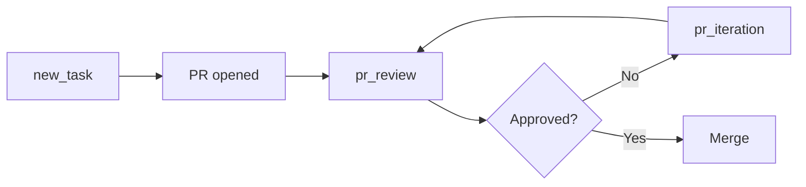

The platform supports three task types that cover the full lifecycle of a code change:

| Type | Description | Outcome |
|---|---|---|
| `new_task` (default) | Create a new branch, implement changes, and open a new PR. | New pull request |
| `pr_iteration` | Check out an existing PR's branch, read review feedback, address it, and push updates. | Updated pull request |
| `pr_review` | Check out an existing PR's branch, analyze the changes read-only, and post a structured review. | Review comments on the PR |

### When to use each type

**`new_task`** - You have a feature request, bug report, or task description and want the agent to implement it from scratch. The agent creates a fresh branch, writes code, runs tests, and opens a new PR. Use this for greenfield work: adding features, fixing bugs, writing tests, refactoring, or updating documentation.

**`pr_iteration`** - A reviewer left feedback on an existing PR and you want the agent to address it. The agent reads the review comments, makes targeted changes, and pushes to the same branch. Use this to accelerate the review-fix-push cycle without context-switching from your current work.

**`pr_review`** - You want a structured code review of an existing PR before a human reviewer looks at it. The agent reads the changes and posts review comments without modifying code. Use this as a first-pass review to catch issues early, especially for large PRs or when reviewers are busy.

### Combining task types

The three task types work together as a development loop:

1. Submit a `new_task` - the agent implements the change and opens a PR.
2. Submit a `pr_review` on the new PR - the agent posts structured review comments.
3. Submit a `pr_iteration` - the agent addresses the review feedback and pushes updates.
4. Repeat steps 2-3 until the PR is ready to merge.

You can automate this loop with webhooks: trigger `pr_review` automatically when a PR is opened, and `pr_iteration` when review comments are posted.