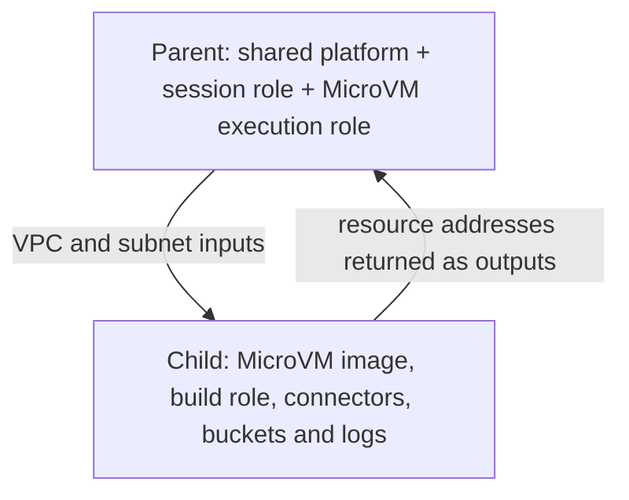

# ADR-021 takeover review: P3 readiness

Reviewed 2026-09-13 against `main` commit `5e10038c7e28179b302ac4de78b709795aeba3ce`.

This review covers the existing MicroVM implementation, related P2 follow-ups, comment accuracy and nested-stack feasibility. It includes local experiments, not an AWS deployment or a new live smoke run. The associated [implementation plan](./645-p3-implementation-plan.md) turns the findings into ordered work.

**Live update (2026-09-14):** subsequent work completed a [clean deployment](./645-p2-clean-deployment-20260913.md) and [real coding, PR iteration and cancellation tests](./645-p2-live-task-20260914.md), including Memory writes and runtime logging. A normal [image rebuild](./645-microvm-image-rebuild-20260914.md) activated version `2.0`; [11 live payload cases](./645-p2-payload-live-20260914.md) then verified transport/rejection, URL expiry/revocation and immediate Run replay. Those records supersede the corresponding gaps in the historical notes below. Full P2 acceptance and integrated P3 sleep/wake remain open; the original review findings are retained as a dated baseline.

**Implementation update (2026-09-13):** subsequent local batches fix thread isolation, deletion/error/byte/contract bugs, approval heartbeat, stable MicroVM start recovery, atomic capacity reservations and coordinator metadata permissions. The latest batch implements v2 authenticated deployment manifests and single-object payload links for both ECS and MicroVM (#817/#700), with no old unsigned fallback. See the [bootstrap runbook](./645-payload-bootstrap.md) and [implementation progress](./645-p3-implementation-plan.md#implementation-progress). A further local batch removes unused logging counters in favor of structured stdout failures and verifies large registry assets through v2 delivery and the local loader. At that batch's completion, effective AWS policies, expiry/networking, stdout ingestion, remote-tool connectivity, clean deployment and P3 sleep/wake were pending; the live update above records later evidence. Findings below preserve the original reviewed baseline, rather than describing all of them as current defects.

Further local work adds durable MicroVM start receipts, stable request tokens and bounded handle recovery. AWS token-retention/conflict behavior and unknown-ID cleanup remain live verification gates. The shared finalizer's repeated-decrement risk was subsequently reproduced and fixed locally with task-owned reservation transactions, unified counter writers and revision-guarded reconciliation, including approval waits. DynamoDB Local exercises the real transaction conditions; deployed IAM, scan scale and upgrade/drain behavior still need AWS verification.

The first local P3 foundation adds the supervisor's pause/wake command methods and fixes approval timing. The timer now keeps both an elapsed-time stopwatch and the original clock deadline, using whichever runs out first. A sleeping VM therefore does not get a fresh approval window. At that foundation milestone, guest hooks and supervisor repair remained unfinished; subsequent milestones below supersede those gaps. The installed AWS SDK does not expose a `RESUMING` state; receiving a wake acknowledgement alone does not prove that the VM is awake.

A second foundation adds saved sleep/wake instructions with revision stamps, so an old supervisor cannot overwrite a newer wake request. A policy helper now handles the observed state and current approval deadline. Real DynamoDB Local transaction tests cover competing writers and restart/readback cases; this is a local database test, not an AWS deployment. See the [lifecycle runbook](./645-lifecycle-intent.md). At that foundation milestone, guest hooks, supervisor integration and live verification remained open.

**Further P3 work (2026-09-14):** the [guest pause controller](./645-p3-guest-barrier.md)
now keeps coding behind a controlled door while approval work is paused. The
[credential implementation](./645-p3-credentials.md) renews the existing AWS key
objects and gives Claude one source of task-specific keys. Actual pinned Claude
tests with fake AWS responses prove renewal before the next request and safe
failure without borrowing the parent's keys. The subsequent
[HTTP hook milestone](./645-p3-lifecycle-hooks.md) connects pause to an atomic
checkpoint and wake to credential renewal plus task/gate reconciliation.
The [image capability milestone](./645-p3-image-capability.md) (2026-09-15) now declares the six hooks and checks/persists support for the actual launched image version. The [supervisor milestone](./645-p3-supervisor.md) now adds durable recovery, post-commit approval wake, bounded cleanup and a default-off rollout flag locally. Real AWS sleep/wake acceptance remains open.

The reservation review found a separate trust boundary: the old agent role could write/replace/delete its task row, including coordinator metadata. A subsequent local fix restricts main-task writes to reporting/approval attributes, removes replacement/deletion permissions and removes unused worker counter grants. It also removes unused Python submission/session-info helpers and corrects overstated tenant-isolation comments. [Metadata verification](./645-coordinator-metadata.md) records the tests and pending AWS gate. Status reports still come from the agent, and the compute role chooses session tags; this is not complete hostile-worker isolation.

## Start here: the pieces in plain language

A **MicroVM** is a small, isolated computer rented from AWS. **Firecracker** is the technology that keeps these small computers separate. A **backend** is the kind of rented computer ABCA chooses to run a coding task.

A **snapshot** is a saved picture of the computer's memory and disk. An **image** is the prepared starting snapshot: installed tools, server and warm files, without a particular user's task. Suspending saves the current task's computer so it can continue later. It is like closing a laptop halfway through homework. Suspending stops compute charges, but snapshot storage and read/write charges remain. The eight-hour session limit includes time asleep.

The **orchestrator** is ABCA's supervisor. It starts computers, checks tasks, and cleans up. A **hook** is a small HTTP handler AWS calls at a lifecycle event, such as “prepare the image” or “about to stop.” These lifecycle calls do not require opening the agent to the public internet.

**CloudFormation** is AWS's deployment system. A **stack** is a group of resources it creates together. **CDK** is code that produces the deployment recipe, called a **template**. A **construct** is a code-organizing box; it does not give its resources a separate CloudFormation quota. A **nested stack** does: it is a smaller deployment managed through the parent deployment. Nesting infrastructure does **not** mean running a VM inside another VM. This review evaluates nested CloudFormation stacks, not nested hardware virtualization.

An **IAM role** is a permission badge. A **trust policy** says who may wear that badge. **PassRole** lets a caller hand a specific badge to an AWS service. A **session role** is the more tightly limited badge for one task. Its **tags** carry task/user/repository identity so access can be restricted to that task's data.

## What is finished?

| Phase | Purpose | Current state |
|---|---|---|
| P1 | Build the computer, start it, deliver a task, check it and stop it | Merged in [#689](https://github.com/aws-samples/sample-autonomous-cloud-coding-agents/pull/689). Strategy, infrastructure, bootstrap permissions, packaging, types, `/ready` and `/run` exist. |
| P2 | Make a real coding task work with configuration, permissions, logs and progress | Merged in [#733](https://github.com/aws-samples/sample-autonomous-cloud-coding-agents/pull/733). `/validate`, `/terminate`, warm-up, runtime grants and heartbeat support exist. The September 14 clean rerun passed coding, iteration and cancellation without manual IAM workarounds, followed by image 2.0 payload/start checks. The broader deployed recovery, effective IAM and network matrix remains open. |
| P3 | Sleep during a human approval wait, wake correctly, and keep deadlines/credentials safe | Local foundations include intent/policy, guest pause control, scoped credential renewal, production HTTP checkpoint/wake hooks and per-worker image capability. Durable supervision and post-commit approval wake are now connected locally with bounded recovery and scoped IAM. Live acceptance remains open; automatic sleep defaults off. |
| P4 | — | ADR-021 defines no P4. Verification runbooks have their own numbered phases; those are not extra ADR milestones. |

The old unchecked checklist and the word “proposed” do not erase the merged work. Conversely, merged code is not proof that the final deployment path works unattended.

## Can MicroVM infrastructure be nested?

**Yes. A local prototype works with a deliberate permission boundary. A one-line wrap is undeployable.**

The naive change puts the existing `LambdaMicrovmCompute` construct inside a `NestedStack`. Two things go wrong:

1. The parent `AgentSessionRole` trusts the child's MicroVM execution role. The child also needs the parent session role's ARN (AWS resource address). Each needs the other created first. This is a **circular dependency**. `app.synth()` wrote templates, but `Template.fromStack()` rejected the result as undeployable with `AgentSessionRole → MicrovmNested → AgentSessionRole` in the cycle. Merely producing a template is insufficient verification.
2. The construct sanitizes `Stack.of(this).stackName` for image/connector names. A nested stack's generated name is an unresolved CDK **token**, a placeholder filled in later. String sanitization destroyed that placeholder, producing names such as `--Token-TOKEN-8353---abca-agent`. Names also varied with construct creation order.

The successful prototype kept the MicroVM **execution role in the parent**, beside the shared session role, and derived resource names from the stable parent name. The child contained image/build/network/bucket/log resources. This removed the cycle; it is not yet a production refactor.

The arrows show configuration passing, not a circular creation dependency: parent resources that depend on child outputs must be separate from the parent resources the child needs to create itself.

### Fresh measurements

Offline synth, bundling disabled, `backgroundagent-dev`, example account `123456789012`, `us-east-1`, `suppressTemplateIndentation: true`. “Image” means a managed image with both `microvm_base_image_arn` and `microvm_base_image_version`. The vault guard was disabled **only in the scratch experiment** to count that combination.

| Configuration | Current root resources | Prototype root resources | MicroVM child resources |
|---|---:|---:|---:|
| Default AgentCore | 454 | 454 | — |
| MicroVM, no image yet | 471 | 457 | 17 |
| MicroVM + managed image | 472 | 457 | 18 |
| Above + tool gateway | 479 | 464 | 18 |
| Above + Linear identity vault | 489 | 474 | 18 |

The fullest root template measured 536,098 bytes; the prototype root measured 515,859 bytes, with a 31,884-byte MicroVM child. Existing registry children had 19 and 35 resources; the optional consent-page child had 12. These are counts per stack, not totals for the whole deployment. The full prototype saves **15 root resources** and about **20 KB**, leaving 26 root resource slots under the 500-resource limit.

The historical 505-resource refusal and 98.6%-full byte claim are stale for this source revision. The guard still exists in shipped code, and these unbundled experiments do not justify silently removing it. A production refactor must also measure real bundled templates and all supported feature combinations. See [probe results](./645-nesting-probe-results.json).

### Conditions for a production split

- Add an explicit execution-role injection point and stable deployment-name input. Do not put `nestedStackParent` lookups throughout production code simply because the scratch probe used one.
- Preserve parent `Microvm*` output keys consumed by the packaging helper and CLI; return child identifiers through outputs.
- Recheck bootstrap IAM. The current MicroVM PassRole patterns match `backgroundagent-dev-LambdaMicrovmComputeBuild*` and `...Connector*`. Moving resources changes generated physical role names, which may no longer match. Use narrowly scoped stable names/patterns, regenerate the bundle and bump its version if permissions change.
- Check every cross-boundary grant, tags, solution user-agent aspect and all nested templates. Parent-only resource assertions no longer cover the child.
- Plan migration. Moving a resource to another stack changes its identity to CloudFormation and can cause replacement. Artifact/payload buckets currently use destructive removal settings; named images/connectors can also collide with their old copies. Review the actual change set and choose a fresh experimental deployment or a supported resource-preserving migration. Never assume moving CDK code moves live resources safely.

Nesting is useful preparation, especially for the vault combination, but it does not implement P3 and is not a fundamental prerequisite for an isolated MicroVM pause/resume prototype.

## Behavior findings that need follow-up

“Confirmed” below means visible in the baseline source or reproduced locally during the initial review. It does not mean reproduced on AWS during this review.

| Finding | Evidence and consequence | Treatment |
|---|---|---|
| Finalize deletes without permission | `orchestrate-task.ts` calls `deleteMicrovmPayload`; `task-orchestrator.ts` grants only PutObject. Tests explicitly assert deletion permission is absent. Prompt data remains until lifecycle deletion when the call is denied. | Confirmed; [#817](https://github.com/aws-samples/sample-autonomous-cloud-coding-agents/issues/817). Add narrowly scoped coordinator delete permission and reverse the wrong assertions. |
| Raw AWS reason text changes error classification | Executing the real classifier with a substrate-completed message plus `MicroVM host unavailable.` produces unsupported-region/non-retryable classification. Hook HTTP 400 is already classified correctly; that old example is stale. | Reproduced locally; #817. Use structured category/code for decisions and preserve service text as diagnostics. |
| ARN validation is consistency, not deployment identity | `_reject_foreign_arns` accepts another workspace's secret in the same account. Its anchor comes from the same supplied block. It checks partition/account agreement, not trusted provenance. | Local validator proof; #817. No forged `/run` reachability or credential theft demonstrated. Trusted deployment binding and negative ingress tests are needed. |
| Payload reader is broader than one task | Worker execution roles can read/list the payload bucket, so prompt data for other tasks may be accessible to untrusted task code. | Confirmed; [#700](https://github.com/aws-samples/sample-autonomous-cloud-coding-agents/issues/700), shared with ECS. Task-scoped transport design is separate from deleting completed payloads. |
| A long approval wait leaves a stale heartbeat on resume | `write_heartbeat` only writes while status is RUNNING. `transact_resume_from_approval` restores RUNNING without refreshing the timestamp. A poll before the next 45-second tick can see an age over 240 seconds and fail a healthy task. | Source-proven race window, no live reproduction. Add atomic refresh plus an adversarial ordering test before P3. |
| Heartbeat is not a general progress watchdog | It runs on an independent thread. A stuck coding thread can coexist with fresh heartbeats. | Confirmed by call structure. Corrected comments; broader progress detection belongs with [#491](https://github.com/aws-samples/sample-autonomous-cloud-coding-agents/issues/491). |
| Start retries have an uncertain-outcome window | `startSessionWithRetry` calls start again on transient errors. No application-stable MicroVM client token links those calls. Lost success response does not prove the first VM was never created. | Source risk, not a demonstrated live leak. Add response-loss fault injection and attempt-scoped idempotency/reconciliation design. Corrected the false guarantee. |
| Snapshot refresh must preserve task identity | `reset_session_cache()` clears tenant tags as well as the session; existing clients and the Claude credential helper can hold separate state. | Confirmed. It is a test reset, not a ready-made `/resume` implementation. |
| Existing progress writes do not provide a suspend barrier | `ProgressWriter._put_event` writes synchronously but catches/drops failures and can disable itself. There is no acknowledged queue-flush contract. | Confirmed. P3 must add a narrow durability barrier with a failure path. |
| Repeated MicroVM poll errors never escalate | The MicroVM branch logs and continues; ECS already has counters. | Confirmed P3 gap. Persist retry counters in durable poll state and bound recovery. |
| Logging failure count is invisible | `_debug_cw_failures` is incremented but never read/exported; `_DEBUG_CW_FAILURE_EMIT_EVERY` is unused. | Confirmed; [#810](https://github.com/aws-samples/sample-autonomous-cloud-coding-agents/issues/810). Comments corrected; telemetry behavior remains work. |
| Server tests can leak background work | Test setup clears `_active_threads` without ensuring the threads finished; late work can use the next test's mocks. | Confirmed structure; [#841](https://github.com/aws-samples/sample-autonomous-cloud-coding-agents/issues/841). Fix before trusting expanded hook tests. |

The security findings are readiness work, not cosmetic cleanup. This review does not silently implement them or claim that their absence makes every existing deployment exploitable.

### P2 issue map

- **#817 is the primary tracker.** [#813](https://github.com/aws-samples/sample-autonomous-cloud-coding-agents/issues/813), [#814](https://github.com/aws-samples/sample-autonomous-cloud-coding-agents/issues/814), [#815](https://github.com/aws-samples/sample-autonomous-cloud-coding-agents/issues/815) and [#816](https://github.com/aws-samples/sample-autonomous-cloud-coding-agents/issues/816) closed because they were consolidated, not because all fixes landed. Its five tracks are classifier correctness, payload deletion IAM, contract/provenance checks, stale docs, and truncated-S3-body route coverage. `_PayloadFetchError` already distinguishes unreadable payloads, but the real bad-byte path needs a route-level regression.
- **[#818](https://github.com/aws-samples/sample-autonomous-cloud-coding-agents/issues/818): registry tool networking and payload size.** Runtime networking is HTTPS/443-only on all three shipped backends, not uniquely MicroVM. Correct the premise, define supported tool ports, and test oversized resolved registry assets through the 4,096-byte/S3 path.
- **[#701](https://github.com/aws-samples/sample-autonomous-cloud-coding-agents/issues/701): bootstrap refresh.** Checking the source version is insufficient; verify the deployed bundle and effective roles. [#867](https://github.com/aws-samples/sample-autonomous-cloud-coding-agents/pull/867) fixed bootstrap template byte size, a different problem.
- **[#857](https://github.com/aws-samples/sample-autonomous-cloud-coding-agents/issues/857): vault + MicroVM guard.** It is on main. [#854](https://github.com/aws-samples/sample-autonomous-cloud-coding-agents/pull/854) reclaimed room; this review's newer measurements supersede old counts, not deployment verification.
- **[#811](https://github.com/aws-samples/sample-autonomous-cloud-coding-agents/issues/811): ECS Haiku model environment parity.** Separate backend fix; not a reason to block MicroVM pause/resume.
- **[#702](https://github.com/aws-samples/sample-autonomous-cloud-coding-agents/issues/702): teardown leaks.** Account for AgentCore ENIs (network attachments) and Memory deletion state when cleaning the test deployment. Separate platform operations work.
- **[#736](https://github.com/aws-samples/sample-autonomous-cloud-coding-agents/issues/736): future IAM conditions.** Revisit when the service supports suitable context keys. Do not restore the previously broken `iam:PassedToService` condition just to make policies look tighter.

## Cleanup in the original review commit

Changes are comments, Python docstrings, documentation, one cdk-nag explanation string and the vault guard’s error wording. The error no longer claims a current 505-resource overflow; the guard still rejects exactly the same combination. The cdk-nag change affects template metadata, not IAM permissions.

- Describe P2's successful workaround-assisted smoke and the remaining clean verification precisely; retain the stable warning ID.
- Remove the false no-delete-by-design explanation and point to the missing permission.
- Correct heartbeat, retry-idempotency, progress-durability and suspended-quota claims.
- Correct unexported logging-counter claims and the region/credential distinction. An offline probe on boto3/botocore 1.43.78 changed `AWS_DEFAULT_REGION`: new clients used the new region while the resolved credentials object remained cached.
- Explain that missing `platform_config` is accepted only when the effective environment already has required identifiers; describe the limits of ARN consistency validation.
- Fix stale ECS sizing/context instructions, root/nested deployment wording, old template counts, and PRNG terminology. Reseeding Python `random` does not make it suitable for secrets.

## Review coverage and limits

Reviewed the MicroVM construct, strategy, shared strategy interface, orchestrator start/poll/finalize paths, approval handlers and task API grant seams; the session role and bootstrap policy; agent hook dispatch/config installation, heartbeat, approval transactions/timers, credentials and progress writer; relevant tests/contracts; ADR, compute/orchestrator/deployment docs, packaging and recorded P1/P2 runbooks.

Local checks and results are recorded in the implementation plan's review-validation section. Source review and mocked tests cannot establish AWS hook ordering, snapshot clock behavior, credential refresh after a long freeze, actual network reachability, or a safe migration of deployed resources. Those remain explicit live gates rather than claims of completion.
